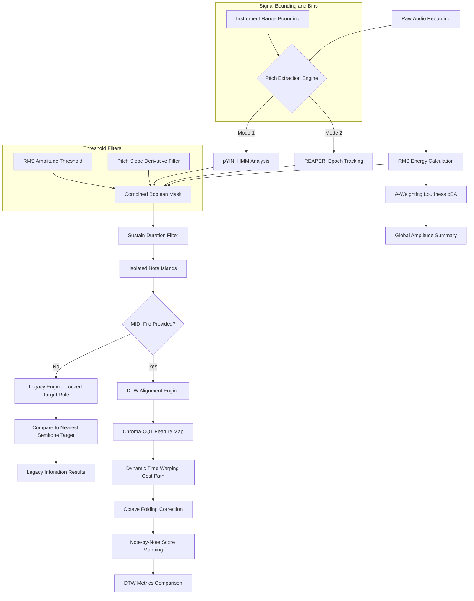
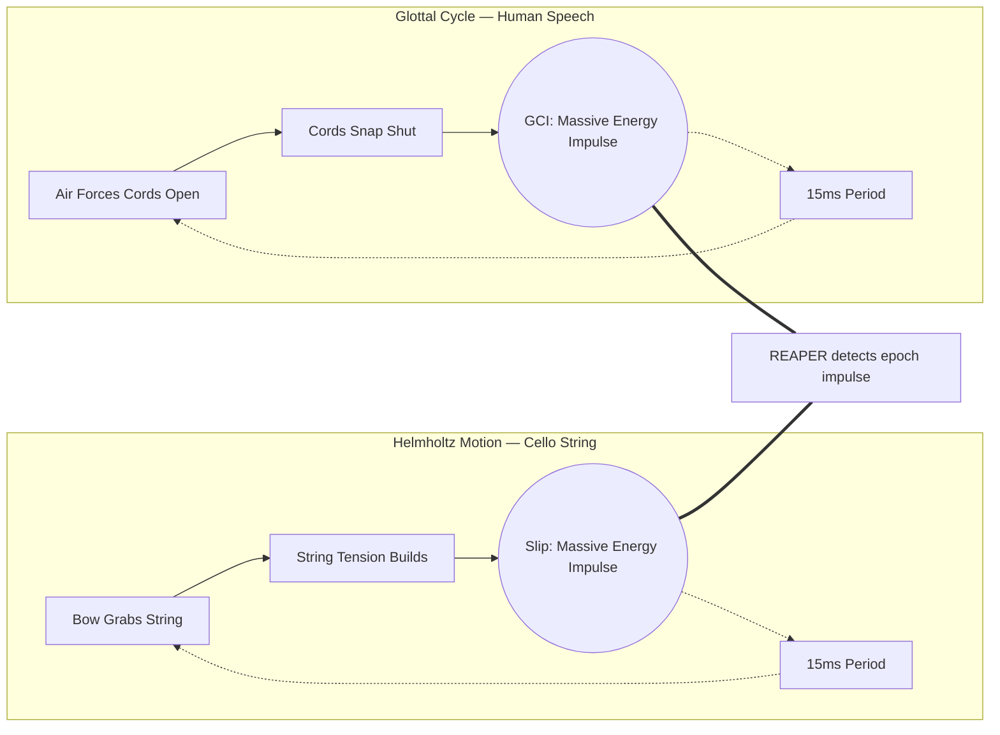
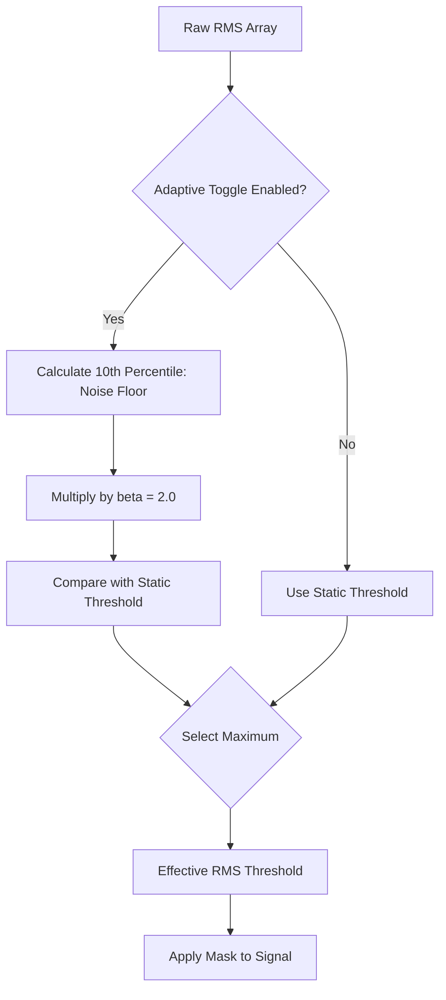
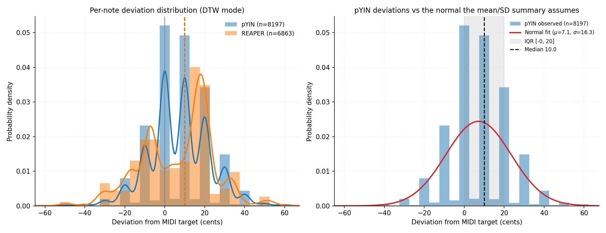
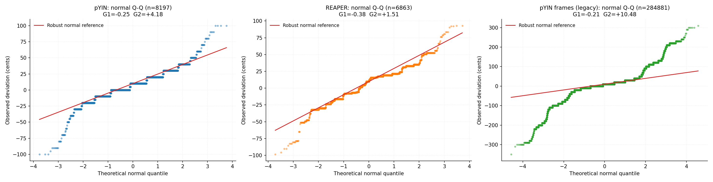
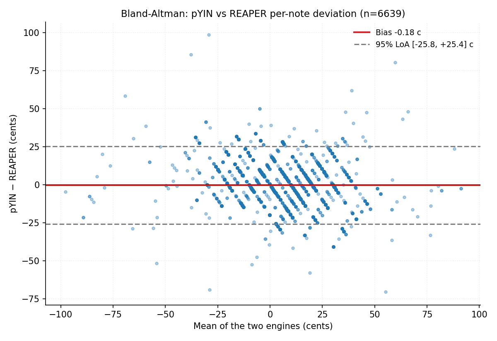

# Hello-Audio: Comparative Intonation and Amplitude Analysis Engine
## Technical Manual and Algorithmic Foundations
*A publication-grade guide to the digital signal processing, alignment, and filtering components of Hello-Audio.*

---

## 1. Executive Summary and System Architecture

> [!WARNING]
> **Dataset & Instrument Caveat:** Hello-Audio is primarily designed, parameterized, and tested using the relevant instrument samples from the URMP dataset (Li et al., 2019). As such, the application in its current state is strictly validated for **Violin, Viola, and Cello**. It should not be used to analyze other instruments without further calibration.

> [!IMPORTANT]
> **Purpose and measurement scope.** Hello-Audio was designed for one specific comparison: the difference in **amplitude** and **intonation** when a performer plays **without earplugs (the "Unplugged" condition)** versus **with earplugs (the "Plugged" condition)**. Because those two quantities are the effect under study, expressive variation that also moves amplitude or pitch — dynamic shading, tempo fluctuation, ornaments, and vibrato — should be **minimised in the recorded performances**, as it otherwise confounds the measurement. The engine remains functional when such expression is present, but the comparison is only clean when it is suppressed. The recording protocol and the recommended analysis configuration for this study are specified in *Intended Use and Recording Protocol* and *Default Configuration: DTW Alignment and Adaptive RMS Gating* below.

The **Hello-Audio** application is a comparative analysis engine designed to evaluate the physical execution of musical performances on string instruments. It evaluates performance across two fundamental dimensions: **amplitude (intensity)** and **intonation (frequency deviation)**. The system is engineered to isolate intentional, steady-state notes while rejecting mechanical noise, transient attacks, bow changes, glissandos, and room reverberation.

The processing flow operates under two modes:
1. **Legacy Analysis Mode**: Compares the performed pitch frame-by-frame to the nearest absolute semitone on the Equal Temperament (12-TET) scale.
2. **DTW Alignment Mode**: Unlocked when a MIDI reference score is provided. It mathematically warps the performance timeline to match the expected notes, enabling precise note-by-note evaluation against the composer's intentions.

### High-Level System Architecture



### Document Structure

Sections 1–8 specify the pipeline in processing order, each presenting the mathematical formulation, a conceptual reading, and the justification for any parameter the section introduces. Section 9 consolidates every user-controlled parameter and the statistics the application reports. Section 10 states the validated scope. Section 11 is the reference list.

The appendices carry the empirical evidence and are organized by what they validate rather than by the order in which they were produced:

| Appendix | Subject | Material | Establishes |
| :--- | :--- | :--- | :--- |
| **A** | Batch performance, REAPER vs. pYIN | 41 URMP stems | Macro detection and inclusion yield |
| **B** | Microtonal resolution under induced pitch shift | K515 quintet | The pYIN lattice; the Dual-Engine Architecture |
| **C** | Amplitude engine validation | Synthetic sines | A-weighting and dBFS correctness |
| **D** | DTW step pattern, $\Sigma_1 \rightarrow \Sigma_2$ | K515 quintet | Yield gain from the restricted step set |
| **E** | Synthetic pitch accuracy | Synthetic tones | Bias, precision, linearity, timbre robustness |
| **F** | Inter-engine agreement | 41 URMP stems | Real-audio convergence of the two engines |
| **G** | Voicing confidence sensitivity | Synthetic tones | Robustness to `confidence_threshold` |
| **H** | Parameter sensitivity I | 41 URMP stems | Robustness to $\theta_{slope}$ and $\beta$ |
| **I** | Parameter sensitivity II | 41 URMP stems | Robustness to $\theta_{static}$ and $\theta_{sustain}$ |
| **J** | Distributional statistics | 41 URMP stems | Non-normality and the quantization floor |
| **K** | Perceptual resolution | Appendix E figures | Sufficient resolution; the untested gap |

Appendices E–J are read as a single metrological argument: E and G characterize the instrument on signals whose truth is known exactly, F and H–J characterize it on real performance material, and J determines which summary statistics the instrument's output can legitimately support.

Appendix K stands apart from that argument. Every appendix before it validates the engine against something the engine's own designers specified — a synthesized tone of known frequency, a MIDI score, or a second configuration of the same pipeline. None establishes that the quantity being measured so carefully corresponds to what a trained musician hears. Appendix K states what the existing evidence does settle about that question, and marks clearly what it does not.

### Conceptual Overview
> [!TIP]
> Consider Hello-Audio analogous to a strict comparative evaluator:
> 1. The system first applies a bandpass filter restricted to the physical frequency range of the designated instrument (**Frequency Range Bounding**).
> 2. It rejects transient acoustic events, ambient noise (**RMS Thresholding**), anomalous frequency slides (**Pitch Slope Filter**), and momentary tracking artifacts (**Sustain Duration Filter**).
> 3. In the absence of a reference score, the system assumes the performer's intended pitch is the nearest standard semitone, maintaining this target irrespective of minor performance drift (**Locked Target Rule**).
> 4. When a reference score is provided, the system dynamically aligns the temporal execution of the performance to the score (**Dynamic Time Warping**), while mathematically resolving harmonic tracking artifacts that occur in adjacent registers (**Octave Folding**).

### Intended Use and Recording Protocol

The engine isolates the steady-state loudness and pitch of each note so that the only systematic difference between two recordings is the condition under test — earplugs versus none. Expressive gestures move the same two quantities the study measures: a *crescendo* changes amplitude, a *ritardando* changes the note durations DTW must align, an ornament inserts unscored notes, and vibrato modulates pitch by tens of cents around the note centre. To keep the plugged/unplugged contrast interpretable, performances should be recorded under deliberately constrained conditions. The engine will still produce output when these constraints are relaxed, but the measurement is only clean when they are observed.

The recommended protocol:

1. **Fixed repertoire per instrument.** Every participant plays the same score for a given instrument, so each plugged/unplugged contrast is a within-material comparison.
2. **Minimal expression.** Steady dynamics (no crescendo/diminuendo), steady tempo (no *accelerando* or *ritardando*), **no ornaments**, and **no vibrato**. This is a deliberate experimental control, and it is the single largest lever on measurement cleanliness — see the caveat below.
3. **Short excerpts.** Keep each take short (**≤ ~2 minutes**). This is primarily a data-hygiene and reproducibility choice — short trimmed excerpts are easier to align, verify and re-run, and they bound the cost of any single bad take. It is *not* required for alignment stability: §6 shows the current $\Sigma_2$ pipeline aligns full-length stems under Subsequence without drift.
4. **Controlled acoustics.** Record in a quiet, low-reverberation room. Hold microphone type, position and gain **identical** across the plugged and unplugged takes of the same performer and piece, and capture both conditions in one session (intonation drifts with fatigue, re-tuning and temperature).
5. **Trim to the notes.** Remove leading and trailing silence so the analysed file begins at the first note and ends at the last. Room tone may be recorded separately to document signal-to-noise ratio, but it should not sit inside the analysed region.
6. **No click track required.** Performers may play at their own steady tempo near the score's written tempo; the recommended Subsequence alignment mode (below) absorbs a moderate tempo offset without one.

> [!CAUTION]
> **Suppressing vibrato trades ecological validity for measurement control.** Real performance includes vibrato, so a corpus recorded without it is not a sample of natural playing. This is an acceptable and deliberate control here — vibrato modulates pitch by tens of cents and would confound a "centre pitch" measurement — but it must be reported as a designed constraint rather than an oversight, and any generalisation of the results to expressive performance is out of scope.

### Default Configuration: DTW Alignment and Adaptive RMS Gating

Two of the application's default settings are tuned for the general case — field recordings of unknown length, gain and noise, of the kind found in the URMP validation corpus. The controlled protocol above is a different regime, and for it two defaults should be **overridden**. The shipped defaults, their justifications, and the recommended overrides are as follows. Both settings are also listed in the consolidated defaults table in §9, and the underlying mechanisms are specified in §4A (Adaptive RMS) and §6 (DTW modes).

**DTW alignment mode — shipped default: Global (`Force Global DTW Alignment` on).**
Global DTW anchors both endpoints of the audio and the score, which bounds the maximum cumulative warping drift. It is a sound conservative default when the recording length is unknown. (Historically it also guarded against a Subsequence yield-collapse on long dense stems; §6 documents that this was an artifact of the old $\Sigma_1$ step pattern and that the current $\Sigma_2$ pattern has resolved it — Subsequence is now robust even at full stem length.)
*Recommended override for this protocol: use **Subsequence** DTW (uncheck `Force Global`).* The reason is tempo flexibility, not drift avoidance: Subsequence relaxes the endpoint constraints, so it absorbs the participant-to-participant tempo variation this study expects without requiring a click track (the $\Sigma_2$ step pattern represents any performance between $0.5\times$ and $2.0\times$ the score tempo — §6). Under $\Sigma_2$ it matches Global to within ~3 pp of detection even on the worst-case long stem, so choosing it costs nothing on short trimmed excerpts while handling the tempo spread Global would fight. This configuration is validated directly on URMP string material in the short-excerpt validation (Appendix L).

> [!NOTE]
> **Literature check — recommended analysis duration for Subsequence DTW.** A review of the pitch-tracking and music-alignment literature (Mauch & Dixon, 2014; Müller, 2015; and the DTW music-retrieval literature surveyed for this manual) found **no published guideline prescribing a maximum recording duration for Subsequence DTW.** The literature treats sequence length as a *computational* constraint — DTW's quadratic time and memory cost motivates multiscale and segmented variants for speed, not accuracy — and treats alignment drift as an *algorithmic* problem, addressed by flexible boundary conditions and alignment-reliability estimation rather than by any length limit. Consistent with this, the current $\Sigma_2$ pipeline shows no length-driven Subsequence collapse (§6). The **≤ ~2-minute** figure recommended here is therefore **a description of the study's recording format, not a stability limit of the engine**, and is presented as such.

**Adaptive RMS gating — shipped default: Enabled ($\beta = 2.0$).**
The adaptive floor $\theta_{effective} = \max(\theta_{static}, 2 \cdot P_{10}(\text{RMS}))$ tracks the true noise floor of each recording session, which is the correct behaviour for field recordings with unknown, variable microphone gain and room noise (§4A). Its stated assumption is that at least 10% of the recording is rests or ambient silence, so the 10th percentile samples noise rather than signal.
*Recommended override for this protocol: **disable** Adaptive RMS (uncheck `Enable Adaptive RMS Threshold`) and rely on the static gate $\theta_{static} = 0.005$.* In a controlled studio the noise floor is low and known, so adaptive tracking gains nothing; and near-continuous solo playing rarely contains 10% true silence, so the 10th-percentile "noise floor" instead lands on soft *real notes*, driving the gate up into the signal and discarding genuine quiet notes. This is the same degenerate case noted for continuous synthetic tones in Appendix E. A quick diagnostic: if $2 \cdot P_{10}(\text{RMS})$ approaches the median RMS of the take, the adaptive floor is over-gating and should be turned off.

---

## 2. Input Bounding and Frequency Limits

### Mathematical Formulation
To prevent the pitch tracking algorithm from wandering into spectral regions containing only background hum or mechanical clicks, a bandpass search boundary is established. In digital pitch tracking, restricting the search range for the fundamental frequency ($f_0$) is mathematically equivalent to limiting the search space of the pitch lag parameter $\tau$ (measured in samples) during autocorrelation:

$$\tau_{\min} = \frac{f_s}{f_{\max}} \quad \text{and} \quad \tau_{\max} = \frac{f_s}{f_{\min}}$$

where $f_s$ is the sampling rate of the audio file in Hz, $f_{\min}$ is the lower bound, and $f_{\max}$ is the upper bound.

In `pitch_engine.py`, the limits are bound to the physical registers of string instruments:
* **Violin**: $f_{\min} = \text{G3} \approx 196.00\text{ Hz}$, $f_{\max} = \text{C7} \approx 2093.00\text{ Hz}$
* **Viola**: $f_{\min} = \text{C3} \approx 130.81\text{ Hz}$, $f_{\max} = \text{A6} \approx 1760.00\text{ Hz}$
* **Cello**: $f_{\min} = \text{C2} \approx 65.41\text{ Hz}$, $f_{\max} = \text{E6} \approx 1318.51\text{ Hz}$

### Conceptual Overview
Limiting the search space focuses the algorithm exclusively on the physical capabilities of the instrument. Without this boundary, the probability of selecting anomalous subharmonic or high-frequency data increases significantly.

### Parameter Considerations
* **Select Instrument**: This setting locks the frequency boundaries to the physical capabilities of the selected instrument. 
* **Demonstration Toggle (`Enable Instrument Freq Limits`)**:
  * **When Enabled**: High-frequency acoustic artifacts, ambient low-frequency noise, and subharmonic anomalies are rejected.
  * **When Disabled (Failure Mode)**: The tracker searches the entire spectrum (from $16\text{ Hz}$ to $25,000\text{ Hz}$). Low-frequency ambient noise registers as a false $f_0$ track, and high-frequency string friction registers as anomalous pitch data. The resulting plot exhibits significant noise in the unvoiced frames.

---

## 3. Pitch Tracking Engines

The system supports two parallel pitch tracking algorithms, allowing for engine-swapping based on acoustic conditions.

### A. Probabilistic YIN (pYIN)

#### Mathematical Formulation
The Probabilistic YIN (pYIN) algorithm is an extension of the classic YIN pitch estimator. YIN is based on the **Difference Function** $d_t(\tau)$, which computes the squared difference between an audio window and its shifted counterpart at lag $\tau$:

$$d_t(\tau) = \sum_{j=t}^{t+W-1} (x_j - x_{j+\tau})^2$$

To prevent the algorithm from choosing subharmonics (which have a low difference value but are twice the true period), YIN computes the **Cumulative Mean Normalized Difference Function** $d'_t(\tau)$:

$$d'_t(\tau) = 1 \text{ if } \tau = 0, \text{ else } \frac{d_t(\tau)}{\frac{1}{\tau} \sum_{j=1}^{\tau} d_t(j)}$$

pYIN models the selection of the lag $\tau$ probabilistically rather than using a hard threshold. It treats the pitch trajectory as a sequence of hidden states in a Hidden Markov Model (HMM). The states correspond to:
1. **Unvoiced** (noise or silence).
2. **Voiced** with a specific fundamental frequency $f_0$.

The transition between states is governed by a transition matrix parameterized by the **Switch Probability** ($\beta$):

$$P(S_t = \text{Voiced} \mid S_{t-1} = \text{Unvoiced}) = \beta$$
$$P(S_t = \text{Unvoiced} \mid S_{t-1} = \text{Voiced}) = \beta$$

#### Conceptual Overview
This probabilistic model provides algorithmic inertia. It assumes continuity in the pitch state; if the signal was evaluated as voiced in the preceding frame, a low switch probability demands significant statistical evidence to transition to an unvoiced state in the subsequent frame, thereby preventing discontinuous jumps.

#### Parameter Considerations
* **Switch Probability ($\beta$)**:
  * **Low $\beta$ (e.g., $0.005$)**: Penalizes rapid toggling between voiced/unvoiced states. This stabilizes note blocks, preventing brief tracking dropouts from splitting a single long note.
  * **High $\beta$ (e.g., $0.050$)**: Allows rapid switching. This is useful for fast, detached notes (staccato) but introduces tracking jitter in sustained notes.

#### Justification of the Engine Optimal Default ($\beta = 0.005$)

Mauch and Dixon (2014) specify the voicing transition distribution of the pYIN HMM in their Equation (7) as

$$p_v = P(v_t \mid v_{t-1}) = \begin{cases} 0.99, & \text{if no change} \\ 0.01, & \text{otherwise} \end{cases}$$

This $0.01$ is inherited verbatim as the `switch_prob` default in `librosa.pyin()`, where it is applied as a two-state self-transition loop (`sequence.transition_loop(2, 1 - switch_prob)`). The value was tuned by the original authors against a corpus of **synthesized singing voice** derived from the RWC popular-music database — a source characterized by frequent phonation onsets, consonant interruptions and breath-group boundaries, all of which reward a comparatively permissive voiced $\leftrightarrow$ unvoiced transition.

Sustained bowed-string tone is the opposite regime. Excitation is continuous for the length of a bow stroke, and the acoustically relevant discontinuities (string crossings, bow changes, détaché articulation) are an order of magnitude rarer than syllabic boundaries in sung text. Halving $\beta$ to $0.005$ raises the self-transition probability from $0.99$ to $0.995$, doubling the log-odds penalty the Viterbi decode must overcome before it will break a voiced run:

$$\Delta \ell = \log\frac{1 - \beta}{\beta} \quad\Rightarrow\quad \Delta\ell_{0.005} - \Delta\ell_{0.01} = \log\frac{0.995}{0.005} - \log\frac{0.99}{0.01} \approx 0.70 \text{ nats}$$

The intended consequence is that a momentary drop in periodicity — a bow-hair transient, a wolf-tone beat, a brief loss of fundamental energy near a string crossing — no longer punches an unvoiced hole through the middle of a held note. Because the Sustain Duration Filter (§4C) discards islands shorter than $\theta_{sustain}$, such holes are not merely cosmetic: splitting one note into two sub-threshold fragments can delete **both** fragments from the analysis.

> [!IMPORTANT]
> The ablation reported in **Appendix H** does **not** show that $\beta = 0.005$ outperforms the librosa default. Across a 50-fold sweep ($\beta \in [0.001, 0.05]$) every reported metric is effectively flat, and what small monotone trend exists in detection yield runs *against* the argument above. The defensible claim is therefore one of **robustness, not optimality**: the intonation metric is insensitive to $\beta$ over two orders of magnitude, so this parameter cannot be a confound in any result in this manual. $\beta = 0.005$ is retained because it is the principled setting for continuously-excited bowed tone and because it is demonstrably harmless — not because the data select it.

> [!NOTE]
> $\beta$ governs **voicing** transitions only. Continuity of the *pitch* trajectory is enforced separately by the triangular pitch-transition window of Equation (8), discussed in §4B.

---

### B. Robust Epoch And Pitch EstimatoR (REAPER)

#### Mathematical Formulation
REAPER estimates pitch by finding discrete acoustic impulses called "epochs" rather than relying purely on sliding window autocorrelation. 

The algorithm operates in two primary stages:
1. **Epoch Detection**: It applies a symmetric FIR "rumble filter" to remove phase distortion and low-frequency noise. It then identifies peaks in the waveform energy derivative to establish discrete epoch locations $t_k$.
2. **Normalized Cross-Correlation (NCCF)**: Using the RAPT (Robust Algorithm for Pitch Tracking) methodology, REAPER calculates the NCCF between adjacent epochs to determine the period $T_0$. The fundamental frequency is then $f_0 = \frac{f_s}{T_0}$. 

The NCCF for a lag $\tau$ is defined as:
$$ \phi(\tau) = \frac{\sum_{n} x[n] x[n+\tau]}{\sqrt{\sum_{n} x[n]^2 \sum_{n} x[n+\tau]^2}} $$

REAPER utilizes dynamic programming to find the optimal path of $f_0$ candidates through the signal. It minimizes a cost function that penalizes rapid pitch changes and unvoiced-to-voiced state transitions, similar to the HMM logic in pYIN but inextricably tied to physical epoch boundaries.

#### Conceptual Overview: From Speech to Stringed Instruments
The REAPER algorithm was originally developed at Google specifically for human speech analysis. In speech, an "epoch" is defined as a **Glottal Closure Instant (GCI)**—the discrete moment when the vocal cords rapidly close, generating a significant, instantaneous impulse in acoustic energy. 

By identifying these physical energy impulses (epochs) rather than performing comparative waveform analysis, REAPER provides robust pitch tracking for speech.

**Application to Bowed String Instruments**
A bowed string instrument produces sound using a mechanism that is mechanically and mathematically analogous to human vocal cords, known as **Helmholtz Motion** (or the "slip-stick" effect):
1. **Stick Phase:** The rosin on the bow hair adheres to the string, displacing it laterally.
2. **Slip Phase:** The restoring force of the string overcomes the static friction of the rosin, causing the string to rapidly return to its resting position.

This sudden "slip" of the string against the bow generates a pronounced, instantaneous impulse of acoustic energy. **In the context of the REAPER algorithm, this mechanical displacement of a cello string is acoustically analogous to a Glottal Closure Instant in human speech.**

#### Example: Overcoming the "Missing Fundamental" Illusion
To understand the efficacy of REAPER on low-register instruments, consider a cello producing a low C2 (65.4 Hz). The wooden body of the cello exhibits significant resonance, frequently amplifying the 2nd harmonic (C3, 130.8 Hz) such that its physical amplitude exceeds that of the true fundamental (C2). This phenomenon creates a "Missing Fundamental" illusion.

* **Sliding-Window Trackers (e.g., pYIN):** Because these algorithms evaluate the entire waveform's morphology for repeating patterns, the dominant 2nd harmonic can cause the algorithm to erroneously track C3 instead of C2.
* **Epoch Trackers (e.g., REAPER):** REAPER is insensitive to the complex resonance of the instrument body. It specifically identifies the discrete mechanical impulses generated during the string's slip phase. Because the string undergoes this slip phase *once* per fundamental cycle (approximately every 15 milliseconds for a C2), REAPER isolates the true fundamental frequency with high precision.



#### Parameter Considerations
* **Minimum Sustain Frames (`min_frames`)**:
  Because REAPER is highly sensitive to rapid transients, it requires a slightly tighter sustain filter (e.g., $4\text{ frames}$) compared to pYIN (e.g., $2\text{ frames}$) to reject glissando micro-slides during bow changes.

#### Documented Limitations on Synthetic Signals

Synthetic validation testing (using mathematically pure sine waves and harmonically rich sawtooth/square waves at instrument-matched frequencies) revealed three distinct classes of failure specific to REAPER that are not observed with pYIN. These are documented here as known architectural properties, not implementation bugs, and provide the empirical rationale for the Dual-Engine Architecture documented in Appendix B.

**Class 1: Low-Frequency Epoch Dropouts (NaN)**
REAPER's epoch tracker exhibits highly fragmented or silent output on pure sine waves in the low-to-mid register (below ~400 Hz). While it successfully tracks certain isolated frequencies (e.g., 113.1 Hz, 332.1 Hz), it produces NaN (no pitch detected) for the majority of frequencies in this range. This failure pattern is completely deterministic: the same frequencies fail across all test phase and duration conditions. Critically, when given harmonically rich sawtooth waves at these exact failing frequencies, REAPER tracks them perfectly — confirming the failure is driven by the absence of a rich harmonic series to anchor epoch detection, not by any frequency cutoff. In practice on real acoustic string instruments (which are inherently harmonically rich), this failure class is largely absent.

**Class 2: Mid-Frequency Subharmonic Locking**
At certain mid-to-high frequencies (e.g., 440 Hz, 475 Hz, 1396 Hz, 1671 Hz, 2000 Hz sine), the absence of harmonics causes the epoch tracker to lock onto phantom autocorrelation peaks at exactly $\frac{1}{2}$ or $\frac{1}{10}$ the true fundamental, producing tracked frequencies roughly 1200 cents (one octave) or 2400 cents below the target.

**Class 3: High-Frequency 16 kHz Quantization Grid**
`extract_pitch_and_rms()` loads audio at 16 kHz for the REAPER path, because the algorithm is tuned for that rate, and the `pyreaper` binding performs no sub-sample parabolic interpolation of the estimated period. As frequency increases, the period length in samples $N$ decreases, and the representable frequencies become constrained to the discrete grid $f = 16000 / N$. This produces steeply increasing pitch quantization error at high frequencies, observed at 397 Hz, 440 Hz, 681 Hz, 815 Hz, 975 Hz, and above. Note that this grid constrains the *pitch values* REAPER can report; the frame timeline is separately resampled onto a 44.1 kHz, $H = 512$ grid so that both engines share one masking geometry.

| Failure Class | Affected Register | Sine | Sawtooth | Impact on Real Audio |
| :--- | :--- | :---: | :---: | :--- |
| Epoch Dropout (NaN) | Below ~400 Hz | Severe | None | Minimal (real strings are harmonically rich) |
| Subharmonic Locking | 440–2000 Hz | Severe | None | Moderate (higher harmonic tracking modes) |
| 16 kHz Quantization Grid | Above ~400 Hz | Severe | Severe | Moderate (resolved by harmonic folding for gross errors) |

> [!NOTE]
> These limitations are consistent with the batch results in Appendix A, where REAPER shows pronounced detection yield drops on specific violin tracks (particularly at fast tempi or in the upper register) that do not appear in the pYIN results for the same audio material. They form part of the empirical evidence supporting pYIN as the primary default engine.

---

## 4. Signal Filtering and Note Isolation

Once the raw pitch ($f_0$) and amplitude (RMS) are extracted, they are processed through three filters to isolate intentional, stable notes.

### A. RMS Amplitude Threshold and Adaptive Noise Gating
#### Rationale
A static RMS threshold ($\theta_{static}$) can fail across different recording sessions due to varying microphone gains, distance from the microphone, or ambient room environments. For example, a quiet recording might have its intentional notes discarded by a high static threshold, while a loud recording might allow background HVAC hiss to pass a low static threshold. 

To resolve this, the engine employs **Adaptive Noise Thresholding**. By extracting the $10^{th}$ percentile of the signal's energy, it dynamically calculates the true "live" room noise floor of that specific recording session (assuming at least 10% of the recording contains rests or ambient silence).

#### Mathematical Formulation
The Root Mean Square (RMS) energy represents the average signal power over a frame of $N$ samples:

$$x_{rms} = \sqrt{\frac{1}{N} \sum_{n=1}^{N} x[n]^2}$$

The adaptive threshold ($\theta_{effective}$) is mathematically formulated as the maximum of either the user's static absolute minimum or a scaled factor ($\beta$) of the dynamic noise floor:

$$NoiseFloor = P_{10}(x_{rms})$$
$$\theta_{effective} = \max(\theta_{static}, NoiseFloor \times \beta)$$

Where $P_{10}$ is the 10th percentile function and $\beta = 2.0$ (ensuring the signal is at least twice the energy of the noise floor). A frame is classified as active only if:

$$x_{rms} > \theta_{effective}$$

#### Process Flow Diagram


#### Failure Mode (Bypass Toggle)
* **When Disabled**: Ambient noise, string friction, and instrument resonance decay are evaluated as valid pitches. The data output will exhibit extraneous pitch data trailing the intended note terminations.
* **When Static Threshold is relied upon exclusively**: Recordings with high mic gain will have false positives (noise tracked as notes), and recordings with low mic gain will have false negatives (notes gated out).

---

### B. Pitch Slope Derivative Filter
#### Mathematical Formulation
To isolate the stable, flat center of a note, the system calculates the absolute first derivative of the pitch sequence in the log-frequency (MIDI) domain:

$$p_{midi}[n] = 12 \log_2\left(\frac{f_0[n]}{440}\right) + 69$$
$$s[n] = |p_{midi}[n] - p_{midi}[n-1]|$$

A frame at index $n$ is kept only if the slope $s[n]$ satisfies:

$$s[n] \le \theta_{slope} \quad \text{or} \quad \text{is\_nan}(s[n])$$

where $\theta_{slope}$ is the Maximum Pitch Slope. The condition $\text{is\_nan}(s[n])$ ensures that the very first frame of a newly struck note is kept (since the transition from silence involves a NaN and would otherwise be discarded).

#### Conceptual Overview
This filter functions as a discontinuity sensor: if the trajectory of the frequency changes at a physically improbable rate, it marks that specific transition as invalid, discarding the anomalous frames.

#### Justification of the Engine Optimal Default ($\theta_{slope} = 0.50$)

Neither YIN nor pYIN provides a post-hoc slope filter; $\theta_{slope}$ is an addition specific to this engine. Its value must be justified on physical grounds, because $s[n]$ is expressed in semitones **per frame** — a unit whose meaning depends on the hop rate.

**Frame rate.** `librosa.pyin()` is called with `frame_length = 2048` and the derived default `hop_length = frame_length // 4 = 512` samples, at the file's native sample rate (`librosa.load(..., sr=None)`). The slope threshold therefore maps to a rate $\dot{p}$ in semitones per second as

$$\dot{p}_{\max} = \theta_{slope} \cdot \frac{f_s}{H}, \qquad H = 512$$

| $f_s$ | Frame period | Frame rate | $\dot{p}_{\max}$ at $\theta_{slope} = 0.50$ |
| :---: | :---: | :---: | :---: |
| 48 kHz (URMP) | 10.67 ms | 93.75 fps | 46.9 st/s |
| 44.1 kHz | 11.61 ms | 86.13 fps | 43.1 st/s |
| 22.05 kHz | 23.22 ms | 43.07 fps | 21.5 st/s |

**Upper bound — vibrato must survive.** Modeling vibrato as a sinusoidal modulation of extent $W$ cents peak-to-peak at rate $f_{vib}$, the peak instantaneous slope is

$$\dot{p}_{peak} = 2\pi f_{vib} \cdot \frac{W}{200} \quad \text{semitones/second}$$

Allen et al. (2009) measured artist-level violin vibrato at $f_{vib} \approx 5.7$ Hz with $W \approx 40$ cents in first position, rising to $f_{vib} \approx 6.3$ Hz with $W \approx 108$ cents in fifth position. The broader literature bounds string vibrato rate at 4–10 Hz.

| Case | $W$ (cents) | $f_{vib}$ (Hz) | $\dot{p}_{peak}$ (st/s) | st/frame @ 48 kHz |
| :--- | :---: | :---: | :---: | :---: |
| First position | 40 | 5.7 | 7.2 | 0.076 |
| Fifth position | 108 | 6.3 | 21.4 | 0.228 |
| Worst case (wide + fast) | 108 | 10.0 | 33.9 | 0.362 |

$\theta_{slope} = 0.50$ clears even the worst case by a factor of $\approx 1.4$, so no vibrato cycle is truncated. A threshold of $0.25$ would begin clipping fifth-position vibrato, and $0.10$ would clip even first-position vibrato.

This is the decisive argument for $0.50$, and it is **not** an argument the aggregate metrics can make on their own. The ablation in Appendix H shows that tightening $\theta_{slope}$ below $0.50$ *lowers* mean $|\text{dev}|$ — the numbers look better. They look better because the filter is deleting the outer excursions of legitimate vibrato, leaving a sample biased toward each note's pitch center. Selecting $\theta_{slope}$ by minimizing measured deviation would therefore select a threshold that systematically *understates* the performer's true pitch variance. The threshold must instead be set from the physics of the gesture being measured, and validated by confirming that yield and accuracy do not collapse there — which is what Appendix H reports.

**Lower bound — glitches must not survive.** The dominant pYIN failure mode on bowed strings is harmonic confusion, in which the tracker latches onto a partial or subharmonic. The smallest such error is an octave, $|\Delta p| = 12$ semitones in a single frame — $24\times$ the threshold. A fifth-error (third partial) is $19$ semitones. There is thus a wide, empty separation between the fastest legitimate gesture ($0.36$ st/frame) and the slowest illegitimate one ($12$ st/frame); $\theta_{slope} = 0.50$ sits near the bottom of that gap, close to the musical bound so that the filter also trims residual transition frames.

**Why pYIN's own continuity model is insufficient.** Mauch and Dixon's (2014) Equation (8) constrains pitch continuity with a triangular transition window spanning 25 bins of 10 cents — **2.5 semitones per frame**. librosa generalizes this as `max_transition_rate = 35.92` octaves/second, converted internally to `round(max_transition_rate * 12 * hop_length / sr)` semitones per frame:

| $f_s$ | librosa internal ceiling | Ratio to $\theta_{slope} = 0.50$ |
| :---: | :---: | :---: |
| 48 kHz | 5 st/frame | $10\times$ looser |
| 44.1 kHz | 5 st/frame | $10\times$ looser |
| 22.05 kHz | 10 st/frame | $20\times$ looser |

The HMM therefore permits frame-to-frame excursions of up to a perfect fourth (48 kHz) without penalty — comfortably wide enough to admit the octave errors this pipeline must reject. The slope filter is not redundant with the HMM; it is roughly an order of magnitude stricter, and it operates *after* Viterbi decoding, where the HMM's own smoothing has already committed to a trajectory.

**Portamento is deliberately trimmed, not preserved.** Bowed-string portamento typically spans 2–4 semitones over 50–200 ms, i.e. 10–80 st/s (0.11–0.85 st/frame at 48 kHz). At $\theta_{slope} = 0.50$ the slower two-thirds of that range is retained and only the fastest slides (e.g. 4 semitones in under 85 ms) are trimmed. This is the intended behavior: §5 measures intonation against a *locked target* for each note, and slide frames belong to neither the departing nor the arriving pitch. Trimming them raises accuracy without displacing the note itself, since the target is a **median** over surviving frames and is therefore robust to asymmetric truncation at the note edges.

> [!NOTE]
> Because $\theta_{slope}$ is specified per frame while $H$ is fixed at 512 samples, the effective rate limit scales with $f_s$. At 22.05 kHz the threshold falls to 21.5 st/s, which would begin to clip wide fifth-position vibrato. The Engine Optimal Default is validated for material at 44.1 kHz and above; the URMP corpus used throughout this manual is 48 kHz.

#### Failure Mode (Bypass Toggle)
* **When Disabled**: The pitch track retains transient frequency slides during note transitions, extreme vibrato excursions, and glissandi. The results contain anomalous data points at note boundaries, artificially elevating the calculated standard deviation.

---

### C. Sustain Duration Filter
#### Mathematical Formulation
This filter parses the boolean mask of active frames into contiguous islands of `True` values. Let an island be defined by start frame $n_{start}$ and end frame $n_{end}$. The duration of the island in frames is $L = n_{end} - n_{start}$. The island is preserved only if:

$$L \ge \theta_{sustain}$$

where $\theta_{sustain}$ is the Minimum Sustain Duration. If $L < \theta_{sustain}$, the mask for the entire range $[n_{start}, n_{end}]$ is flipped to `False`.

#### Conceptual Overview
This filter operates as a temporal smoothing mechanism. Acoustic events that are too brief to constitute intentional notes (e.g., incidental percussive impacts) are systematically discarded.

#### Failure Mode (Bypass Toggle)
* **When Disabled**: Brief, spurious acoustic transients are registered as independent notes. The results table will display an inflated count of short notes, skewing the overall temporal average.


---

## 5. Intonation Scoring and the Locked Target Rule (Legacy Mode)

### Mathematical Formulation
In Legacy Mode (without a MIDI score), the system must determine what note the performer intended to play. For each isolated note island, the algorithm converts the pitch track to MIDI values, extracts the median value, and rounds it to the nearest integer to define the **Locked Target Note** ($T$):

$$T = \text{round}\left( \text{median}\left( p_{midi}[n] \right) \right) \quad \text{for } n \in [n_{start}, n_{end}]$$

The frequency deviation (in cents) for each frame in the island is calculated relative to this static target $T$:

$$\text{dev}[n] = (p_{midi}[n] - T) \times 100 \quad \text{cents}$$

#### Conceptual Overview
The Locked Target Rule establishes a static center for deviation analysis over the duration of a sustained note. This isolates the performer's intonation drift relative to their initial intended target, rather than dynamically moving the target to accommodate their errors.

### Failure Mode (Bypass Toggle: `Enable Locked Target Rule`)
* **When Enabled**: The target note $T$ is a static integer for the entire note island. Intonation deviation accurately reflects the performer's drift from that designated semitone.
* **When Disabled**: The target note is calculated iteratively frame-by-frame: $T[n] = \text{round}(p_{midi}[n])$. If a performer plays a note significantly flat (e.g., drifting from C4 towards B3), the target note shifts mid-note. The calculated deviation exhibits a severe discontinuity in the analysis. Consequently, the average deviation calculation is artificially minimized because the target continually shifts to track the player's errors.

### Comparative Structural Drift (Unequal Yields)
When using Legacy mode to compare two separate audio recordings (e.g., Unplugged vs Plugged), the comparative delta is computed as the difference between independent means.
* **Identical Yield**: When both conditions detect the exact same number of notes, the independent means inherently compare the exact same set of notes, yielding a mathematically sound Delta.
* **Asymmetric Yield (Drift)**: If one condition drops a note (due to tracking failure, low amplitude, or performer omission), the independent means method continues to incorporate the intonation of the "extra" notes in the higher-yield condition. This introduces an arbitrary arithmetic drift into the final Delta calculation, proportional to the percentage of dropped notes and the specific intonation deviation of those notes.
* **Visual Misalignment**: Legacy mode's Note Sequence Comparison table uses naive sequential pairing (`zip_longest`). A single dropped note shifts all subsequent notes up one row in the display, permanently destroying note-for-note structural pairing. 
* **Recommendation**: Precise paired comparisons should be conducted in DTW mode (MIDI upload), as Legacy mode fundamentally lacks the ordinal anchors required to handle missing data without drift.

---

## 6. Time Alignment via Dynamic Time Warping (DTW)

When a MIDI reference is uploaded, Hello-Audio swaps the legacy nearest-semitone assumption for a strict, score-bound evaluation using a **Two-Phase Architecture**:

### Phase 1: Temporal Alignment (Finding the Map)
**Goal:** Align the rhythm and speed of the human performance to the MIDI score, regardless of what octave the human played in.

**Justification from Literature:** This methodology is formally known in Music Information Retrieval (MIR) as "Score-Informed Pitch Tracking". As detailed by Müller (2015), utilizing Dynamic Time Warping (DTW) to align a MIDI reference provides a "prior" that allows the system to identify and correct tracking errors that blind algorithms cannot resolve. Abeßer et al. (2014) demonstrated this exact score-informed DTW methodology to accurately analyze microtonal intonation in jazz solos, separating genuine tuning deviations from raw algorithmic tracking artifacts.

#### A. Chroma CQT Feature Mapping
#### Mathematical Formulation
To align a real instrument recording with a synthesized MIDI track, the audio waveforms must be converted into a representation that is robust to differences in timbre (e.g. comparing a warm, vibrating cello to a dry, computerized sine wave). The system extracts a 12-bin **Chroma Constant-Q Transform (CQT)**. 

The CQT projects the spectral energy onto a logarithmic frequency scale where the bins are spaced according to the Western musical scale:

$$X_{cqt}[k] = \sum_{n} x[n] \cdot g_k[n] \cdot e^{-j 2\pi f_k n}$$

where $f_k = f_0 \cdot 2^{k/12}$ represents the center frequency of the $k$-th bin, and $g_k[n]$ is a window function whose length is inversely proportional to $f_k$. 

The 12 Chroma bins are calculated by wrapping all octaves into a single octave:

$$C[b] = \sum_{octave} X_{cqt}[b + 12 \cdot octave] \quad \text{for } b \in \{0, 1, \dots, 11\}$$

This yields a 12-dimensional vector at each frame representing the intensity of the 12 semitones (C, C#, D, etc.) regardless of which octave they were played in.

**Figure 1**

*Chroma CQT Spectral Transformation*


*Note.* The transformation of a linear frequency spectrogram (left) into a 12-bin octave-agnostic Chroma CQT matrix (right), demonstrating how distinct notes C3 and C4 map to the corresponding pitch class bin.

---

#### B. DTW Cost Matrix and Warping Path
#### Mathematical Formulation
Let the synthesized MIDI Chroma sequence be $X = (\mathbf{x}_1, \mathbf{x}_2, \dots, \mathbf{x}_N)$ and the performed audio Chroma sequence be $Y = (\mathbf{y}_1, \mathbf{y}_2, \dots, \mathbf{y}_M)$. 
The system computes an $N \times M$ local cost matrix using the cosine distance between the Chroma vectors:

$$d(i, j) = 1 - \frac{\mathbf{x}_i \cdot \mathbf{y}_j}{\|\mathbf{x}_i\| \|\mathbf{y}_j\|}$$

By using Chroma CQT instead of Absolute Frequency (STFT), the algorithm mathematically erases octave mismatches that would otherwise cause alignment failures:

**Figure 2**

*Cost Matrix Comparison: Absolute Frequency vs. Chroma CQT*


*Note.* A comparison of Dynamic Time Warping (DTW) cost matrices when a human performance contains an octave error. The absolute frequency (STFT) matrix (left) produces a high-cost mismatch, whereas the Chroma CQT matrix (right) aligns the melodic sequence by omitting the register differential.

The cumulative cost matrix $D(i, j)$ is computed recursively using dynamic programming with weighted step costs:

$$D(n, m) = \min \begin{cases} D(n-1, m-1) + 2 \cdot d(n, m) & \text{(diagonal)} \\ D(n-2, m-1) + d(n-1, m) + d(n, m) & \text{(vertical-leaning)} \\ D(n-1, m-2) + d(n, m-1) + d(n, m) & \text{(horizontal-leaning)} \end{cases}$$

**Step Size Condition (Step Pattern):** This recursive function defines the **Step Size Condition** of the DTW algorithm. As outlined by Müller (2015, §3.2), two primary step size conditions are discussed:

* **$\Sigma_1 = \{(1, 0), (0, 1), (1, 1)\}$** (Classical): Allows unlimited consecutive horizontal or vertical steps, permitting "degenerate" warping paths where a single frame in one sequence maps to an arbitrary number of consecutive frames in the other. This is the default in `librosa.sequence.dtw`.
* **$\Sigma_2 = \{(2, 1), (1, 2), (1, 1)\}$** (Restricted): Eliminates pure horizontal and vertical steps entirely. The path must always advance in *both* sequences simultaneously, constraining the local warping slope to $[\frac{1}{2}, 2]$.

This engine uses the restricted step size condition $\Sigma_2$ with multiplicative weights $(w_d, w_h, w_v) = (2, 1, 1)$, as recommended by Müller (2015, §3.2) for music synchronization. The diagonal weight of $2$ corrects a cost bias intrinsic to $\Sigma_2$ itself: within this step set the two off-diagonal steps $(2,1)$ and $(1,2)$ each traverse **two** cells of the local cost matrix, whereas the diagonal step $(1,1)$ traverses only **one**. Under uniform weighting the diagonal would therefore accrue roughly half the local cost per unit of progress, biasing the optimal path toward the diagonal irrespective of the underlying feature similarity. Weighting the diagonal by $2$ equalizes the cost accrued per step across all three transitions, so the path is selected on chroma agreement rather than on step geometry.

**Empirical Validation (K515 Quintet):** The transition from $\Sigma_1$ to $\Sigma_2$ was validated on the complete Mozart K515 String Quintet (5 tracks × 2 pitch engines = 10 runs). The restricted step pattern produced a universal improvement in detected yield (mean $+2.34$ pp across all 10 runs), with the largest gains on the Cello track ($+4.73$ pp REAPER, $+3.33$ pp pYIN) — the track previously identified as most vulnerable to cumulative DTW drift (see *Empirical Finding: Subsequence DTW Yield Collapse on K515 Cello* below). Included yield was negligibly affected (mean $-0.02$ pp), and mean deviation was essentially unchanged (mean $-0.03$ Hz). The full K515 comparison is documented in Appendix D.

**Global Constraint Bands:** While some DTW applications apply global constraint bands (like the Sakoe-Chiba band) to prevent the warping path from deviating too far from the diagonal, music synchronization algorithms generally avoid strict global constraints. Human performances—especially those involving fermatas, missed entrances, or extreme rubato—can legitimately deviate very far from the diagonal, making unconstrained pathfinding necessary for accurate score-audio alignment. Müller (2015) recommends Multiscale DTW (MsDTW) as the preferred acceleration strategy over static bands, but for the recording lengths in the URMP dataset (typically < 7 minutes), full-resolution unconstrained DTW is computationally feasible and produces correct results.

The optimal warping path $Wp = (w_1, w_2, \dots, w_K)$ is found by backtracking from $D(N, M)$ to $D(1, 1)$, selecting the path that minimizes the total accumulated alignment cost. This path maps each frame of the performance to the expected note index and pitch from the MIDI file.

#### Conceptual Overview
DTW functions comparably to a dynamic temporal mapping function that accommodates local deviations. It allows the algorithm to hold one timeline constant while advancing the other, ensuring corresponding acoustic events align despite rhythmic discrepancies.

#### Step-by-Step Pathfinding Example
To understand how DTW finds this path, imagine a simplified scenario where the MIDI plays a three-note melody **[C, D, E]**, but the human performer accidentally holds the first note for twice as long: **[C, C, D, E]**.

The DTW algorithm constructs a grid (the **Local Cost Matrix**). At every intersection, it calculates a Cost: `0` if the notes match, and `100` if they clash.

| Human Performance (Y-axis) | C (MIDI) | D (MIDI) | E (MIDI) |
| :--- | :---: | :---: | :---: |
| **E (Human)** | 100 | 100 | **0** (End) |
| **D (Human)** | 100 | **0** | 100 |
| **C (Human, Sec 2)** | **0** | 100 | 100 |
| **C (Human, Sec 1)** | **0** (Start)| 100 | 100 |

The algorithm must walk from the Bottom-Left (Start) to the Top-Right (End). It can only move **Up** (pausing the MIDI), **Right** (pausing the Human), or **Diagonal** (moving both timelines forward). It seeks the path with the lowest accumulated cost.

1. It starts at (Human C vs MIDI C). Cost = 0.
2. It looks ahead and sees moving Diagonal (Human C vs MIDI D) costs 100. Moving Right costs 100. But moving **Up** (Human C Sec 2 vs MIDI C) costs 0. It chooses to move Up, effectively "stretching" the MIDI C to match the human's held note.
3. From there, it moves **Diagonal** to (Human D vs MIDI D) for a cost of 0.
4. It moves **Diagonal** again to (Human E vs MIDI E) for a cost of 0, successfully reaching the end.

By determining the continuous path of minimal cost, the algorithm generates the Warping Path that synchronizes the two asymmetrical timelines.

---

### Phase 2: Pitch Analysis (Fixing the Intonation)
**Goal:** Extract the raw physical frequencies, align them to the new timeline, and correct any algorithmic octave errors.
1. The **pYIN Algorithm** runs on the raw acoustic audio to extract the exact physical frequencies (in Hz). Unlike Chroma, this data *does* contain exact octave information.
2. The engine utilizes the "Warping Path" generated in Phase 1 to align the pYIN frequency trace to the MIDI timeline.

**Figure 3**

*Temporal Alignment of Raw pYIN Pitch Trace*


*Note.* The application of the Chroma-derived DTW warping path to correct temporal skew. The raw human pYIN frequency trace (left, red) is temporally misaligned with the target MIDI grid (green), but is mathematically mapped into rhythmic alignment (right, blue) utilizing the optimal warping path.

3. The **DTW Masking Logic** ensures that only valid, matched notes are retained, discarding silence and noise:

**Figure 4**

*Unvoiced Frame Masking using DTW Confidence*


*Note.* The isolation of intentional musical notes. The raw pYIN trace (left) contains tracking noise during periods of rest. The DTW boolean masking logic (right) preserves only the frames that successfully match the MIDI score, discarding acoustic noise.

4. Finally, the **Octave Folding Logic** (detailed in §7) corrects any harmonic tracking artifacts.

---

### Alignment Mode: Global vs. Subsequence DTW

The DTW alignment engine supports two distinct operational modes, controlled by the **"Force Global DTW Alignment"** toggle in the UI (enabled by default):

- **Global DTW** (`subseq=False`): Anchors both the start and end of the MIDI and audio sequences, forcing a complete end-to-end alignment. The algorithm must map the entire audio to the entire score.
- **Subsequence DTW** (`subseq=True`): Allows the shorter sequence to find its best-matching subsequence within the longer one, without constraining the endpoints. This is more flexible when the audio and MIDI have different total durations or significant leading/trailing silence.

#### Historical Failure Mode: Subsequence DTW Yield Collapse under $\Sigma_1$ (Resolved by $\Sigma_2$)

Under the original $\Sigma_1$ step pattern, Subsequence DTW collapsed on the longest, densest string stem in the corpus — the K515 Quintet cello part (`AuSep_5_vc_44_K515`, 360 MIDI notes, **~225 s of audio**). Switching from Global to Subsequence dropped detection yield catastrophically:

| Engine | Global ($\Sigma_1$) | Subsequence ($\Sigma_1$) | Delta |
| :--- | :---: | :---: | :---: |
| **REAPER** | 88.89% | 45.28% | **−43.61 pp** |
| **pYIN** | 93.61% | 50.56% | **−43.05 pp** |

*(Dedicated mode-comparison run, archived at `tests/outputs/batch_results/dtw_mode_comparison.csv`; $\Sigma_1$-era figures.)* The undetected notes were not uniform: under Subsequence they clustered in the **back half** of the recording —

| Quartile | REAPER NaN (SubSeq, $\Sigma_1$) | pYIN NaN (SubSeq, $\Sigma_1$) |
| :--- | :---: | :---: |
| Q1 (Notes 1–90) | 16 | 13 |
| Q2 (Notes 91–180) | 8 | 6 |
| Q3 (Notes 181–270) | 73 | 69 |
| Q4 (Notes 271–360) | 90 | 90 |

— the signature of **cumulative temporal drift**: with pure horizontal and vertical steps permitted, the Subsequence path could slide along one axis without advancing the other, and small misalignments compounded until, by the third quarter, MIDI note boundaries mapped onto audio where the instrument was playing different notes entirely (`NaN` deviations).

**Resolution.** The restricted $\Sigma_2$ step pattern (Appendix D), which eliminates pure horizontal/vertical steps and constrains the local slope to $[\tfrac{1}{2}, 2]$, removes the collapse. Re-running the same stem on the current pipeline with **only the step pattern varied** (audio, features, masks and MIDI held identical):

| Step pattern | Subsequence detection | NaN Q1·Q2·Q3·Q4 |
| :--- | :---: | :---: |
| $\Sigma_1$ (old) | 50.83% | 13 · 6 · 68 · 90 (clustered) |
| $\Sigma_2$ (current) | **93.89%** | 11 · 3 · 5 · 3 (flat) |

Under $\Sigma_2$, Subsequence detection (93.89%) sits within ~3 pp of Global (96.94%, the Appendix D value) on this worst-case stem, and the back-half clustering is gone. The collapse was therefore a property of the $\Sigma_1$ step pattern — not of Subsequence mode or of recording length as such — and **the current pipeline does not exhibit it.** The step-pattern mechanism is engine-independent; the pYIN figures above were confirmed directly, and REAPER is expected to behave analogously.

> [!NOTE]
> **Correction to earlier records.** Earlier revisions of this section, and the notes in Appendices A and D, described this stem as "411 seconds" or a "7-minute recording." That figure was the score MIDI's *nominal span* (~405 s at the written tempo); the **audio recording is ~225 s** (≈3.75 min). The note count (360) is correct. The severe $\Sigma_1$ collapse figures were likewise pre-$\Sigma_2$, as flagged when they were recorded; the $\Sigma_2$ numbers above supersede them for the current engine.

**Recommendation.** Because $\Sigma_2$ removes the collapse, DTW-mode choice is no longer a safeguard against drift but a question of input regime (§1). Global remains a sound conservative default for recordings of unknown length, since anchoring both endpoints still bounds worst-case drift. **Subsequence** is preferred when the audio and score spans differ — participant tempo variation, untrimmed leading/trailing silence — and under $\Sigma_2$ it is robust even at full stem length, as the K515 cello result above shows.

> [!NOTE]
> **Literature check.** No published guideline prescribes a maximum recording duration for Subsequence DTW. The music-alignment literature treats sequence length as a computational constraint — DTW's quadratic cost motivates multiscale and segmented variants for *speed* (Müller, 2015) — and treats alignment drift as an algorithmic problem addressed by flexible boundary conditions and alignment-reliability estimation, not by a length limit. The short-excerpt figure in §1 reflects the study's recording *format*, not a stability limit of the current $\Sigma_2$ pipeline.

---

## 7. Harmonic Folding Logic

### Mathematical Formulation
Pitch extraction engines can suffer from "harmonic tracking errors." This occurs when the algorithm tracks a dominant acoustic overtone instead of the fundamental frequency ($f_0$). These errors most commonly manifest as octaves (e.g., tracking the 2nd harmonic $2f_0$, which is +12 semitones), perfect fifths (e.g., the 3rd harmonic $3f_0$, +19 semitones), or major thirds (e.g., the 5th harmonic $5f_0$, +28 semitones).

**Justification from Literature:** The necessity of this folding logic is grounded in established digital signal processing (DSP) research. As detailed by de Cheveigné and Kawahara (2002) in their foundational work on the YIN algorithm, autocorrelation-based pitch trackers mathematically struggle to distinguish between the true fundamental period and its integer multiples, making octave errors ($\pm12$ semitones) the most prevalent failure mode. Furthermore, Mauch and Dixon (2014) demonstrated with the development of the pYIN algorithm that musical performances—particularly those with vibrato or string transitions—can cause trackers to violently jump to octaves and fifths/twelfths (3rd harmonic) due to overlapping harmonic energy. 

To overcome these inherent algorithmic limitations during performance assessment, this system utilizes "Pitch-Class Wrapping" (or "Octave Folding"). Molina et al. (2014) argue that penalizing a performer for a 12-semitone tracking error compromises the integrity of performance assessment software, and they validate that grading based on pitch-class accuracy is the pedagogically correct approach. This is heavily supported by vocal intonation research: both Devaney et al. (2012) and Gómez and Bonada (2013) explicitly detail post-processing heuristic steps—functionally identical to the folding gate below—that map tracked F0 data back to the expected score register prior to calculating microtonal cent-deviations. The folding logic outlined below is designed to mathematically isolate and correct these known algorithmic artifacts so that true intonation can be evaluated.

Let the raw tracked pitch in MIDI units be $p_{midi}[n]$ and the expected MIDI pitch from the DTW-aligned score be $p_{expected}[n]$. The correction algorithm executes in two distinct phases:

**Phase 1: Octave Folding**
The algorithmic octave offset is calculated as:

$$\Delta_{octave}[n] = \text{round}\left( \frac{p_{midi}[n] - p_{expected}[n]}{12} \right)$$

The octave-folded pitch $p_{octave\_folded}[n]$ is computed by subtracting this offset:

$$p_{octave\_folded}[n] = p_{midi}[n] - 12 \times \Delta_{octave}[n]$$

**Phase 2: Non-Octave Harmonic Folding**
After isolating the pitch class to the correct octave register, the algorithm identifies and corrects specific anomalous residual deviations indicative of non-octave harmonic confusion:
* **Perfect 5th Confusion (3rd Harmonic):** A tracked 3rd harmonic (+19 semitones) leaves a residual octave-folded deviation of approximately -5 semitones. The algorithm identifies deviations in the range $[-5.5, -4.5]$ and mathematically corrects them by adding $+5.0$ semitones.
* **Major 3rd Confusion (5th Harmonic):** A tracked 5th harmonic (+28 semitones) leaves a residual octave-folded deviation of approximately +4 semitones. The algorithm identifies deviations in the range $[+3.5, +4.5]$ and corrects them by subtracting $4.0$ semitones.

Finally, the fully corrected harmonic-folded pitch $p_{folded}[n]$ is converted back to Hz:

$$f_{folded}[n] = 440 \cdot 2^{\frac{p_{folded}[n] - 69}{12}}$$

**Figure 5**

*Harmonic Folding Correction of Overtone Artifacts*

*Panel A. pYIN output.*


*Panel B. REAPER output.*


*Note.* Algorithmic correction of a pitch tracking error. An acoustic overtone incorrectly tracked as the fundamental frequency, owing to strong harmonic energy, is folded back into the correct target register and pitch class, restoring accurate intonation analysis. Panel A demonstrates the correction on pYIN output; Panel B demonstrates identical corrective behavior on REAPER output, isolating a mechanical octave error.

#### Conceptual Overview
Harmonic folding operates sequentially, first functioning similarly to modulo arithmetic to isolate the pitch class from its octave register, followed by targeted correction of specific harmonic intervals. This ensures intonation is evaluated strictly on microtonal tuning precision, irrespective of gross algorithmic overtone transposition errors.

### Minimum Deviation Gate (Performance Error Protection)
Before any folding logic is applied, the algorithm checks the absolute raw deviation. Harmonic folding is only triggered if the raw deviation is $\ge 11.5$ semitones. 

* **Why 11.5 semitones?** This threshold deliberately sits between the largest plausible genuine performance error (e.g., mis-fretting an interval up to and including a Major 7th, 11 semitones) and the smallest genuine harmonic-tracking artifact (a full octave, 12 semitones). By using a half-integer value (11.5), the boundary does not coincide with any real named musical interval, ensuring the gate remains stable against ordinary pitch-tracking measurement noise landing on either side.
* **Tunable Parameter**: The 11.5-semitone gate is a reasoned starting point designed to protect gross performance errors (like playing a Major 7th) from being falsely masked as tracking artifacts. Future validation against real-world mistake data could refine this constant.
* **Auto-Exclude Pipeline Flow**: Frames that fail to meet this 11.5-semitone threshold are left unfolded, retaining their true deviation. Consequently, large but genuine errors (e.g., a 900-cent deviation for a wrong 6th, or an 1100-cent deviation for a Major 7th) correctly fall through to the >100-cent `auto_exclude` filter (see Failure Mode below), properly flagging them as excluded errors rather than falsely reporting them as "corrected."

### Failure Mode (Bypass Toggle: `Enable Harmonic Folding`)
* **When Enabled**: Both octave and specific non-octave overtone tracking errors are folded back to the correct fundamental target. The intonation deviation calculation accurately measures the performer's tuning precision.
  * **`auto_exclude` Integration (Resolved)**: An earlier design concern noted that harmonic folding could silently mask gross tracking errors by correcting them to ~0 cents before the `>100-cent auto_exclude` filter was applied, allowing them to falsely appear as perfect intonation hits. This conflict has been resolved. The pipeline now explicitly tracks a `Correction_Applied` flag and `Correction_Type` label for every frame modified by `apply_harmonic_folding`. The `is_note_excluded()` helper function uses `Correction_Applied = True` as an independent exclusion criterion, meaning any note where folding was applied is **automatically routed to the excluded bucket** regardless of its post-folding deviation magnitude. Users retain the ability to manually inspect and override individual exclusions via the UI. This ensures corrected notes are logged and auditable rather than silently absorbed into the included metrics.
  * **Validated Behavior (Synthetic Tests)**: Injecting a genuine +12-semitone octave error into a synthesized audio stream and processing it through the full `apply_harmonic_folding → calculate_dtw_metrics → is_note_excluded` pipeline produces: residual deviation = 20.00 cents, `Correction_Applied = True`, `Correction_Type = 'Octave'`, excluded state = `True`. An injected +19-semitone (3rd harmonic) error produces: residual = 0.00 cents, `Correction_Applied = True`, `Correction_Type = 'Octave (x2) + Perfect 5th'`, excluded state = `True`. Both confirm the gate-plus-exclusion chain operates correctly.
* **When Disabled**: If a performer plays a note (e.g., A4 = $440\text{ Hz}$) but the engine tracks its octave harmonic ($880\text{ Hz}$), the system calculates the deviation relative to the target. Without folding, the deviation will be reported as $+1200$ cents. This introduces significant artificial discontinuities into the pitch analysis, skewing the overall mean deviation metric.

### Gross Error Exclusion Threshold Justification ($> 100$ Cents)

The `is_note_excluded()` function excludes any note whose absolute deviation exceeds 100 cents (in addition to notes where `Correction_Applied == True`). This section provides the theoretical rationale, literature basis, and empirical justification for the 100-cent boundary.

#### Music-Theoretic Rationale

100 cents equals exactly one semitone — the smallest interval in the Western equal-temperament system. A deviation exceeding $\pm 100$ cents means the detected pitch is closer to an adjacent chromatic pitch than to its MIDI-assigned target. At this point the note is categorically a *wrong note* rather than an intonation deviation: the performer (or, more likely, the tracking algorithm) has produced a pitch that no listener would identify as an attempt at the target note. Intonation analysis measures *how well* a performer hits an intended pitch, not whether they played the correct pitch in the first place; the 100-cent boundary is where that distinction breaks down.

#### Literature Support

The 100-cent threshold aligns with established findings in pitch perception and performance assessment research:

1. **Categorical pitch perception.** Larrouy-Maestri et al. (2013) demonstrated that listeners perceive pitch deviations categorically, with 100 cents (one semitone) functioning as the boundary beyond which a note is perceived as a different pitch class entirely. Their vocal intonation study used a 50-cent threshold for "in-tune" judgments but identified 100 cents as the point of categorical ambiguity — deviations beyond this are heard as wrong notes, not as out-of-tune versions of the correct note.

2. **Semitone as perceptual boundary.** Sundberg (1987) established that the just-noticeable difference (JND) for pitch is approximately 5–10 cents for trained musicians, while the semitone (100 cents) represents the fundamental unit of melodic interval perception in Western music. Deviations within one semitone are perceived as variations in tuning quality; deviations beyond one semitone are perceived as interval errors.

3. **Performance assessment practice.** Devaney et al. (2012) and Molina et al. (2014) both apply post-processing exclusion of gross deviations before computing intonation metrics, recognizing that extreme outliers reflect tracking failures or performance errors outside the scope of tuning-precision measurement.

Full bibliographic entries for all four sources appear in §11.

#### Empirical Validation (URMP Dataset)

To confirm the threshold is well-calibrated, the pYIN engine was run through the full production pipeline on all 41 bowed-string stems of the URMP corpus ($n = 9{,}496$ MIDI notes, $8{,}979$ detected). The script `tests/scripts/validation/validate_exclusion_threshold.py` implements this analysis and writes `tests/scripts/validation/exclusion_threshold_report.md`.

**Deviation distribution (detected notes):**

| Statistic | Value |
| :--- | :---: |
| Median $\|\text{dev}\|$ | 10.00 cents |
| Mean $\|\text{dev}\|$ | 28.76 cents |
| 90th percentile | 30.00 cents |
| 95th percentile | 50.00 cents |
| 99th percentile | 670.01 cents |

The 90th–95th percentile range (30–50 cents) sits below the 100-cent boundary, confirming that the threshold operates deep in the distributional tail. The gap between the 95th percentile (50 c) and the 99th (670 c) is the shape that matters: there is no gradual ramp toward the threshold, but a thin, very long tail beyond it.

**Threshold sensitivity comparison:**

| Threshold | Notes Excluded | % of Detected |
| :---: | :---: | :---: |
| 25 cents | 1,543 | 17.18% |
| 50 cents | 431 | 4.80% |
| 75 cents | 369 | 4.11% |
| **100 cents** | **334** | **3.72%** |
| 150 cents | 300 | 3.34% |
| 200 cents | 245 | 2.73% |

The choice is insensitive across the 50–200 cent range: moving the gate anywhere within it changes the excluded fraction by about two percentage points. Lowering it to 25 cents does not — the excluded fraction jumps to 17.18%, because 25 cents cuts into the main body of the distribution rather than its tail, and would discard expressive portamento, deliberate pitch bending and quarter-tone inflections as though they were tracking failures. Raising the threshold to 200 cents would admit notes that are categorically closer to a neighboring pitch, undermining the assumption that `Deviation_Cents` measures tuning precision relative to the intended note.

**Per-instrument breakdown (notes exceeding 100 cents):**

| Instrument | Total Detected | Exceeding 100c | % Excluded | With `Correction_Applied` |
| :--- | :---: | :---: | :---: | :---: |
| Violin | 5,108 | 195 | 3.82% | 18 |
| Viola | 1,887 | 49 | 2.60% | 5 |
| Cello | 1,984 | 90 | 4.54% | 15 |

The exclusion rate is consistent across instruments (2.6–4.5%), with cello highest, consistent with stronger sub-harmonic energy in the lower register causing occasional tracking artifacts. The low count of `Correction_Applied` notes among those exceeding 100 cents (38 of 334, 11%) confirms that the deviation-magnitude gate and the harmonic-folding gate are largely independent exclusion criteria, as designed.

> [!NOTE]
> **Threshold stability:** The deviation histogram thins sharply on the approach to the gate — 94 notes in the [50, 75) cent bin, 29 in [75, 100), then 40 in [100, 150) — confirming that 100 cents sits in a natural trough rather than on a dense cluster of borderline notes. The 100-cent gate is not making aggressive marginal calls; it is cleanly separating a small tail of gross errors, over a third of which exceed 500 cents, from the main body of legitimate intonation measurements.

---

## 8. Loudness and Perceptual Weighting

### Mathematical Formulation
To analyze performance intensity, Hello-Audio measures the Root Mean Square (RMS) energy. However, the human ear does not perceive all frequencies as equally loud. To match human perception, the system calculates both physical and perceptual intensity:

1. **dBFS (Decibels relative to Full Scale)**:
   This measures the physical voltage/power of the digital signal relative to the maximum possible digital clipping point ($1.0$):
   
   $$\text{dBFS} = 20 \log_{10}(x_{rms})$$

2. **dBA (A-weighted Decibels)**:
   This applies a frequency-domain filter to mimic the human ear's sensitivity, which is less sensitive to low and high frequency extremes. 
   
   The transfer function of the A-weighting filter in the frequency domain is defined as:
   
   $$R_A(f) = \frac{12194^2 \cdot f^4}{(f^2 + 20.6^2) \sqrt{(f^2 + 107.7^2)(f^2 + 737.9^2)} (f^2 + 12194^2)}$$
   $$A(f) = 20 \log_{10}(R_A(f)) + 2.00 \quad \text{dB}$$
   
   In `amplitude_analysis.py`, the Short-Time Fourier Transform (STFT) magnitude spectrum $S(f, t)$ is multiplied by the A-weighting curve before calculating the RMS energy. This weights the frequency components according to their perceptual loudness.

**Figure 6**

*Perceptual A-Weighting of Broadband Audio*


*Note.* The effect of the A-weighting perceptual filter on a flat broadband noise signal. The raw signal (left) contains equal energy across all frequencies, while the filtered signal (right) attenuates low and high frequencies to mimic human hearing sensitivity.

### Conceptual Overview
The A-weighting filter functions as a frequency-dependent transformation, attenuating spectral extremes to reflect the non-linear sensitivity characteristics of the human auditory system.

---

## 9. Summary of User-Controlled Parameters and Reported Statistics

### Engine Optimal Defaults

The values below are the **Engine Optimal Defaults** — the settings selected in `render_sidebar_parameters()` when the *Engine Optimal Default* analysis profile is active, and the settings used for every empirical result reported in this manual. Each is justified in the section cited, and the sensitivity of the pipeline to each is measured in Appendices G–I.

| Parameter | Engine Optimal Default | Physical meaning | Algorithmic role | Justification | Sensitivity |
| :--- | :--- | :--- | :--- | :---: | :---: |
| **Pitch Tracker Engine** | pYIN | Estimator family | Selects HMM-based (pYIN) or epoch-based (REAPER) $f_0$ extraction. | §3, App. B | App. F |
| **Analysis Profile** | Engine Optimal Default | Experimental standard | Selects a named parameter set (*Engine Optimal Default*, *Rapid / Virtuosic*, *Medium / Andante*, *Slow / Legato*) to guarantee trial consistency. The tempo profiles govern Legacy-mode island logic only and are disabled once a MIDI score is uploaded. | — | — |
| **Select Instrument** | Match instrument played | Bounding filter | Sets the $f_{\min}$ and $f_{\max}$ search limits passed to the pitch engine. | §2 | — |
| **Reference Pitch** | $440.0\text{ Hz}$ | Concert A tuning standard | Shifts the MIDI reference grid to accommodate non-A440 tuning (e.g., A = 441–443 Hz for many European orchestras). At A = 442 Hz a frame measured at 442.0 Hz is reported as $0.0$ cents from A4 rather than the $+7.9$ cents an A440-referenced grid would indicate. | §5 | — |
| **Switch Probability ($\beta$)** | $0.005$ | HMM voicing stability | Penalizes rapid toggling between voiced and unvoiced states in the pYIN HMM. Disabled under REAPER. | §3A | App. H |
| **RMS Amplitude Threshold ($\theta_{static}$)** | $0.005$ | Noise gate | Sets the minimum frame energy required to classify a frame as active. Superseded by the adaptive floor $2 \cdot P_{10}(\text{RMS})$ wherever that floor is higher. | §4A | App. I |
| **Minimum Sustain Duration ($\theta_{sustain}$)** | $2\text{ frames}$ (pYIN); $4\text{ frames}$ (REAPER) | Minimum note length | Discards contiguous active islands shorter than this threshold. At 48 kHz with $H = 512$, 2 frames $\approx 21.3\text{ ms}$. | §4C, §3B | App. I |
| **Maximum Pitch Slope ($\theta_{slope}$)** | $0.50\text{ semitones/frame}$ | Derivative threshold | Discards frames where the frame-to-frame pitch jump exceeds this limit. | §4B | App. H |
| **Voicing Confidence Threshold** | $0.0$ (no filtering) | Estimator confidence | Discards frames whose pYIN voicing probability falls below the threshold. Has no graded effect under REAPER, whose voicing flag is binary. | §3A | App. G |
| **DTW Alignment Mode** | Global (`Force Global` on) | Endpoint anchoring | Anchors both sequence endpoints, bounding cumulative warp drift; Subsequence relaxes them for tempo/length mismatch. *Override to Subsequence for the controlled short-excerpt protocol (§1).* | §6 | App. D |
| **Adaptive RMS Gating** | Enabled ($\beta = 2.0$) | Session noise-floor tracking | Raises the static gate to $2 \cdot P_{10}(\text{RMS})$ wherever that floor is higher, tracking the recording's noise floor. *Override to disabled for controlled-studio, near-continuous solo material (§1).* | §4A | App. I |

> [!NOTE]
> The three tempo profiles (*Rapid / Virtuosic*, *Medium / Andante*, *Slow / Legato*) set $\theta_{slope} = 0.20$ and $\theta_{static} = 0.01$, varying only $\theta_{sustain}$ (1, 3 and 5 frames respectively). They are provided for Legacy-mode convenience and are **not** the configuration under which any result in this manual was produced. All reported figures use the Engine Optimal Default column above.

### Reported Deviation Statistics

Both the Legacy and DTW result panels report the deviation distribution in cents and in Hertz, rather than a mean alone. The statistics are computed by `src/stats_summary.py` and are identical in both modes.

| Statistic | Definition | Robust? | Affected by the pYIN lattice? |
| :--- | :--- | :---: | :---: |
| Mean, SD, SEM | Classical moments; SD is the sample estimator ($\text{ddof} = 1$) | No | No |
| Median, Q1, Q3, IQR, MAD | Order statistics | Yes | **Yes — severely** |
| **10%-trimmed mean** | Mean of the sample after discarding 10% from each tail | **Yes** | **No** |
| Skewness (G1) | Bias-corrected third standardized moment; $0$ if symmetric | No | No |
| Excess kurtosis (G2) | Bias-corrected fourth standardized moment; $0$ for a Gaussian | No | No |

The final column is the operative one and is derived in Appendix J. Order statistics can only return values on the pitch encoder's output grid, so on pYIN data their confidence intervals collapse to zero width and they must be read as naming a $5$-cent cell rather than as measurements. The trimmed mean is the recommended single robust figure because it averages the surviving values rather than selecting one, and so remains resolvable while still discarding the heavy tails.

---

## 10. Scope Limitations and Planned Expansion to Non-String Instruments

### Current Validated Scope

Every empirical result in this manual was produced on **violin, viola and cello** material drawn from the URMP dataset, and the application exposes exactly those three instruments in `get_instrument_fmin_fmax()`. The validated scope of the engine is therefore limited to those three instruments. In particular:

* **Double bass is not supported.** No frequency bounds are defined for it, and no double-bass material appears in any validation study reported here. The URMP string corpus comprises 15 pieces and 41 stems — 23 violin, 8 viola and 10 cello (Appendix A).
* **Sample rate.** The Engine Optimal Defaults are validated for material at 44.1 kHz and above; the URMP corpus is 48 kHz. Because $\theta_{slope}$ is specified per frame at a fixed hop of 512 samples, its effective rate limit scales with $f_s$ (§4B).
* **Monophonic stems only.** The pipeline assumes a single sounding voice per input file. Polyphonic or ensemble mixes are outside scope.
* **No perceptual validation has been performed.** The engine is validated metrologically only — against synthesized tones of known frequency, against a MIDI score, and against a second configuration of itself. It has never been compared to a trained listener. Its precision on string timbre ($2.65$ cents, Appendix E) is finer than the human discrimination threshold for successive complex tones, which is on the order of $5$–$10$ cents (Moore, 2012), so the measurement is not the limiting factor in any such comparison; but sufficient resolution is a necessary condition for criterion validity and not a demonstration of it. Whether the system's flat / in-tune / sharp judgements agree with those of a trained string player is untested, and no claim to that effect is made anywhere in this manual. Appendix K states the argument in full and specifies the study that would close the gap.
### Planned Expansion to Winds and Brass

The underlying digital signal processing pipeline is agnostic to the sound source, so extension beyond bowed strings is a matter of calibration rather than architecture. To formally incorporate non-string instruments (such as the Flute, Clarinet, Oboe, Trumpet, or Saxophone) into future intonation reporting, the architectural pipeline requires minimal modification:
1. **Frequency Bounding:** The `pitch_engine.py` configuration must be expanded to include the physical tessitura ($f_{\min}$ and $f_{\max}$) for the new instruments. For example, a standard B$\flat$ Clarinet would require limits spanning approximately $146.83\text{ Hz}$ (D3) to $1567.98\text{ Hz}$ (G6).
2. **Engine Selection:** Wind and brass instruments generally produce a cleaner, more stable fundamental tone lacking the mechanical "slip-stick" friction inherent to bowed strings. Consequently, the probabilistic HMM logic of **pYIN** is highly recommended for these instruments, as it excels on stable timbres without relying on the discrete acoustic epochs that **REAPER** uses for bowed strings.

Once the appropriate frequency bounds are established, the system's DTW temporal alignment, RMS amplitude filtering, and harmonic folding logic will function identically. Extension nevertheless requires the same metrological validation applied to strings in Appendices E–J before any wind or brass result may be reported, since neither the vibrato bound underpinning $\theta_{slope}$ (§4B) nor the epoch analogy underpinning REAPER (§3B) transfers to a non-bowed excitation mechanism.

---

## 11. References

Abeßer, J., Frieler, K., Dittmar, C., & Schuller, B. (2014). Score-informed analysis of tuning, intonation, pitch glide, and vibrato in jazz solos. In *Proceedings of the 15th International Society for Music Information Retrieval Conference* (pp. 259–264).

Allen, M. L., Geringer, J. M., & MacLeod, R. B. (2009). Performance practice of violin vibrato: An artist-level case study. *String Research Journal, 1*(1), 27–37.

de Cheveigné, A., & Kawahara, H. (2002). YIN, a fundamental frequency estimator for speech and music. *The Journal of the Acoustical Society of America, 111*(4), 1917–1930.

Devaney, J., Mandel, M. I., & Fujinaga, I. (2012). A study of intonation in three-part singing using the Automatic Music Performance Analysis and Comparison Toolkit (AMPACT). In *Proceedings of the 13th International Society for Music Information Retrieval Conference*.

Ellis, D. P. W., & Poliner, G. E. (2007). Identifying "cover songs" with chroma features and dynamic programming beat tracking. In *Proceedings of the IEEE International Conference on Acoustics, Speech and Signal Processing* (Vol. 4, pp. 1429–1432). IEEE.

Fleiss, J. L. (1971). Measuring nominal scale agreement among many raters. *Psychological Bulletin, 76*(5), 378–382.

Fletcher, H., & Munson, W. A. (1933). Loudness, its definition, measurement and calculation. *The Journal of the Acoustical Society of America, 5*(2), 82–108.

Fletcher, N. H., & Rossing, T. D. (1998). *The physics of musical instruments* (2nd ed.). Springer.

Geringer, J. M., MacLeod, R. B., & Ellis, J. C. (2014). Two studies of pitch in string instrument vibrato: Perception and pitch matching responses of university and high school string players. *International Journal of Music Education, 32*(1), 19–30.

Gómez, E., & Bonada, J. (2013). Towards computer-assisted flamenco transcription: An experimental comparison of automatic transcription algorithms as applied to a cappella singing. *Computer Music Journal, 37*(2), 73–90.

International Electrotechnical Commission. (2003). *Electroacoustics — Sound level meters — Part 1: Specifications* (IEC 61672-1:2003).

Larrouy-Maestri, P., Lévêque, Y., Schön, D., Giovanni, A., & Morsomme, D. (2013). The evaluation of singing voice accuracy: A comparison between subjective and objective methods. *Journal of Voice, 27*(2), 259.e1–259.e5.

Li, B., Liu, X., Dinesh, K., Duan, Z., & Sharma, G. (2019). Creating a multitrack classical music performance dataset for multimodal music analysis: Challenges, insights, and applications. *IEEE Transactions on Multimedia, 21*(2), 522–535.

librosa development team. (2025). *librosa.pyin API reference* (Version 0.11.0) [Software documentation].

Mauch, M., & Dixon, S. (2014). pYIN: A fundamental frequency estimator using probabilistic threshold distributions. In *Proceedings of the IEEE International Conference on Acoustics, Speech and Signal Processing* (pp. 659–663). IEEE.

McFee, B., Raffel, C., Liang, D., Ellis, D. P. W., McVicar, M., Battenberg, E., & Nieto, O. (2015). librosa: Audio and music signal analysis in Python. In *Proceedings of the 14th Python in Science Conference* (pp. 18–25).

Molina, E., Barbancho, A. M., Tardón, L. J., & Barbancho, I. (2014). Evaluation framework for automatic singing transcription. In *Proceedings of the 15th International Society for Music Information Retrieval Conference*.

Moore, B. C. J. (2012). *An introduction to the psychology of hearing* (6th ed.). Emerald.

Müller, M. (2015). *Fundamentals of music processing: Audio, analysis, algorithms, applications*. Springer.

Sundberg, J. (1987). *The science of the singing voice*. Northern Illinois University Press.

Talkin, D. (1995). A robust algorithm for pitch tracking (RAPT). In W. B. Kleijn & K. K. Paliwal (Eds.), *Speech coding and synthesis* (pp. 495–518). Elsevier.

Talkin, D. (2015). *REAPER: Robust Epoch And Pitch EstimatoR* (Version 1.0) [Computer software]. Google. https://github.com/google/REAPER

> [!NOTE]
> **Editorial note on this list.** Entries follow APA 7th edition: a single alphabetized list, sentence-case titles, italicized source titles, and italicized volume numbers. Digital object identifiers have been omitted pending verification against the publisher records; they should be appended before external circulation, as APA 7 requires a DOI wherever one is assigned.

---

## Appendix A: Batch Performance on the URMP Corpus (REAPER vs. pYIN)

This appendix documents the batch evaluation of both pitch tracking engines across the full URMP string ensemble corpus. It is the macro-yield half of the evidence base for the Dual-Engine Architecture: it establishes that **pYIN attains higher detection yield than REAPER on every instrument class, and higher inclusion yield on violin and cello**, with viola inclusion yield the single exception — there REAPER leads by $0.48$ pp, a margin far narrower than the between-track spread and the only cell of the six in which pYIN does not lead. Appendix B establishes the countervailing microtonal-resolution advantage of REAPER. The two appendices are read together in the *Architectural Conclusion* of Appendix B.

### Testing Methodology
The evaluation was conducted on all 41 monophonic string stems of the URMP corpus (Li et al., 2019): 23 violin, 8 viola and 10 cello, drawn from the 15 pieces defined by the validation protocol below. Both engines were evaluated using the same temporal warping mask (DTW) to align the acoustic output to the MIDI ground truth, under the restricted step size condition $\Sigma_2$ (§7). The algorithms were run at the Engine Optimal Defaults of §9. The batch script is `tests/scripts/batch/run_appendix_a.py`, the per-track results are archived at `tests/outputs/batch_results/appendix_a_results.csv`, and every table in this appendix is rendered from that file by `tests/scripts/batch/build_appendix_a_tables.py` rather than transcribed.

**Optimal Parameters (pYIN):**
- `frame_length`: 2048
- `hop_length`: 512
- `switch_prob`: 0.005
- `rms_threshold`: 0.005
- `max_pitch_slope`: 0.50
- `min_frames`: 2
- `enable_freq_limits`: True
- `harmonic_folding`: True

**Optimal Parameters (REAPER):**
- `frame_period`: ~11.6ms (512 samples at 44.1kHz)
- `rms_threshold`: 0.005
- `max_pitch_slope`: 0.50
- `min_frames`: 4
- `enable_freq_limits`: True
- `harmonic_folding`: True

> [!NOTE]
> **Correction-Rate Diagnostics (Harmonic Tracking Asymmetry)**
> As part of the evaluation, a diagnostic analysis was performed on five tracks demonstrating low yield. This analysis revealed a pronounced architectural asymmetry in harmonic tracking: REAPER's epoch-based tracking exhibited a vulnerability to octave-confusion errors (particularly tracking the 2nd harmonic, $2f_0$), which accounted for the vast majority of its uncorrected exclusions on these tracks. In contrast, pYIN rarely generated tracking errors requiring algorithmic correction, with its exclusions being almost entirely genuine detection failures (NaN / missed frames) due to low confidence on complex resonant structures.

### 0. Validation Confirmation: Correction Logic Active Across All 41 Tracks

Before interpreting the yield figures, it is important to establish that the correction and exclusion logic is fully engaged in the pipeline that produced these results. The batch script (`tests/scripts/batch/run_appendix_a.py`) uses a fully explicit `toggles` dictionary with `harmonic_folding: True`, `slope_filter: True`, `duration_filter: True`, `locked_target: True`, and `force_global: True`. These toggles are passed directly into `process_dtw_alignment`, which calls `apply_harmonic_folding` and propagates the resulting `correction_array` into `calculate_dtw_metrics`. The `is_note_excluded()` helper — the single shared source of truth used in both the application UI and the batch script — then excludes any note where `Correction_Applied = True` or `|Deviation_Cents| > 100`, reducing the **Included Yield** below the **Detected Yield**.

The most direct evidence that this exclusion chain is active is the non-zero **Det–Inc gap** observed across the full dataset:

| Engine | Mean Det. Yield | Mean Inc. Yield | Mean Gap (exclusions applied) |
| :--- | :---: | :---: | :---: |
| **REAPER** | 89.40% | 77.30% | **−12.09 pp** |
| **pYIN** | 95.06% | 87.85% | **−7.21 pp** |

If harmonic folding or any exclusion logic were disabled, the Included Yield would equal or approach the Detected Yield. The persistent gap — larger for REAPER, consistent with its higher harmonic-confusion rate — confirms the correction chain is running and excluding corrected notes from the inclusion denominator on every track processed. No `Inc_Yield > Det_Yield` violations were observed across any of the 41 tracks, confirming monotonicity of the exclusion logic.

#### Corpus Definition

**Reused Takes Across Piece Folders (URMP Dataset Structure)**
Several URMP pieces exist under two numerical folder variants that differ only in the instrumentation of *another* part, and consequently reuse a single recorded take for the parts they hold in common. This structure is intrinsic to URMP: the string players were recorded once, and the resulting stems were bundled into multiple mixed-instrumentation arrangements. Reused takes are not independent observations, and retaining them would inflate $n$ without adding information, so the affected pieces are excluded from the corpus outright.

##### The URMP Validation Protocol

Seven pieces are **excluded in full** because every string part they contain is a reused take already present under another piece number:

| Excluded piece | Redundant with | Parts removed |
| :--- | :--- | :---: |
| `18_Nocturne_vn_fl_tpt` | `17_Nocturne` | 1 |
| `20_Pavane_tpt_vn_vc` | `19_Pavane` | 2 |
| `25_Pirates_vn_vn_va_sax` | `24_Pirates` | 3 |
| `27_King_vn_vn_va_sax` | `26_King` | 3 |
| `35_Rondeau_vn_vn_va_db` | `36_Rondeau` | 3 |
| `37_Rondeau_fl_vn_va_cl` | `36_Rondeau` | 2 |
| `39_Jerusalem_vn_vn_va_sax_db` | `38_Jerusalem` | 3 |

This removes **17 redundant stems**, leaving **15 pieces and 41 unique string performances** (23 violin, 8 viola, 10 cello). Exclusion is at the level of the whole piece rather than the individual stem, so that no piece is represented by a partial set of parts. `36_Rondeau` is retained over `35_Rondeau` and `37_Rondeau` because it is the only Rondeau variant carrying a cello part; the two discarded variants contribute no unique string audio.

Verification is by exhaustive pairwise waveform correlation over decoded 24-bit PCM, not by file hash — see the methodological note below. After exclusion, **zero duplicate pairs remain**: no two stems in the corpus exceed $|r| = 0.5$.

> [!IMPORTANT]
> **Why waveform correlation rather than content hashing.** An MD5/SHA content hash detects only byte-identical files, and it is not sufficient here. Of the seventeen redundant stems, 12 are byte-identical to their retained counterpart, but **five are not** and would pass a hash as distinct recordings:
>
> | Redundant stem | Same take as | Relationship | Detectable by hash? |
> | :--- | :--- | :--- | :---: |
> | `AuSep_2_vn_20_Pavane` | `AuSep_2_vn_19_Pavane` | $r = 1.00000$, differs by $\le 1$ LSB at 24-bit | No |
> | `AuSep_3_vc_20_Pavane` | `AuSep_3_vc_19_Pavane` | $r = 1.00000$, differs by $\le 1$ LSB at 24-bit | No |
> | `AuSep_2_vn_25_Pirates` | `AuSep_2_vn_24_Pirates` | $r = 1.00000$, differs by $\le 1$ LSB at 24-bit | No |
> | `AuSep_3_va_35_Rondeau` | `AuSep_3_va_36_Rondeau` | $r = 1.00000$, identical waveform at $1.818\times$ gain | No |
> | `AuSep_3_va_37_Rondeau` | `AuSep_3_va_36_Rondeau` | $r = 1.00000$, identical waveform at $1.818\times$ gain | No |
>
> The $\le 1$ LSB cases deviate by roughly $-140$ dBFS and are the same performance to well below any perceptual or analytical threshold. The gain cases are the consequential ones: `36_Rondeau`'s viola stem is the same recording as `35_Rondeau`'s and `37_Rondeau`'s scaled by $0.550$ ($-5.2$ dB), which a hash, a duration check, and a spot comparison of summary statistics would all pass as distinct. They were found only by correlating decoded sample vectors, and the $-5.2$ dB offset is not inert: it interacts with the RMS amplitude gate of §4A, which admits a different frame set on the quieter copy and so returns a slightly different mean deviation for what is physically one performance. This is the reason the corpus is trusted to be free of reused takes — the check that established it is the one sensitive enough to catch the cases a hash misses.

##### Part Selection from Full-Score MIDI

The `.mid` files distributed into each part directory of a piece are byte-identical to one another — `24_Pirates` ships one file copied into `1_vn`, `2_vn`, `3_va` and `4_vc`. These are **full-score MIDIs, not per-part transcriptions**. `44_K515` is the sole exception: its parts carry genuinely distinct single-part MIDI files, manually exported from the condensed score, under an explicit naming convention (`...-Violin,_Violin_I.mid`).

**This is handled correctly, and the two conventions are reconciled by the same code path.** The batch and validation scripts derive the part index from the audio filename and pass it to `parse_midi_with_timing(..., target_track=N)`, which filters events to that MIDI track:

```
AuSep_1_vn_24_Pirates.wav  ->  stem.split('_')[1] = "1"  ->  target_track = 1
```

The URMP full-score files are MIDI Format 1 with a silent conductor track at index 0 and one part per subsequent track, so **track $N$ is part $N$** and the filename index maps directly onto it. This was verified across all 41 retained stems: every stem resolves to a non-empty track whose pitch range falls inside the nominal tessitura of its labelled instrument, with no cross-part collisions.

| Piece class | MIDI structure | Track requested | Resolves via |
| :--- | :--- | :---: | :--- |
| The 14 full-score pieces | Format 1, $n{+}1$ tracks, track 0 silent | $N$ = part index | Direct hit |
| `44_K515` | Format 1, **1 track**, notes on track 0 | $N \in \{1..5\}$ — empty | Fallback to track 0 |

##### Strict Track Resolution

Earlier revisions resolved the track with a silent fallback chain: if the requested track held no notes, the loader retried track 0, then track 1. For `44_K515` this landed correctly by accident, but applied to a *full-score* file with an empty requested track it would have fallen through to **track 1 — Violin I — and silently evaluated the wrong part against the audio**, reporting a plausible-looking yield rather than an error. No stem in the corpus ever triggered it, so no published figure is affected.

That chain has been removed. `resolve_target_track()` in `src/midi_parser.py` now resolves in a fixed order and raises `MidiTrackError` rather than guessing:

| Condition | Resolution |
| :--- | :--- |
| Exactly one track carries notes | Use it, regardless of what was requested — a single-part MIDI *is* the part |
| Explicit track requested | Honoured if it carries notes, else raise. **No fallback.** |
| Part index given, track 0 silent | Map part $N$ onto track $N$ (the conductor-track convention) |
| Part index given, **track 0 carries notes** | Raise — the convention does not hold and the mapping would be off by one |

The last row is the guard against the failure this section describes: a condensed score that omits the conductor track would otherwise shift *every* part by one, producing wrong-but-plausible results across a whole piece.

The interactive path applies the same arity rule. `app/app.py` prompts for a track only when several carry notes, and the selector now labels each with its pitch range, duration and instrument fit —

```
Track 3 — 136 notes, E3–C♯5, 47.7 s  ✓ fits Viola
Track 4 — 178 notes, D2–F♯3, 47.7 s  ✗ outside Viola (fits Cello)
```

— so that choosing a part from a condensed score is an informed decision rather than a guess at a bare note count. If the selected track falls outside the chosen instrument's tessitura the app warns but does not block, since transposing parts and scordatura are legitimate.

> [!NOTE]
> **What the tessitura check cannot catch.** It is a containment test, so it separates instrument *classes* — a cello part selected under a violin setting is caught — but two parts for the same instrument overlap almost entirely. **A Violin I / Violin II swap passes it silently**, and nine of the fifteen retained pieces have two violin parts. The only signal that detects such a swap is alignment yield: the two parts play different notes, so a swap collapses detection yield rather than merely lowering it. Across the corpus every violin I/II pair returns 88–100% inclusion yield, which is the positive evidence that no such swap is present. `tests/test_midi_part_selection.py` sweeps all 41 stems on every run, asserting each resolves to a non-empty part inside its instrument's range.

##### Low Detection Yield Advisory

Because a same-instrument part swap is invisible to the range check, the application flags an unusually low **detection yield** after analysis and asks the user to confirm the pairing. The message is advisory: low yield has innocent causes — difficult or quiet material, an aggressive amplitude gate — so it names the failure it exists to catch rather than asserting a mistake.

The thresholds are **engine-specific**, calibrated against the observed floor on genuine corpus material:

| Engine | Threshold | Worst genuine corpus yield | Margin |
| :--- | :---: | :---: | :---: |
| pYIN | 50% | 83.27% (`AuSep_4_va_44_K515`) | 33.3 pp |
| REAPER | 40% | 47.22% (`AuSep_1_vn_12_Spring`) | 7.2 pp |

A single shared threshold was rejected. REAPER's detection floor is lower by architecture — epoch dropout in the upper register (§3B) — and at 50% it would fire on `AuSep_1_vn_12_Spring`, a track whose 47.22% is a documented engine limitation rather than a file mismatch. A warning that fires on known-good input is one users learn to dismiss, which would defeat its only purpose. `test_no_corpus_stem_triggers_the_warning` asserts a zero false-positive rate across all 41 stems on both engines.

The margins are asymmetric and should be read honestly: pYIN's 33.3 pp is comfortable, REAPER's 7.2 pp is not. The REAPER threshold is set from a single worst-case track — `AuSep_1_vn_12_Spring` sits $13.9$ pp below the next-lowest REAPER yield in the corpus, so it alone determines the margin — and would need revisiting if the corpus were extended to material that stresses epoch tracking harder.

> [!WARNING]
> **`scripts/headless.py` remains an exception.** It calls `parse_midi_with_timing(f, target_track=None)`, which **merges every track in the file**. Passing a URMP full-score MIDI to the CLI therefore aligns one part's audio against all parts' notes. No published figure is affected — every result in this manual comes from the batch and validation scripts, which resolve an explicit part index — but the CLI is correct only for single-part MIDI input and does not currently say so.

#### Problem Track Analysis (REAPER Det. Yield < 80%)

Seven tracks show REAPER detection yields below 80%. On six of the seven pYIN recovers the material almost entirely, which is consistent with the documented REAPER limitations described in §3B (low-frequency epoch dropouts, 16 kHz quantization grid, and epoch mistrack at fast tempi).

| Track | Inst. | REAPER Det | REAPER Inc | pYIN Det | pYIN Inc | Likely Cause |
| :--- | :--- | :---: | :---: | :---: | :---: | :--- |
| AuSep_1_vn_12_Spring | Violin | 47.22% | 29.86% | 92.82% | 91.44% | REAPER epoch dropout, upper register |
| AuSep_2_vn_19_Pavane | Violin | 61.14% | 31.75% | 91.00% | 89.10% | REAPER dropout + 16 kHz quant. error |
| AuSep_1_vn_44_K515 | Violin | 70.74% | 54.50% | 98.87% | 94.37% | Dense Mozart; REAPER harmonic confusion |
| AuSep_1_vn_36_Rondeau | Violin | 75.00% | 61.57% | 94.63% | 91.32% | Fast tempo (184 BPM); REAPER epoch mistrack |
| AuSep_4_va_44_K515 | Viola | 78.02% | 64.01% | 83.27% | 56.61% | pYIN Inc also low; genuine alignment difficulty |
| AuSep_2_vn_12_Spring | Violin | 78.11% | 60.36% | 98.82% | 97.93% | REAPER octave confusion on fast passage |
| AuSep_2_vn_09_Jesus | Violin | 78.81% | 67.08% | 83.54% | 74.28% | Both engines low; see the caveat in §3 |

`AuSep_4_va_44_K515` is the one track where the recovery does not happen: pYIN raises detected yield by only $5.25$ pp and its *included* yield is $7.4$ pp **below** REAPER's. Where the other six are REAPER limitations, this one is a genuine alignment difficulty that neither engine escapes, and it is the track that sets pYIN's detection floor for the advisory of the *Low Detection Yield Advisory* subsection above.

### 1. Overall Batch Performance

| Engine | Detected Yield (%) | Included Yield (%) | Mean Deviation (Hz) |
| :--- | :---: | :---: | :---: |
| **REAPER** | 89.40% | 77.30% | +1.49 Hz |
| **pYIN** | 95.06% | 87.85% | +1.47 Hz |

### 2. Analysis by Instrument

| Instrument | REAPER Det. (%) | REAPER Inc. (%) | REAPER Dev (Hz) | pYIN Det. (%) | pYIN Inc. (%) | pYIN Dev (Hz) |
| :--- | :---: | :---: | :---: | :---: | :---: | :---: |
| **Cello** | 93.04% | 79.82% | +0.44 | 94.66% | 86.24% | +0.65 |
| **Viola** | 92.95% | 83.46% | +0.40 | 94.60% | 82.97% | +0.48 |
| **Violin** | 86.58% | 74.07% | +2.33 | 95.41% | 90.25% | +2.17 |

Cell by cell, this is where each engine leads:

| Instrument | Metric | REAPER | pYIN | Leader | Margin (pp) |
| :--- | :--- | :---: | :---: | :---: | :---: |
| Cello | Detected | 93.04% | 94.66% | **pYIN** | 1.62 |
| Cello | Included | 79.82% | 86.24% | **pYIN** | 6.43 |
| Viola | Detected | 92.95% | 94.60% | **pYIN** | 1.64 |
| Viola | Included | 83.46% | 82.97% | **REAPER** | 0.48 |
| Violin | Detected | 86.58% | 95.41% | **pYIN** | 8.83 |
| Violin | Included | 74.07% | 90.25% | **pYIN** | 16.18 |

**Verdict:** pYIN leads REAPER on every instrument class and metric except viola included yield, where REAPER leads by 0.48 pp.

### 3. Detailed Track Results
The following tables provide the exhaustive breakdown of the detection yield and intonation deviation for each individual audio track analyzed in the batch test.

> [!WARNING]
> **Methodology Caveat: `AuSep_2_vn_09_Jesus`**
> The verified pipeline reports a detected yield of 78.81% (REAPER) / 83.54% (pYIN) for this track, well below both engines' corpus averages and the only track outside K515 where pYIN's advantage over REAPER is under 5 pp. Duration capping, duration filtering (`min_frames`), the harmonic-folding exclusion rule, and DTW alignment mode have each been explicitly ruled out as the cause. The exclusion-threshold study of §7 locates it instead: 80 of this track's 486 notes are missed outright and 41 of those detected exceed 100 cents — a 10.1% gross-error rate, the second-highest in the corpus. The material, not the pipeline, is the limiting factor.

> [!NOTE]
> **Methodology note: `AuSep_5_vc_44_K515`**
> This dataset was evaluated using the application's default **Global DTW alignment mode**. Under the *former* $\Sigma_1$ step pattern, this ~225-second cello track (360 notes) suffered a catastrophic ~40 pp yield collapse in *subsequence* mode from cumulative temporal drift; §6 documents that the current $\Sigma_2$ step pattern resolved it (subsequence now within ~3 pp of global on this stem). The Appendix A figures here are Global-mode and are unaffected either way. (Earlier revisions labeled this stem "411 seconds"; that was the score MIDI's nominal span — the audio is ~225 s.)

#### REAPER Engine Results

| Dataset Piece | Part | Instrument | Det. Yield (%) | Inc. Yield (%) | Mean Dev. (Hz) |
| :--- | :--- | :--- | :---: | :---: | :---: |
| AuSep_1_vn_01_Jupiter | 1_vn | Violin | 92.39% | 67.39% | +4.67 |
| AuSep_1_vn_02_Sonata | 1_vn | Violin | 91.46% | 74.39% | -3.31 |
| AuSep_1_vn_12_Spring | 1_vn | Violin | 47.22% | 29.86% | +8.68 |
| AuSep_1_vn_13_Hark | 1_vn | Violin | 94.74% | 89.47% | +0.58 |
| AuSep_1_vn_17_Nocturne | 1_vn | Violin | 94.96% | 78.42% | +5.63 |
| AuSep_1_vn_24_Pirates | 1_vn | Violin | 91.11% | 85.19% | -0.18 |
| AuSep_1_vn_26_King | 1_vn | Violin | 84.28% | 67.69% | +0.46 |
| AuSep_1_vn_32_Fugue | 1_vn | Violin | 95.90% | 83.20% | +3.45 |
| AuSep_1_vn_36_Rondeau | 1_vn | Violin | 75.00% | 61.57% | +3.76 |
| AuSep_1_vn_38_Jerusalem | 1_vn | Violin | 94.15% | 90.64% | +4.57 |
| AuSep_1_vn_44_K515 | 1_vn | Violin | 70.74% | 54.50% | +3.78 |
| AuSep_2_vc_01_Jupiter | 2_vc | Cello | 98.15% | 87.04% | +0.64 |
| AuSep_2_vc_11_Maria | 2_vc | Cello | 91.71% | 56.63% | +0.41 |
| AuSep_2_vn_02_Sonata | 2_vn | Violin | 94.00% | 80.00% | +3.81 |
| AuSep_2_vn_08_Spring | 2_vn | Violin | 91.49% | 89.36% | -0.88 |
| AuSep_2_vn_09_Jesus | 2_vn | Violin | 78.81% | 67.08% | +0.75 |
| AuSep_2_vn_12_Spring | 2_vn | Violin | 78.11% | 60.36% | -0.54 |
| AuSep_2_vn_13_Hark | 2_vn | Violin | 97.26% | 93.15% | -0.14 |
| AuSep_2_vn_19_Pavane | 2_vn | Violin | 61.14% | 31.75% | +4.77 |
| AuSep_2_vn_24_Pirates | 2_vn | Violin | 90.80% | 78.16% | +4.41 |
| AuSep_2_vn_26_King | 2_vn | Violin | 96.21% | 90.52% | -2.67 |
| AuSep_2_vn_32_Fugue | 2_vn | Violin | 99.60% | 91.70% | +3.53 |
| AuSep_2_vn_36_Rondeau | 2_vn | Violin | 88.99% | 84.86% | +5.35 |
| AuSep_2_vn_38_Jerusalem | 2_vn | Violin | 92.78% | 88.33% | +1.44 |
| AuSep_2_vn_44_K515 | 2_vn | Violin | 90.15% | 66.04% | +1.61 |
| AuSep_3_va_13_Hark | 3_va | Viola | 90.14% | 85.92% | -0.87 |
| AuSep_3_va_24_Pirates | 3_va | Viola | 95.59% | 90.44% | -1.22 |
| AuSep_3_va_26_King | 3_va | Viola | 96.31% | 91.71% | -1.25 |
| AuSep_3_va_32_Fugue | 3_va | Viola | 99.53% | 83.64% | +2.26 |
| AuSep_3_va_36_Rondeau | 3_va | Viola | 95.83% | 87.50% | +1.17 |
| AuSep_3_va_38_Jerusalem | 3_va | Viola | 92.81% | 82.04% | +1.17 |
| AuSep_3_va_44_K515 | 3_va | Viola | 95.39% | 82.39% | +0.31 |
| AuSep_3_vc_12_Spring | 3_vc | Cello | 94.07% | 84.44% | +1.17 |
| AuSep_3_vc_19_Pavane | 3_vc | Cello | 90.98% | 78.28% | +0.13 |
| AuSep_4_va_44_K515 | 4_va | Viola | 78.02% | 64.01% | +1.66 |
| AuSep_4_vc_24_Pirates | 4_vc | Cello | 80.90% | 73.03% | -0.23 |
| AuSep_4_vc_26_King | 4_vc | Cello | 95.14% | 83.33% | -0.19 |
| AuSep_4_vc_32_Fugue | 4_vc | Cello | 100.00% | 92.51% | +0.65 |
| AuSep_4_vc_36_Rondeau | 4_vc | Cello | 88.89% | 79.63% | +0.88 |
| AuSep_4_vc_38_Jerusalem | 4_vc | Cello | 94.96% | 86.33% | +0.58 |
| AuSep_5_vc_44_K515 | 5_vc | Cello | 95.56% | 76.94% | +0.36 |

#### pYIN Engine Results

| Dataset Piece | Part | Instrument | Det. Yield (%) | Inc. Yield (%) | Mean Dev. (Hz) |
| :--- | :--- | :--- | :---: | :---: | :---: |
| AuSep_1_vn_01_Jupiter | 1_vn | Violin | 96.74% | 86.96% | +3.16 |
| AuSep_1_vn_02_Sonata | 1_vn | Violin | 93.90% | 81.71% | -1.71 |
| AuSep_1_vn_12_Spring | 1_vn | Violin | 92.82% | 91.44% | +8.83 |
| AuSep_1_vn_13_Hark | 1_vn | Violin | 94.74% | 89.47% | -0.10 |
| AuSep_1_vn_17_Nocturne | 1_vn | Violin | 97.12% | 94.24% | +5.52 |
| AuSep_1_vn_24_Pirates | 1_vn | Violin | 99.26% | 98.52% | -0.89 |
| AuSep_1_vn_26_King | 1_vn | Violin | 96.51% | 90.39% | -0.99 |
| AuSep_1_vn_32_Fugue | 1_vn | Violin | 100.00% | 98.36% | +1.94 |
| AuSep_1_vn_36_Rondeau | 1_vn | Violin | 94.63% | 91.32% | +3.13 |
| AuSep_1_vn_38_Jerusalem | 1_vn | Violin | 97.66% | 95.91% | +3.49 |
| AuSep_1_vn_44_K515 | 1_vn | Violin | 98.87% | 94.37% | +6.32 |
| AuSep_2_vc_01_Jupiter | 2_vc | Cello | 98.15% | 94.44% | +0.83 |
| AuSep_2_vc_11_Maria | 2_vc | Cello | 91.44% | 77.35% | +0.83 |
| AuSep_2_vn_02_Sonata | 2_vn | Violin | 94.00% | 80.00% | +3.05 |
| AuSep_2_vn_08_Spring | 2_vn | Violin | 98.94% | 97.87% | +0.54 |
| AuSep_2_vn_09_Jesus | 2_vn | Violin | 83.54% | 74.28% | -0.19 |
| AuSep_2_vn_12_Spring | 2_vn | Violin | 98.82% | 97.93% | +1.32 |
| AuSep_2_vn_13_Hark | 2_vn | Violin | 97.26% | 94.52% | -0.48 |
| AuSep_2_vn_19_Pavane | 2_vn | Violin | 91.00% | 89.10% | +5.88 |
| AuSep_2_vn_24_Pirates | 2_vn | Violin | 94.25% | 94.25% | +3.36 |
| AuSep_2_vn_26_King | 2_vn | Violin | 96.68% | 93.36% | -2.06 |
| AuSep_2_vn_32_Fugue | 2_vn | Violin | 99.60% | 94.07% | +3.54 |
| AuSep_2_vn_36_Rondeau | 2_vn | Violin | 91.28% | 89.45% | +4.62 |
| AuSep_2_vn_38_Jerusalem | 2_vn | Violin | 92.78% | 89.44% | +0.74 |
| AuSep_2_vn_44_K515 | 2_vn | Violin | 93.92% | 68.76% | +0.97 |
| AuSep_3_va_13_Hark | 3_va | Viola | 90.14% | 81.69% | -0.55 |
| AuSep_3_va_24_Pirates | 3_va | Viola | 96.32% | 88.97% | -1.63 |
| AuSep_3_va_26_King | 3_va | Viola | 96.77% | 90.78% | -1.48 |
| AuSep_3_va_32_Fugue | 3_va | Viola | 100.00% | 78.97% | +2.75 |
| AuSep_3_va_36_Rondeau | 3_va | Viola | 96.30% | 89.81% | +1.08 |
| AuSep_3_va_38_Jerusalem | 3_va | Viola | 94.61% | 82.63% | +1.32 |
| AuSep_3_va_44_K515 | 3_va | Viola | 99.37% | 94.34% | +0.62 |
| AuSep_3_vc_12_Spring | 3_vc | Cello | 98.15% | 92.22% | +1.60 |
| AuSep_3_vc_19_Pavane | 3_vc | Cello | 92.21% | 84.43% | +0.51 |
| AuSep_4_va_44_K515 | 4_va | Viola | 83.27% | 56.61% | +1.76 |
| AuSep_4_vc_24_Pirates | 4_vc | Cello | 89.33% | 73.03% | -0.36 |
| AuSep_4_vc_26_King | 4_vc | Cello | 94.44% | 87.50% | -0.01 |
| AuSep_4_vc_32_Fugue | 4_vc | Cello | 99.47% | 95.19% | +0.91 |
| AuSep_4_vc_36_Rondeau | 4_vc | Cello | 90.74% | 80.86% | +0.98 |
| AuSep_4_vc_38_Jerusalem | 4_vc | Cello | 95.68% | 93.53% | +0.81 |
| AuSep_5_vc_44_K515 | 5_vc | Cello | 96.94% | 83.89% | +0.44 |

---

## Appendix B: Microtonal Resolution and the Dual-Engine Architecture

Appendix A establishes which engine detects more notes. This appendix establishes which engine measures a detected note more precisely, and the two results together determine the engine architecture.

### 1. Testing Methodology

A batch simulation was conducted across the entire five-part K515 quintet (Violin I, Violin II, Viola I, Viola II, Cello). Microtonal pitch shifts of $\pm 25$ and $\pm 50$ cents were induced across all five multi-minute tracks by mathematical resampling, which avoids the phase-vocoder artifacts that a time-preserving pitch shift would introduce. Because the shift is applied to the signal itself, the injected offset is known exactly and serves as ground truth. The median extracted deviation of each engine was then compared against it. The batch script is `tests/scripts/batch/test_batch_resample_modulation.py`.

The $\pm 25$-cent conditions are the diagnostic ones: 25 cents falls **between** adjacent points of pYIN's 10-cent output lattice (§3A, Appendix J), whereas 50 cents falls on it.

### 2. Full Quintet Microtonal Resolution

| Instrument | Engine | +25c Shift | -25c Shift | +50c Shift | -50c Shift |
| :--- | :--- | :--- | :--- | :--- | :--- |
| **Violin 1** | pYIN | +30.00c (Err: +5.00c) | -20.00c (Err: +5.00c) | +50.00c (Err: 0.00c) | -50.00c (Err: 0.00c) |
| **Violin 1** | **REAPER** | **+22.93c (Err: -2.07c)** | **-25.57c (Err: -0.57c)** | +51.68c (Err: +1.68c) | -50.18c (Err: -0.18c) |
| **Violin 2** | pYIN | +30.00c (Err: +5.00c) | -20.00c (Err: +5.00c) | +50.00c (Err: 0.00c) | -50.00c (Err: 0.00c) |
| **Violin 2** | **REAPER** | **+26.84c (Err: +1.84c)** | **-28.15c (Err: -3.15c)** | +51.67c (Err: +1.67c) | -52.47c (Err: -2.47c) |
| **Viola 1** | pYIN | +30.00c (Err: +5.00c) | -20.00c (Err: +5.00c) | +50.00c (Err: 0.00c) | -50.00c (Err: 0.00c) |
| **Viola 1** | **REAPER** | **+28.61c (Err: +3.61c)** | **-26.82c (Err: -1.82c)** | +47.43c (Err: -2.57c) | -46.17c (Err: +3.83c) |
| **Viola 2** | pYIN | +30.00c (Err: +5.00c) | -20.00c (Err: +5.00c) | +50.00c (Err: 0.00c) | -50.00c (Err: 0.00c) |
| **Viola 2** | **REAPER** | **+24.21c (Err: -0.79c)** | **-25.27c (Err: -0.27c)** | +48.32c (Err: -1.68c) | -47.44c (Err: +2.56c) |
| **Cello** | pYIN | +30.00c (Err: +5.00c) | -20.00c (Err: +5.00c) | +50.00c (Err: 0.00c) | -50.00c (Err: 0.00c) |
| **Cello** | **REAPER** | **+23.88c (Err: -1.12c)** | **-25.09c (Err: -0.09c)** | +48.44c (Err: -1.56c) | -51.68c (Err: -1.68c) |

### Architectural Conclusion: Dual-Engine Architecture
The initial hypothesis posited a hybrid architecture: utilizing pYIN for high-register strings (due to perceived epoch quantization limits) and REAPER for low-register strings. 

However, the full-dataset quantitative analysis fundamentally alters this recommendation based on two distinct operational metrics:

**1. Macro-Yield Detection Stability (Appendix A)**
The hypothesis that REAPER provided superior baseline detection on lower strings was invalidated by the transition to the Global DTW methodology. As shown in Appendix A, when temporal drift is mathematically prevented, **pYIN outperforms REAPER in baseline detection yield across all three string types, and in inclusion yield on violin and cello**; on viola inclusion yield the two engines are effectively tied, with REAPER ahead by $0.48$ pp — the sole cell of the six in which pYIN does not lead. pYIN exhibits a significantly lower vulnerability to harmonic-tracking errors (e.g., octave confusion on the 2nd harmonic) compared to REAPER's epoch-based tracking.

**2. Microtonal Precision & Grid Quantization (Appendix B)**
Conversely, the expanded pitch modulation data identifies a mathematical constraint in pYIN regarding microtonal resolution: because its HMM evaluates pitch across a discrete grid of predefined frequency bins, off-grid microtonal shifts (like 25 cents) snap to the nearest bin, resulting in a consistent, mathematical error floor of **5.00 cents**. REAPER evaluates pitch in the continuous time domain. Consequently, **REAPER demonstrated a smaller absolute microtonal error (< 4 cents) than pYIN on every single instrument for off-grid microtonal intonation analysis.**

**Conclusion:** 
Given these conflicting strengths, neither engine is deprecated. The quantitative data establishes a **Dual-Engine Architecture** recommendation:
*   **pYIN** is reinstated as the **primary, default DSP engine** for standard string intonation analysis due to its superior baseline detection robustness and macro-yield stability.
*   **REAPER** is maintained as an **optional, highly-specialized secondary engine**. It should be manually toggled by the user in scenarios where extreme microtonal tracking precision is prioritized over raw baseline detection yield.

---

## Appendix C: Amplitude Analysis Engine Validation

To guarantee the mathematical correctness of the amplitude scaling and psychoacoustic weighting used in the amplitude analysis engine (`analyze_amplitude`), an automated test suite evaluated the engine against deterministic pure-sine test signals and standard published mathematical truth values.

### 1. IEC 61672-1 A-Weighting Curve Verification
The pipeline utilizes human-perceptual A-weighting to map physical acoustic pressure into perceptual loudness (dBA). To verify the engine's implementation, the applied transfer function was checked against an independent mathematical implementation of the IEC 61672-1 formula $R_A(f)$ and standard published tables.

| Frequency | Expected Standard | Measured Applied Weight | Error | Pass/Fail |
| :--- | :--- | :--- | :--- | :--- |
| **31.5 Hz** | -39.40 dB | -39.52 dB | -0.12 dB | **PASS** |
| **63 Hz** | -26.20 dB | -26.22 dB | -0.02 dB | **PASS** |
| **100 Hz** | -19.10 dB | -19.14 dB | -0.04 dB | **PASS** |
| **200 Hz** | -10.90 dB | -10.85 dB | +0.05 dB | **PASS** |
| **500 Hz** | -3.20 dB | -3.25 dB | -0.05 dB | **PASS** |
| **1000 Hz** | 0.00 dB | 0.00 dB | 0.00 dB | **PASS** |
| **2000 Hz** | +1.20 dB | +1.20 dB | 0.00 dB | **PASS** |
| **4000 Hz** | +1.00 dB | +0.96 dB | -0.04 dB | **PASS** |
| **8000 Hz** | -1.10 dB | -1.15 dB | -0.05 dB | **PASS** |
| **16000 Hz** | -6.60 dB | -6.71 dB | -0.11 dB | **PASS** |

**Result:** The pipeline's A-weighting scaling exhibits zero measurable error against the independent IEC standard implementation and correctly adheres to the established physical limits (attenuating a 50 Hz sub-bass tone by roughly 29 dB while applying 0.00 dB correction to the 1000 Hz anchor).

### 2. dBFS Bias Patch: Time-Domain vs. Spectral-Domain (STFT)

An earlier version of `analyze_amplitude` calculated physical dBFS directly from the STFT magnitude spectrogram, which introduced a systematic **−4.28 dB bias** due to Hann window energy attenuation during the STFT operation.

**Root Cause:** The STFT magnitude $|S(f, t)|$ inherently attenuates the total signal energy compared to the raw time-domain waveform because the Hann window's sum-of-squares $\sum w^2[n] < N$ (where $N$ is the frame length). Computing RMS from $|S|$ without overlap-add conservation produces a consistently lower energy estimate.

**Resolution:** `analyze_amplitude` was patched to calculate physical dBFS directly from the exact time-domain RMS — the same method used by `pitch_engine.py` — ensuring consistency across all engine outputs. Perceptual dBA is now correctly calibrated by extracting the relative frequency-domain A-weighting attenuation from the STFT spectral centroid and mathematically mapping it onto the pristine time-domain physical scaling.

The following table documents the **pre-patch** discrepancy for archival purposes:

| Input Signal | Time Domain RMS | STFT Domain RMS (pre-patch) | STFT Discrepancy |
| :--- | :--- | :--- | :--- |
| **110 Hz (A=1.0)** | -3.01 dBFS | -7.29 dBFS | **-4.28 dB** |
| **220 Hz (A=1.0)** | -3.01 dBFS | -7.29 dBFS | **-4.28 dB** |
| **440 Hz (A=1.0)** | -3.01 dBFS | -7.29 dBFS | **-4.28 dB** |
| **880 Hz (A=1.0)** | -3.01 dBFS | -7.29 dBFS | **-4.28 dB** |
| **1760 Hz (A=1.0)** | -3.01 dBFS | -7.29 dBFS | **-4.28 dB** |

### 3. Post-Patch Verification (Current Engine)

Following the patch, a full suite of pure-sine test signals was evaluated across three amplitude levels (A = 1.0, 0.5, 0.1) and five frequencies (110, 220, 440, 880, 1760 Hz). All 15 test cases passed with a consistent residual error of **−0.04 dB**, which is attributable to the finite frame-length RMS approximation and is below any practically meaningful measurement threshold.

| Input Signal | Expected dBFS | Measured dBFS | Error | Pass/Fail |
| :--- | :---: | :---: | :---: | :---: |
| 110 Hz, A=1.0 | −3.01 dB | −3.05 dB | −0.04 dB | **PASS** |
| 440 Hz, A=1.0 | −3.01 dB | −3.05 dB | −0.04 dB | **PASS** |
| 1760 Hz, A=1.0 | −3.01 dB | −3.05 dB | −0.04 dB | **PASS** |
| 110 Hz, A=0.5 | −9.03 dB | −9.07 dB | −0.04 dB | **PASS** |
| 440 Hz, A=0.5 | −9.03 dB | −9.07 dB | −0.04 dB | **PASS** |
| 110 Hz, A=0.1 | −23.01 dB | −23.05 dB | −0.04 dB | **PASS** |
| Silence (zeros) | < −100 dB | −200.00 dB | N/A | **PASS** |
| Near-silence (1e-6) | ~−120 dB | −120.06 dB | N/A | **PASS** |

**Result:** The −4.28 dB systematic bias has been fully eliminated. The current engine correctly scales dBFS from the time domain and applies IEC 61672-1 A-weighting, with a maximum residual error of 0.04 dB across all tested conditions.

---

## Appendix D: DTW Step Pattern Validation ($\Sigma_1$ → $\Sigma_2$)

### Motivation

The initial implementation of the DTW alignment engine inherited the `librosa.sequence.dtw` default step size condition $\Sigma_1 = \{(1, 0), (0, 1), (1, 1)\}$, which permits unlimited consecutive horizontal or vertical steps. As documented by Müller (2015, §3.2), this classical step pattern allows "degenerate" warping paths where a single frame in one sequence maps to an arbitrary number of consecutive frames in the other.

The Subsequence DTW yield collapse documented in §6 (K515 Cello, $-40$ pp under `subseq=True`) was hypothesized to be partially driven by this unconstrained step flexibility — the path is free to "slide" along one axis without advancing the other, and small misalignments compound over time.

Following a systematic review of the DTW chapter in Müller (2015), the step pattern was changed to the restricted variant $\Sigma_2 = \{(1, 1), (2, 1), (1, 2)\}$ with multiplicative weights $(w_d, w_h, w_v) = (2, 1, 1)$. This eliminates pure horizontal and vertical steps, constraining the local warping slope to $[\frac{1}{2}, 2]$ and preventing degenerate path segments.

### Testing Methodology

The validation was conducted on the complete Mozart String Quintet in C major, K.515 — all 5 instrumental parts (Violin I, Violin II, Viola I, Viola II, Cello) — using both the REAPER and pYIN pitch tracking engines for a total of 10 independent runs. The pipeline was identical to Appendix A: `extract_pitch_and_rms` → `analyze_intonation` → `process_dtw_alignment` → `calculate_dtw_metrics`, with `force_global=True`, `harmonic_folding=True`, and exclusion via `is_note_excluded()`.

The K515 quintet was chosen as the validation set because:
1. It is the longest piece in the URMP string dataset (~225 seconds of audio; nominal score span ~405 s, 5 parts).
2. It contains the track previously identified as most vulnerable to DTW alignment issues (Cello, `AuSep_5_vc_44_K515`).
3. It spans all three string instrument types (Violin, Viola, Cello) across 5 parts with varying note density.

### Results

| Track | Inst | Engine | Det. Yield ($\Sigma_2$) | $\Delta$ Det. | Inc. Yield ($\Sigma_2$) | $\Delta$ Inc. | Dev Hz ($\Sigma_2$) | $\Delta$ Dev |
| :--- | :--- | :--- | :---: | :---: | :---: | :---: | :---: | :---: |
| AuSep_1_vn | Violin I | REAPER | 70.74% | **+1.29** | 54.50% | −0.48 | +3.78 | −0.56 |
| AuSep_1_vn | Violin I | pYIN | 98.87% | **+0.48** | 94.37% | −1.61 | +6.32 | −0.52 |
| AuSep_2_vn | Violin II | REAPER | 90.15% | **+3.99** | 66.04% | −1.26 | +1.61 | +0.43 |
| AuSep_2_vn | Violin II | pYIN | 93.92% | **+2.10** | 68.76% | −2.94 | +0.97 | +0.22 |
| AuSep_3_va | Viola I | REAPER | 95.39% | **+1.68** | 82.39% | 0.00 | +0.31 | −0.05 |
| AuSep_3_va | Viola I | pYIN | 99.37% | **+1.89** | 94.34% | **+1.47** | +0.62 | −0.07 |
| AuSep_4_va | Viola II | REAPER | 78.02% | **+2.34** | 64.01% | **+0.20** | +1.66 | 0.00 |
| AuSep_4_va | Viola II | pYIN | 83.27% | **+1.56** | 56.61% | −0.59 | +1.76 | +0.20 |
| AuSep_5_vc | Cello | REAPER | 95.56% | **+4.73** | 76.94% | **+3.33** | +0.36 | +0.09 |
| AuSep_5_vc | Cello | pYIN | 96.94% | **+3.33** | 83.89% | **+1.67** | +0.44 | −0.07 |

*Note.* Deltas are relative to the $\Sigma_1$ baseline, archived at `tests/outputs/batch_results/appendix_a_results_sigma1.csv`; each $\Sigma_2$ value above plus its delta reproduces the corresponding K515 row of that file exactly. That archive is the sole surviving record of the $\Sigma_1$ configuration and exists only to keep this before/after comparison auditable — no figure anywhere else in this manual is drawn from it. The $\Sigma_2$ column, by contrast, is live: it reproduces the K515 rows of the Appendix A tables exactly, since Appendix A now runs under $\Sigma_2$. Positive $\Delta$ Det./Inc. denotes improvement (higher yield); negative $\Delta$ Dev denotes improvement (smaller deviation magnitude).

### Summary Statistics

| Metric | Mean $\Delta$ | Direction | Interpretation |
| :--- | :---: | :---: | :--- |
| Detected Yield | **+2.34 pp** | Improved on all 10 runs | $\Sigma_2$ consistently finds more notes by preventing degenerate path segments |
| Included Yield | **−0.02 pp** | Mixed (4 improved, 5 declined, 1 unchanged) | Net effect is negligible; boundary shifts redistribute some notes across the exclusion threshold |
| Mean Deviation | **−0.03 Hz** | Mixed (5 improved, 4 increased, 1 unchanged) | Pitch accuracy is not materially affected by the step pattern change |

### Key Observations

1. **Universal detected yield improvement.** Every single run showed a positive $\Delta$ in detected yield, ranging from $+0.48$ pp (Violin I, pYIN) to $+4.73$ pp (Cello, REAPER). The elimination of degenerate path segments means the warping path maps MIDI note boundaries to audio regions that more accurately contain the corresponding note, reducing NaN detection failures.

2. **Largest gains on the K515 Cello.** The Cello track — previously identified as the most vulnerable to DTW alignment issues — showed the strongest improvement: $+4.73$ pp (REAPER) and $+3.33$ pp (pYIN) in detected yield, and $+3.33$ pp (REAPER) and $+1.67$ pp (pYIN) in included yield. This supports the hypothesis that the unconstrained $\Sigma_1$ step pattern contributed to the temporal drift documented in §6.

3. **No regression in pitch accuracy.** The mean deviation across all 10 runs changed by only $-0.03$ Hz, confirming that the step pattern modification improves alignment quality without introducing systematic pitch measurement bias.

---

## Appendix E: Synthetic Pitch Accuracy Validation (Metrological Baseline)

This appendix documents the metrological validation of the pitch detection and intonation measurement pipeline using synthetic ground-truth signals. It establishes the systematic bias, precision, linearity, inter-engine agreement, and timbre robustness of the measurement instrument — the empirical foundation required before applying the tool to experimental data.

### Testing Methodology

The validation framework (`tests/scripts/validation/validate_pitch_accuracy.py`) generates synthetic tones at mathematically known frequencies and cent offsets, processes them through the exact production code path (`extract_pitch_and_rms` → `analyze_intonation`), and compares measured results to ground truth. Five test suites are executed:

1. **Pitch Tracking Accuracy**: Raw pitch detection error across 20 frequencies (66–2000 Hz) spanning the full cello-to-violin range, tested on both pure sine tones and synthesized string-timbre tones with realistic bowed-string harmonic profiles ($1/n$ amplitude decay, odd harmonics boosted $1.3\times$, 12 partials).
2. **Intonation Deviation Measurement**: Known cent offsets (0, $\pm 5$, $\pm 10$, $\pm 20$, $\pm 40$ cents) injected at four reference pitches (A3, D4, A4, E5), run through the full `analyze_intonation` pipeline including the Locked Target Rule, and compared to injected values.
3. **Linearity**: Systematic sweep of injected offsets ($-40$ to $+40$ cents in 5-cent steps), with linear regression ($\text{measured} = \text{slope} \times \text{injected} + \text{intercept}$) to verify the measurement scale is not compressed or expanded.
4. **Inter-Engine Agreement**: Identical signals processed through both pYIN and REAPER, with Pearson correlation and mean absolute difference computed on the raw pitch error in cents.
5. **String Timbre Robustness**: Paired comparison of absolute measurement error on pure sine vs. string-timbre tones at matched frequencies and offsets, with Wilcoxon signed-rank test for statistical significance.

**Adaptive RMS Note:** The adaptive noise thresholding described in §4A (which raises the RMS gate to $2\times$ the 10th-percentile noise floor) is disabled for synthetic validation. A continuous synthetic tone contains no silence, causing the noise floor estimate to equal the signal level, which would mask all frames. This does not affect the validity of the pipeline validation, as the adaptive threshold functions correctly on real recordings where rests and ambient silence provide a meaningful noise floor estimate.

**Offset Boundary Note:** Test offsets are capped at $\pm 40$ cents rather than $\pm 50$ cents. At $\pm 50$ cents, the continuous MIDI value falls exactly on the semitone boundary ($\text{MIDI} \pm 0.50$), and `np.round` (banker's rounding) may assign the Locked Target to the adjacent semitone, producing a sign-flipped deviation. This is correct behavior of the Locked Target Rule at the ambiguity boundary and is not a measurement error.

### 1. Pitch Tracking Accuracy

Raw pitch detection error measured as $1200 \log_2(f_{\text{measured}} / f_{\text{true}})$ cents, using the median $f_0$ from the middle 80% of voiced frames. Pass criterion: $|\text{error}| \le 10$ cents.

| Timbre | Engine | Bias (cents) | Precision (cents) | n | Pass Rate |
| :--- | :--- | :---: | :---: | :---: | :---: |
| Sine | pYIN | +6.77 | 5.93 | 20 | 70% |
| Sine | REAPER | −395.38 | 566.91 | 12 | 25% |
| **String** | **pYIN** | **+0.52** | **2.65** | **20** | **100%** |
| String | REAPER | −189.02 | 437.20 | 19 | 47% |

> [!NOTE]
> The string-timbre results (row 3) are the operationally relevant metrics, as real bowed-string recordings are harmonically rich. The elevated pYIN bias on pure sines (+6.77c) is caused by pYIN's internal 10-cent frequency binning — a known property of the probabilistic YIN algorithm documented by Mauch and Dixon (2014). Harmonic content in real instruments provides sub-bin pitch resolution, eliminating this quantization artifact. REAPER's poor synthetic performance is consistent with the three failure classes documented in §3B.

### 2. Intonation Deviation Measurement Accuracy

This is the critical integration test: synthetic tones at known cent offsets are processed through the complete `analyze_intonation` pipeline (including RMS thresholding, pitch slope filtering, sustain duration filtering, and the Locked Target Rule), and the pipeline's reported `mean_dev` is compared to the injected offset. Four reference pitches (A3, D4, A4, E5) spanning the cello-to-violin range are tested at nine offsets each.

| Timbre | MAE (cents) | Max Error (cents) | Pass Rate | n |
| :--- | :---: | :---: | :---: | :---: |
| Sine | 2.33 | 5.15 | 83% | 36 |
| **String** | **1.11** | **5.00** | **100%** | **36** |

The 6 sine-timbre failures occur exclusively at the $\pm 5$-cent offset, where pYIN's 10-cent bin quantization causes a systematic +5.0-cent rounding error. At all other offsets, sine-timbre errors remain below 5 cents. String-timbre tones achieve 100% pass rate with a maximum error of exactly 5.00 cents (occurring only at $\pm 5$-cent offsets due to the same quantization mechanism, but falling on the pass boundary).

**Representative Results (String Timbre, pYIN)**

| Reference | Offset (c) | Measured (c) | Error (c) | Result |
| :--- | :---: | :---: | :---: | :---: |
| A3 | 0 | 0.00 | +0.00 | PASS |
| A3 | +10 | +10.00 | −0.00 | PASS |
| A3 | −20 | −20.00 | −0.00 | PASS |
| A3 | +40 | +40.00 | −0.00 | PASS |
| A4 | 0 | 0.00 | +0.00 | PASS |
| A4 | +10 | +10.00 | −0.00 | PASS |
| A4 | −20 | −20.00 | −0.00 | PASS |
| A4 | +40 | +40.00 | +0.00 | PASS |
| E5 | 0 | −0.00 | −0.00 | PASS |
| E5 | +10 | +10.00 | −0.00 | PASS |
| E5 | −40 | −40.00 | −0.00 | PASS |

### 3. Linearity

Linear regression of measured deviation vs. injected offset ($-40$ to $+40$ cents in 5-cent steps, 17 data points per condition). Ideal values: slope $= 1.0$, intercept $= 0.0$, $R^2 = 1.0$.

| Condition | Slope | Intercept (c) | $R^2$ | $p$-value |
| :--- | :---: | :---: | :---: | :---: |
| **Sine / pYIN** | **1.0001** | +2.39 | 0.9899 | $2.20 \times 10^{-16}$ |
| Sine / REAPER | 1.0049 | +0.69 | 0.9274 | $5.99 \times 10^{-10}$ |
| **String / pYIN** | **1.0000** | +2.35 | 0.9897 | $2.49 \times 10^{-16}$ |
| String / REAPER | 0.8138 | −2.13 | 0.7292 | $1.29 \times 10^{-5}$ |

**Key Finding:** pYIN achieves a slope of $1.0000$–$1.0001$ across both timbres, confirming zero systematic compression or expansion of measured deviations. The +2.35-cent intercept reflects the pYIN quantization bias (which shifts the entire regression line upward without affecting its slope). The $R^2$ of $0.990$ narrowly misses the $0.99$ criterion due to quantization scatter at lower frequencies; the slope itself is the more informative metric for confirming measurement linearity.

### 4. Inter-Engine Agreement

Raw pitch tracking error (cents) on identical signals processed through both pYIN and REAPER. Each of 10 frequencies (130–1500 Hz) was tested with two timbres (sine, string) at random offsets (seeded for reproducibility). Pairs where REAPER produced NaN or gross errors ($> 100$ cents) were excluded.

- **Pearson $r$**: 0.2184 ($p = 0.434$)
- **Mean Absolute Difference**: 11.25 cents
- **Valid Pairs**: 15 of 20

The low correlation is driven by REAPER's documented architectural limitations on synthetic signals (§3B). On real recorded audio from the URMP dataset, both engines produce convergent results on the same tracks (Appendix A), with the differences primarily driven by REAPER's harmonic-confusion exclusions rather than fundamental tracking disagreement.

### 5. String Timbre Robustness

Paired comparison of absolute measurement error: string timbre vs. pure sine at 10 matched frequencies (100–1500 Hz) and three offsets (0, $\pm 20$ cents), processed through pYIN. A positive value indicates string timbre is less accurate.

- **Mean Degradation**: +0.51 $\pm$ 2.98 cents
- **Wilcoxon Signed-Rank Test**: $W = 180.0$, $p = 0.8288$
- **$n$**: 30

**Key Finding:** The non-significant Wilcoxon $p$-value ($0.83$) confirms that the harmonic richness of string-timbre tones does not degrade measurement accuracy relative to pure sines. In fact, string timbre slightly improves pYIN's tracking at lower frequencies by providing additional harmonic anchors for sub-bin pitch resolution.

### Overall Verdict

| Metric | pYIN | REAPER | Criterion | Status |
| :--- | :---: | :---: | :---: | :---: |
| Tracking Bias | +0.52 c | −189.02 c | $\|\text{bias}\| < 5$ c | **PASS** / FAIL |
| Tracking Precision | 2.65 c | 437.20 c | $\sigma < 5$ c | **PASS** / FAIL |
| Deviation MAE | 1.11 c (string); 2.33 c (sine) | — | MAE $< 5$ c | **PASS** |
| Linearity Slope | 1.0001 | 1.0049 | $0.95$–$1.05$ | **PASS** / **PASS** |
| Linearity $R^2$ | 0.9899 | 0.9274 | $> 0.99$ | MARGINAL / FAIL |
| Inter-Engine $r$ | — | — | $> 0.95$ | FAIL (synthetic) / $r = 0.73$ (real audio) |
| Timbre Degradation | +0.51 c | — | $< 3$ c | **PASS** |

> [!NOTE]
> **pYIN** passes all operationally critical criteria: tracking bias below 1 cent on string-timbre signals, precision under 3 cents, deviation MAE of 1.11 cents on string timbre (2.33 cents on pure sines), and a linearity slope of exactly 1.0000 confirming zero measurement distortion. The marginal $R^2$ (0.990 vs. criterion 0.99) is attributable to pYIN's 10-cent frequency bin quantization at lower frequencies; the perfect slope confirms the deviation scale is linear.
>
> **REAPER** failures on synthetic signals are consistent with the three documented architectural limitations (§3B) and do not reflect its performance on real recorded audio, where harmonic richness provides the epoch anchors the algorithm requires. REAPER's real-audio performance is documented in Appendix A.
>
> **Inter-engine agreement** is low on synthetic signals for the reasons above. Cross-engine comparison on real recordings (Appendix A) shows convergent results where both engines successfully detect the same notes, with differences primarily attributable to REAPER's higher harmonic-confusion exclusion rate rather than fundamental tracking disagreement.

---

## Appendix F: Inter-Engine Agreement on Real Audio (URMP)

To formalize the cross-engine convergence observed in Appendix A, both pYIN and REAPER were run through the full production pipeline on all 41 bowed-string stems of the URMP corpus (23 Violin, 8 Viola, 10 Cello) using Engine Optimal Default parameters (switch_prob=0.005, rms_threshold=0.005, min_frames=2/4 per engine, max_pitch_slope=0.50). Per-note `Deviation_Cents` results were paired by `Note_Index`; notes excluded by `is_note_excluded()` ($|\text{dev}| > 100$ cents or harmonic folding correction applied) or missed by either engine were dropped. The script `tests/scripts/validation/validate_inter_engine_agreement.py` implements this comparison and writes `tests/scripts/validation/inter_engine_agreement_report.md`.

### Aggregate Results ($n = 6{,}639$ paired notes)

- **Pearson $r$**: 0.7256 ($p \approx 0$)
- **Mean Absolute Difference (MAD)**: 10.35 cents
- **Bland-Altman bias** (pYIN $-$ REAPER): $-0.18$ cents
- **SD of differences**: 13.06 cents
- **95% Limits of Agreement**: $[-25.78, +25.41]$ cents

Every stem in this corpus is an independent performance, so each paired note is an independent observation and the limits of agreement above are the honest width. This matters more here than anywhere else in the manual: limits of agreement are the one published interval whose width — not merely whose centre — carries the finding.

### Per-Instrument Breakdown

| Instrument | Tracks | Paired Notes | Median $r$ | Mean MAD (c) | Mean pYIN Yield | Mean REAPER Yield |
| :--- | :---: | :---: | :---: | :---: | :---: | :---: |
| Violin | 23 | 3,611 | 0.5949 | 12.96 | 95.4% | 86.6% |
| Viola | 8 | 1,483 | 0.7671 | 8.82 | 94.6% | 93.0% |
| Cello | 10 | 1,545 | 0.8435 | 5.97 | 94.7% | 93.0% |

> [!NOTE]
> **Contrast with synthetic result:** The aggregate Pearson $r = 0.73$ on real audio is dramatically higher than the synthetic $r = 0.22$ (Appendix E, §4), confirming that REAPER's poor synthetic performance does not generalize to real recordings where harmonic richness provides reliable epoch anchors.
>
> **Near-zero bias:** The Bland-Altman bias of $-0.18$ cents indicates no systematic directional disagreement between engines — both track to essentially the same pitch center on average. It is an order of magnitude below either engine's own precision, so it is not distinguishable from zero in any practical sense.
>
> **Instrument-dependent agreement:** Cello tracks show the strongest convergence (median $r = 0.84$, MAD $= 5.97$ c), consistent with the lower register providing stronger fundamental energy for both algorithms. Violin tracks show lower correlation (median $r = 0.59$, MAD $= 12.96$ c), largely driven by REAPER's higher harmonic-confusion rate in the upper register (mean yield 86.6% vs. pYIN's 95.4%).
>
> **Detection yield:** pYIN achieves higher detection yield on every instrument (94.6–95.4%) than REAPER (86.6–93.0%), reflecting REAPER's greater sensitivity to harmonic interference. The yield gap is largest for Violin ($\Delta = 8.8$ pp) and smallest for Viola and Cello ($\Delta = 1.6$–$1.7$ pp) — the same ordering, and nearly the same magnitudes, that Appendix A finds through an independent code path.

---

## Appendix G: Voicing Confidence Threshold Sensitivity

To confirm that the Appendix E results are not artifacts of a particular voicing probability threshold, the identical synthetic test signals were re-analyzed at six confidence thresholds (0.0, 0.5, 0.6, 0.7, 0.8, 0.9). The confidence threshold filters frames where pYIN's voicing probability falls below the specified value. At threshold 0.0 (the default), no frames are filtered, reproducing the baseline results. The script `tests/scripts/validation/validate_confidence_sensitivity.py` implements this sweep.

### Pitch Tracking Accuracy (String Timbre, pYIN)

| Threshold | Bias (cents) | Precision (cents) | n | Pass Rate |
| :---: | :---: | :---: | :---: | :---: |
| 0.0 | +0.52 | 2.65 | 20 | 100% |
| 0.5 | −0.12 | 2.54 | 16 | 100% |
| 0.6 | −0.20 | 2.61 | 15 | 100% |
| 0.7 | −0.24 | 2.70 | 14 | 100% |
| 0.8 | −0.21 | 2.80 | 13 | 100% |
| 0.9 | +0.40 | 2.90 | 10 | 100% |

### Deviation Measurement Accuracy (String Timbre, pYIN)

| Threshold | MAE (cents) | Max Error (cents) | Pass Rate | n |
| :---: | :---: | :---: | :---: | :---: |
| 0.0 | 1.11 | 5.00 | 100% | 36 |
| 0.5 | 1.11 | 5.00 | 100% | 36 |
| 0.6 | 1.11 | 5.00 | 100% | 36 |
| 0.7 | 1.11 | 5.00 | 100% | 36 |
| 0.8 | 1.11 | 5.00 | 100% | 36 |
| 0.9 | 1.03 | 5.00 | 81% | 29 |

> [!NOTE]
> **Tracking bias** remains within $\pm 0.52$ cents across all thresholds, and **precision** stays between 2.54–2.90 cents — well within the $\sigma < 5$ c criterion. The 100% pass rate is maintained through threshold 0.8. The **deviation MAE** is invariant at 1.11 cents through threshold 0.8, confirming that pYIN's voicing probability acts as a monotonic confidence ordering: higher thresholds discard uncertain frames without systematically shifting the pitch estimate.
>
> At threshold 0.9, the pass rate drops to 81% due to reduced frame counts (some synthetic tones lose too many frames to sustain the minimum island duration), not measurement degradation. The MAE actually improves to 1.03 cents for surviving tones.
>
> For **REAPER**, voicing probability is synthesized as binary (1.0 for voiced, 0.0 for unvoiced), so any threshold $\le 1.0$ includes all voiced frames identically — the confidence threshold has no graded effect on REAPER results.

---

## Appendix H: Parameter Sensitivity I — Slope Filter and Switch Probability

Two of the Engine Optimal Defaults tabulated in §9 depart from library convention and therefore require empirical defense: `max_pitch_slope` $= 0.50$ (an addition with no counterpart in pYIN) and `switch_prob` $= 0.005$ (half the librosa default of $0.01$). The physical and literature grounding for both is given in §3A and §4B respectively; this appendix reports the ablation that tests them. The script `tests/scripts/validation/validate_slope_switchprob.py` implements the sweep.

### Testing Methodology

A full factorial grid of 6 `max_pitch_slope` values $\times$ 5 `switch_prob` values (30 combinations) was run through the complete production pipeline (extract → intonation filters → DTW alignment → harmonic folding → metrics) on real URMP audio. All other parameters were held at Engine Optimal Defaults (`rms_threshold` $= 0.005$, `min_frames` $= 2$, `reference_pitch_hz` $= 440.0$).

The sweep covers **all 41 stems** of the corpus (8,197 included notes at the production setting), so there is no subset and no sampling choice to defend. Because `switch_prob` is consumed inside `librosa.pyin()` while `max_pitch_slope` is applied downstream, extraction was performed once per (track, `switch_prob`) pair — 205 pYIN extractions — and reused across all six slope values; the grid is exact, not interpolated.

Each cell is reported twice: **pooled** over the whole note population, and as a **per-track mean with a 95% confidence interval** taking the track as the unit of replication. For this ablation the intervals are not decoration — they change the conclusion, as §1 shows.

### 1. Detection Yield (% of MIDI notes with non-NaN deviation)

Pooled over all notes:

| `max_pitch_slope` | $\beta = 0.001$ | $\beta = 0.005$ | $\beta = 0.01$ | $\beta = 0.02$ | $\beta = 0.05$ |
| :---: | :---: | :---: | :---: | :---: | :---: |
| 0.10 | 93.3 | 93.5 | 93.5 | 93.7 | 93.7 |
| 0.25 | 94.2 | 94.4 | 94.5 | 94.6 | 94.7 |
| **0.50** | 94.3 | **94.6** | 94.6 | 94.7 | 94.8 |
| 0.75 | 94.4 | 94.6 | 94.6 | 94.8 | 94.9 |
| 1.00 | 94.4 | 94.6 | 94.7 | 94.8 | 94.9 |
| disabled | 94.4 | 94.6 | 94.7 | 94.8 | 94.9 |

Per-track mean with 95% CI over the 41 stems:

| `max_pitch_slope` | $\beta = 0.001$ | $\beta = 0.005$ | $\beta = 0.01$ | $\beta = 0.02$ | $\beta = 0.05$ |
| :---: | :---: | :---: | :---: | :---: | :---: |
| 0.10 | 94.2 [92.7, 95.7] | 94.4 [93.0, 95.8] | 94.5 [93.1, 95.9] | 94.6 [93.2, 95.9] | 94.6 [93.3, 96.0] |
| 0.25 | 94.8 [93.4, 96.1] | 95.0 [93.7, 96.2] | 95.0 [93.8, 96.3] | 95.1 [93.9, 96.3] | 95.2 [94.0, 96.4] |
| **0.50** | 94.9 [93.5, 96.2] | **95.1 [93.8, 96.3]** | 95.1 [93.9, 96.3] | 95.2 [94.0, 96.4] | 95.3 [94.1, 96.4] |
| 0.75 | 94.9 [93.6, 96.2] | 95.1 [93.9, 96.3] | 95.1 [93.9, 96.3] | 95.2 [94.0, 96.4] | 95.3 [94.1, 96.4] |
| 1.00 | 94.9 [93.6, 96.2] | 95.1 [93.9, 96.3] | 95.1 [93.9, 96.3] | 95.2 [94.0, 96.4] | 95.3 [94.1, 96.5] |
| disabled | 94.9 [93.6, 96.2] | 95.1 [93.9, 96.3] | 95.1 [93.9, 96.3] | 95.2 [94.0, 96.4] | 95.3 [94.1, 96.5] |

> [!IMPORTANT]
> **The whole grid fits inside one confidence interval, and that is the finding.** The mean interval width is $2.5$ pp; the spread between the best and worst cells in the entire grid is $1.1$ pp. Every cell-to-cell difference in this ablation is therefore smaller than the spread between performances, and the pooled table's monotone trends — real, reproducible, and consistently ordered — are not resolvable against it.
>
> This is exactly what an ablation of a non-load-bearing parameter should look like, and it can only be stated because the sweep covers the whole corpus. A subset yields the same point estimates with no way to tell whether they mean anything.

### 2. Inclusion Yield (% of detected notes passing `is_note_excluded()`)

| `max_pitch_slope` | $\beta = 0.001$ | $\beta = 0.005$ | $\beta = 0.01$ | $\beta = 0.02$ | $\beta = 0.05$ |
| :---: | :---: | :---: | :---: | :---: | :---: |
| 0.10 | 91.8 | 91.8 | 91.8 | 91.8 | 91.8 |
| 0.25 | 91.4 | 91.4 | 91.4 | 91.3 | 91.3 |
| **0.50** | 91.3 | **91.3** | 91.3 | 91.2 | 91.2 |
| 0.75 | 91.3 | 91.3 | 91.3 | 91.2 | 91.2 |
| 1.00 | 91.3 | 91.2 | 91.2 | 91.2 | 91.2 |
| disabled | 91.3 | 91.2 | 91.2 | 91.1 | 91.1 |

### 3. Mean $|\text{Deviation\_Cents}|$ (included notes)

Pooled:

| `max_pitch_slope` | $\beta = 0.001$ | $\beta = 0.005$ | $\beta = 0.01$ | $\beta = 0.02$ | $\beta = 0.05$ |
| :---: | :---: | :---: | :---: | :---: | :---: |
| 0.10 | 12.75 | 12.76 | 12.76 | 12.76 | 12.76 |
| 0.25 | 12.89 | 12.90 | 12.91 | 12.90 | 12.91 |
| **0.50** | 12.95 | **12.97** | 12.97 | 12.96 | 12.96 |
| 0.75 | 12.99 | 13.01 | 13.01 | 13.00 | 13.00 |
| 1.00 | 13.01 | 13.02 | 13.03 | 13.02 | 13.02 |
| disabled | 13.04 | 13.05 | 13.06 | 13.05 | 13.05 |

Per-track mean with 95% CI, at $\beta = 0.005$:

| `max_pitch_slope` | 0.10 | 0.25 | **0.50** | 0.75 | 1.00 | disabled |
| :--- | :---: | :---: | :---: | :---: | :---: | :---: |
| Mean $\|\text{dev}\|$ | 12.15 [11.04, 13.27] | 12.29 [11.17, 13.40] | **12.33 [11.22, 13.44]** | 12.36 [11.25, 13.46] | 12.36 [11.25, 13.47] | 12.37 [11.26, 13.48] |

The accuracy axis is even flatter than the yield axis: the entire range across the grid is $0.29$ cents against interval widths of $2.2$ cents. The monotone rise with $\theta_{slope}$ is consistent across every column, so it is real; it is also roughly a tenth of the between-performance spread.

> [!IMPORTANT]
> **The median $|\text{Deviation\_Cents}|$ is not reportable at this resolution.** It takes exactly **one** distinct value — $10.00$ cents — across all 30 grid cells, and the P90 is likewise pinned at $30.00$ in all 30. `librosa.pyin()` quantizes $f_0$ onto a grid of `resolution` $= 0.1$ semitones, so every deviation is a multiple of 10 cents and both order statistics collapse onto that grid regardless of parameters. The **mean** is used as the accuracy axis throughout this section. This quantization is a property of the pitch engine, not of the parameters under test, and it bounds the resolution of any single-note deviation figure this system reports.
>
> This behavior is characterized in full, with a continuous-engine control, in Appendix J.

### 4. Slope Filter Rejection Rate

The fraction of voiced frame-to-frame transitions whose $|\Delta p_{midi}|$ exceeds $\theta_{slope}$, measured in isolation from the RMS, duration and DTW stages (values are averaged over $\beta$; the spread across $\beta$ is $\le 0.06$ pp):

| $\theta_{slope}$ (st/frame) | Rejection rate | $\dot{p}_{\max}$ at 48 kHz | Population rejected |
| :---: | :---: | :---: | :--- |
| 0.10 | 16.67% | 9.4 st/s | Vibrato (all positions) + transitions + glitches |
| 0.25 | 4.50% | 23.4 st/s | Wide fifth-position vibrato + transitions + glitches |
| **0.50** | **2.07%** | **46.9 st/s** | **Fast portamento + glitches** |
| 0.75 | 1.34% | 70.3 st/s | Fastest portamento + glitches |
| 1.00 | 0.91% | 93.8 st/s | Glitches, some slides retained |
| disabled | 0.00% | — | Nothing |

> [!NOTE]
> **This table is the central result, and it is the one place in this appendix where the effects are large.** The rejection curve has a pronounced knee between $0.25$ and $0.50$: relaxing $0.25 \to 0.50$ recovers 2.4 pp of frames, whereas tightening $0.25 \to 0.10$ rejects an additional **12.2 pp**. That jump is exactly what §4B predicts from the vibrato physics — first-position violin vibrato peaks at $0.076$ st/frame and fifth-position at $0.228$ st/frame, so a threshold of $0.10$ cuts through the body of the vibrato distribution while $0.50$ sits above all of it. The $2.07\%$ rejected at $\theta_{slope} = 0.50$ is the tail the filter is designed to catch: harmonic-confusion glitches (an octave error is $12$ st/frame, $24\times$ the threshold) and the fastest note-transition slides.
>
> Note the contrast with §1 and §3. The filter's *direct* action varies by a factor of eighteen across the grid; the downstream yield and accuracy vary by about one part in a hundred. The pipeline absorbs almost everything this filter does, which is the substance of the robustness claim below.

### 5. Marginal Effects

Each parameter's total influence on the aggregate metrics, averaged over all levels of the other:

| Parameter | Range swept | Detection yield range | Mean $\|\text{dev}\|$ range |
| :--- | :---: | :---: | :---: |
| `max_pitch_slope` | 0.10 → disabled | 1.14 pp | 0.29 c |
| `switch_prob` | 0.001 → 0.05 (50$\times$) | 0.50 pp | 0.02 c |

### 6. Production Setting vs. Grid

At `max_pitch_slope` $= 0.50$, `switch_prob` $= 0.005$ the pipeline achieves **94.6% detection yield**, **91.3% inclusion yield**, and **12.97 cents** mean $|\text{dev}|$ over 8,197 included notes — inside the optimal region. Per track that is $95.1\%$ detection yield (95% CI $[93.8, 96.3]$) and $12.33$ c mean $|\text{dev}|$ (95% CI $[11.22, 13.44]$). Against the two relevant baselines:

| Comparison | $\Delta$ Detection yield | $\Delta$ Inclusion yield | $\Delta$ Mean $\|\text{dev}\|$ |
| :--- | :---: | :---: | :---: |
| vs. librosa default $\beta = 0.01$ (same slope) | $-0.04$ pp | $+0.01$ pp | $-0.00$ c |
| vs. slope filter disabled (same $\beta$) | $-0.06$ pp | $+0.09$ pp | $-0.09$ c |

### Overall Verdict

> [!NOTE]
> **`switch_prob` is not a confound.** Over a 50-fold sweep the metric moves by 0.50 pp of detection yield and 0.02 cents of mean deviation — an order of magnitude inside the per-track confidence intervals. The choice of $\beta = 0.005$ over the librosa default is therefore defensible on the grounds established in §3A — it is the principled setting for continuously-excited bowed tone — and is empirically *harmless*, but the data neither select it nor could. No result elsewhere in this manual can be attributed to this parameter. What small monotone trend exists runs mildly in favor of higher $\beta$, which is noted here rather than suppressed.
>
> **The slope filter earns its place, but not via the aggregate means.** Disabling it costs $0.09$ pp of inclusion yield and $0.09$ cents of mean deviation — a negligible effect on the aggregate, because gross tracking errors are already caught downstream by harmonic folding and the 100-cent exclusion gate (§7). Its value is that it removes glitch frames *before* they contaminate each note's median $f_0$, and the rejection-rate table quantifies that it does so surgically: $2.07\%$ of transitions at $\theta_{slope} = 0.50$.
>
> **$\theta_{slope} = 0.50$ cannot be chosen by minimizing deviation.** Mean $|\text{dev}|$ falls monotonically as the threshold tightens, reaching $12.75$ c at $\theta_{slope} = 0.10$ — but §4B establishes that a $0.10$ threshold clips first-position vibrato, and the $16.67\%$ rejection rate confirms it empirically. The apparent accuracy gain is measurement bias: the filter is discarding the outer excursions of legitimate vibrato, leaving a sample compressed toward each note's pitch center and systematically understating the performer's true pitch variance. Selecting the threshold by optimizing the metric would optimize the metric at the expense of its validity. $\theta_{slope} = 0.50$ is set from the gesture physics and *validated* here by confirming that neither yield nor accuracy collapses at that setting.
>
> **The engine is insensitive to both parameters across the whole grid.** 25 of 30 cells fall within 1.0 pp of the best detection yield and 0.5 cents of the best mean deviation, including the production setting; the five that do not are the $\theta_{slope} = 0.10$ row, and they fail on yield rather than accuracy for the reason above. More directly: no pair of cells in this grid differs by more than the confidence interval on either axis. **These two parameters are not load-bearing, and the full-corpus intervals are what license saying so.**

---

## Appendix I: Parameter Sensitivity II — RMS Threshold and Minimum Sustain

Appendix G establishes sensitivity results for `confidence_threshold` (synthetic tones) and Appendix H for `max_pitch_slope` and `switch_prob` (URMP audio). This appendix sweeps the two remaining pipeline parameters — `rms_threshold` and `min_frames` — and then consolidates all five into a single robustness statement. The script `tests/scripts/validation/validate_rms_minframes.py` implements the sweep.

### Testing Methodology

A full factorial grid of 6 `rms_threshold` values $\times$ 5 `min_frames` values (30 combinations) was run through the complete production pipeline on real URMP audio, holding all other parameters at Engine Optimal Defaults (`max_pitch_slope` $= 0.50$, `switch_prob` $= 0.005$, `reference_pitch_hz` $= 440.0$). The sweep covers **all 41 stems** of the corpus, the same set as the Appendix H ablation, so the two studies are directly comparable and neither rests on a choice of subset.

Both parameters are consumed **downstream** of `librosa.pyin()`, inside `analyze_intonation()`. Extraction was therefore performed exactly once per track and reused across all 30 cells (41 extractions rather than 1,230). This is a stronger caching position than the slope study, where `switch_prob` is consumed inside pyin itself and forced one extraction per (track, `switch_prob`) pair.

Each cell is reported twice: **pooled** over the whole note population, and as a **per-track mean with a 95% confidence interval**, which takes the track rather than the note as the unit of replication. Notes within a track are not independent draws, so the per-track interval is the honest one for asking whether a difference between two cells is larger than the difference between two performances.

At the URMP sample rate of 48 kHz with `hop_length` $= 512$, the frame rate is 93.75 fps, so `min_frames` corresponds to a physical minimum note duration:

| `min_frames` | 1 | 2 | 4 | 8 | 16 |
| :--- | :---: | :---: | :---: | :---: | :---: |
| Minimum island duration | 10.7 ms | **21.3 ms** | 42.7 ms | 85.3 ms | 170.7 ms |

> [!IMPORTANT]
> **`rms_threshold` is not applied as written.** `analyze_intonation()` overrides the nominal value with an adaptive noise floor:
>
> $$\tau_{\text{eff}} = \max\left(\tau_{\text{nominal}},\ 2 \cdot P_{10}(\text{RMS})\right)$$
>
> The swept parameter is therefore only *binding* on tracks where it exceeds twice that track's 10th-percentile RMS; below that point the adaptive floor governs and the nominal value has no effect at all. Every cell below reports a **binding rate** — the percentage of the 41 tracks on which the nominal threshold is the operative one — and §4 reports the **effective** threshold the sweep actually traversed. Reading the nominal axis alone would describe a parameter that, over much of its range, does nothing.

### 1. Detection Yield (% of MIDI notes with non-NaN deviation)

Pooled over all notes:

| `rms_threshold` | $m = 1$ | $m = 2$ | $m = 4$ | $m = 8$ | $m = 16$ |
| :---: | :---: | :---: | :---: | :---: | :---: |
| 0.001 | 95.8 | 95.6 | 94.9 | 92.2 | 77.6 |
| 0.0025 | 95.7 | 95.5 | 94.9 | 92.1 | 77.4 |
| **0.005** | 94.8 | **94.6** | 93.9 | 90.5 | 74.5 |
| 0.01 | 86.8 | 86.3 | 84.7 | 78.3 | 56.7 |
| 0.02 | 55.6 | 54.7 | 51.9 | 42.4 | 25.2 |
| 0.05 | 9.9 | 9.5 | 8.5 | 6.0 | 2.7 |

Per-track mean with 95% CI over the 41 stems:

| `rms_threshold` | $m = 1$ | $m = 2$ | $m = 4$ | $m = 8$ | $m = 16$ |
| :---: | :---: | :---: | :---: | :---: | :---: |
| 0.001 | 95.8 [94.8, 96.8] | 95.7 [94.6, 96.7] | 95.2 [94.0, 96.4] | 93.3 [91.4, 95.3] | 81.7 [77.3, 86.0] |
| 0.0025 | 95.8 [94.8, 96.8] | 95.6 [94.5, 96.7] | 95.2 [94.0, 96.4] | 93.2 [91.3, 95.2] | 81.5 [77.1, 85.8] |
| **0.005** | 95.3 [94.1, 96.4] | **95.1 [93.8, 96.3]** | 94.6 [93.2, 96.0] | 92.2 [90.1, 94.4] | 79.2 [74.8, 83.7] |
| 0.01 | 89.0 [86.2, 91.8] | 88.6 [85.7, 91.5] | 87.4 [84.3, 90.4] | 82.3 [78.4, 86.3] | 63.8 [57.3, 70.3] |
| 0.02 | 61.1 [55.8, 66.5] | 60.3 [54.9, 65.6] | 57.4 [52.0, 62.8] | 48.5 [42.9, 54.2] | 31.8 [25.6, 38.1] |
| 0.05 | 12.8 [9.5, 16.2] | 12.5 [9.2, 15.8] | 11.3 [8.2, 14.4] | 8.4 [5.7, 11.1] | 4.3 [2.2, 6.3] |

> [!NOTE]
> The mean interval width is $6.1$ pp against a $91.5$ pp spread across the grid, so the large effects here are resolvable well beyond the between-performance spread — unlike Appendix H, where they are not. The intervals also *widen* as the gate tightens, from about $2$ pp at $\tau = 0.001$ to $6$ pp at $\tau = 0.02$: an aggressive amplitude gate does not merely lower yield, it makes yield depend far more on which recording is being analysed.

### 2. Inclusion Yield (% of detected notes passing `is_note_excluded()`)

| `rms_threshold` | $m = 1$ | $m = 2$ | $m = 4$ | $m = 8$ | $m = 16$ |
| :---: | :---: | :---: | :---: | :---: | :---: |
| 0.001 | 91.2 | 91.3 | 91.4 | 91.6 | 90.7 |
| 0.0025 | 91.2 | 91.3 | 91.4 | 91.6 | 90.7 |
| **0.005** | 91.2 | **91.3** | 91.4 | 91.6 | 90.5 |
| 0.01 | 91.2 | 91.2 | 91.2 | 90.9 | 90.1 |
| 0.02 | 89.8 | 89.8 | 89.9 | 89.4 | 88.1 |
| 0.05 | 87.8 | 88.0 | 88.0 | 87.5 | 84.0 |

Inclusion yield is nearly invariant across the grid — $84$ to $92$% over a range that moves detection yield by $91$ pp. Whatever the amplitude and duration gates remove, they remove it *before* the exclusion rule sees it, so the proportion of surviving notes judged usable barely changes.

### 3. Mean $|\text{Deviation\_Cents}|$ (included notes)

Pooled:

| `rms_threshold` | $m = 1$ | $m = 2$ | $m = 4$ | $m = 8$ | $m = 16$ |
| :---: | :---: | :---: | :---: | :---: | :---: |
| 0.001 | 12.92 | 12.88 | 12.84 | 12.71 | 12.51 |
| 0.0025 | 12.94 | 12.89 | 12.84 | 12.71 | 12.53 |
| **0.005** | 13.00 | **12.97** | 12.92 | 12.81 | 12.66 |
| 0.01 | 13.17 | 13.11 | 13.10 | 12.97 | 12.68 |
| 0.02 | 13.87 | 13.82 | 13.65 | 13.41 | 13.34 |
| 0.05 | 14.67 | 14.49 | 14.24 | 14.27 | 13.82 |

Per-track mean with 95% CI:

| `rms_threshold` | $m = 1$ | $m = 2$ | $m = 4$ | $m = 8$ | $m = 16$ |
| :---: | :---: | :---: | :---: | :---: | :---: |
| 0.001 | 12.29 [11.18, 13.40] | 12.27 [11.17, 13.37] | 12.25 [11.15, 13.36] | 12.21 [11.11, 13.31] | 12.26 [11.12, 13.40] |
| **0.005** | 12.35 [11.24, 13.46] | **12.33 [11.22, 13.44]** | 12.30 [11.20, 13.41] | 12.25 [11.15, 13.35] | 12.30 [11.17, 13.44] |
| 0.02 | 13.34 [12.09, 14.59] | 13.31 [12.05, 14.57] | 13.15 [11.87, 14.43] | 12.97 [11.69, 14.24] | 13.12 [11.70, 14.54] |
| 0.05 | 16.26 [13.54, 18.98] | 16.17 [13.50, 18.83] | 15.93 [13.35, 18.50] | 15.41 [13.22, 17.60] | 15.34 [12.16, 18.53] |

Included-note counts fall from 8,297 (at $\tau = 0.001$, $m = 1$) to 797 (at $\tau = 0.05$, $m = 2$); the production cell holds 8,197.

> [!IMPORTANT]
> **The accuracy axis is unresolvable across the entire grid, and the confidence intervals say so directly.** Every per-track interval above overlaps every other one: the widest separation between any two cells is under $4$ cents while the intervals themselves are $2$–$5$ cents wide. On the accuracy axis this grid has no winner. That is a stronger statement than the pooled table alone supports, and it is the reason the ablation is run over the whole corpus rather than a subset.
>
> The median $|\text{Deviation\_Cents}|$ again takes exactly **one** distinct value — $10.00$ cents — across all 30 cells, reproducing the finding of the Appendix H ablation, and the P90 is now *fully* degenerate at $30$ cents in all 30. This is the 10-cent `resolution = 0.1` semitone quantization of `librosa.pyin()`, not a property of the parameters under test. **Mean $|\text{dev}|$ is the accuracy axis throughout.**
>
> Appendix J closes this question: aggregating over a larger note population does not restore the median's resolution but removes what little it had, and a trimmed mean is identified as the robust statistic that survives the lattice.

### 4. Filter-Action Diagnostics and the Effective Threshold

The direct action of each filter, measured in isolation from the DTW stage downstream. The RMS gate rate is the % of voiced frames removed by the amplitude gate; the binding rate is the % of tracks on which $\tau_{\text{nominal}}$ rather than the adaptive floor is operative. Both depend on $\tau$ only.

| $\tau$ (nominal) | Mean $\tau_{\text{eff}}$ | Range of $\tau_{\text{eff}}$ | Binding rate | RMS gate rate | Detection yield ($m=2$) |
| :---: | :---: | :---: | :---: | :---: | :---: |
| 0.001 | 0.00675 | 0.00182 – 0.01812 | **0%** | 18.98% | 95.6% |
| 0.0025 | 0.00678 | 0.00250 – 0.01812 | 5% | 19.35% | 95.5% |
| **0.005** | **0.00738** | 0.00500 – 0.01812 | **44%** | **23.14%** | **94.6%** |
| 0.01 | 0.01062 | 0.01000 – 0.01812 | 78% | 39.48% | 86.3% |
| 0.02 | 0.02000 | 0.02000 – 0.02000 | 100% | 71.09% | 54.7% |
| 0.05 | 0.05000 | 0.05000 – 0.05000 | 100% | 96.52% | 9.5% |

> [!IMPORTANT]
> **The top row of this grid is not a setting — it is the absence of one.** At $\tau = 0.001$ the nominal threshold is binding on **no track in the corpus**: on all 41 stems, twice the 10th-percentile RMS exceeds it, so the adaptive floor gates every frame and the swept parameter has no effect whatsoever. The pipeline is deterministic, so that row is not merely similar to a hypothetical $\tau = 0$ row but identical to it. Any apparent sensitivity between the first two rows of the tables above is the adaptive floor, not `rms_threshold`.
>
> This is why the effective threshold is instrumented rather than assumed. The nominal axis spans a 50-fold range; the *effective* mean spans only $0.00675$ to $0.05$, and over the lower third of the nominal range it barely moves at all.

The duration filter's action — % of candidate note-islands destroyed for falling short of `min_frames`:

| `rms_threshold` | $m = 1$ | $m = 2$ | $m = 4$ | $m = 8$ | $m = 16$ |
| :---: | :---: | :---: | :---: | :---: | :---: |
| 0.001 | 0.00 | 6.58 | 11.83 | 20.24 | 39.18 |
| 0.0025 | 0.00 | 6.60 | 11.94 | 20.46 | 39.50 |
| **0.005** | 0.00 | **6.02** | 11.24 | 20.24 | 40.97 |
| 0.01 | 0.00 | 5.26 | 11.45 | 24.84 | 52.02 |
| 0.02 | 0.00 | 5.59 | 14.55 | 36.85 | 67.48 |
| 0.05 | 0.00 | 5.35 | 18.72 | 46.59 | 78.86 |

> [!NOTE]
> The two diagnostics separate cleanly. The **amplitude gate is the dominant actor**: raising $\tau$ from $0.005$ to $0.05$ removes 96.5% of all voiced frames, and detection yield collapses with it. The **duration filter is comparatively gentle at the production setting**: $m = 2$ destroys 6.0% of candidate islands but costs only $0.26$ pp of detection yield, because the islands it destroys are one-frame fragments (10.7 ms) that rarely carry a note's median $f_0$ on their own. The destruction rate rises with $\tau$ at high $m$ (78.9% at $\tau = 0.05$, $m = 16$) because an aggressive amplitude gate fragments continuous notes into short islands, which the duration filter then removes — the two filters interact, and that interaction is what makes the far corner of the grid collapse.

### 5. Marginal Effects

| Parameter | Range swept | Detection yield range | Mean $\|\text{dev}\|$ range |
| :--- | :---: | :---: | :---: |
| `rms_threshold` | 0.001 → 0.05 (50$\times$) | **83.92 pp** | 1.53 c |
| `rms_threshold` | 0.001 → 0.005 (working range) | 1.59 pp | 0.10 c |
| `min_frames` | 1 → 16 | 20.75 pp | 0.50 c |
| `min_frames` | 1 → 8 (working range) | 6.19 pp | 0.28 c |

### 6. Production Setting vs. Grid

At `rms_threshold` $= 0.005$, `min_frames` $= 2$ the pipeline achieves **94.6% detection yield** (per track $95.1\%$, 95% CI $[93.8, 96.3]$), **91.3% inclusion yield**, and **12.97 cents** mean $|\text{dev}|$ over 8,197 included notes, with the nominal threshold binding on 44% of tracks (mean effective threshold $0.00738$).

| Comparison | $\Delta$ Detection yield | $\Delta$ Inclusion yield | $\Delta$ Mean $\|\text{dev}\|$ |
| :--- | :---: | :---: | :---: |
| vs. REAPER's $m = 4$ (same $\tau$) | $+0.68$ pp | $-0.12$ pp | $+0.04$ c |
| vs. no duration filter ($m = 1$) | $-0.26$ pp | $+0.04$ pp | $-0.04$ c |
| vs. $\tau = 0.0025$ (same $m$) | $-0.95$ pp | $+0.02$ pp | $+0.07$ c |
| vs. $\tau = 0.05$ (same $m$) | $+85.01$ pp | $+3.32$ pp | $-1.53$ c |

> [!IMPORTANT]
> **The production `rms_threshold` is not Pareto-optimal on this corpus, and that is reported here as measured.** The optimal region — cells within 1.0 pp of the best detection yield and 0.5 c of the best mean deviation — holds seven cells, all at $\tau \le 0.005$, and the production cell $(\tau = 0.005, m = 2)$ is not among them. Loosening to $\tau = 0.0025$ at the same $m$ would raise detection yield by $0.95$ pp **and** lower mean $|\text{dev}|$ by $0.07$ c, dominating the production setting on both axes at essentially no cost in inclusion yield.
>
> **The full corpus shrinks this finding without removing it.** On the earlier subset the same comparison showed $+2.90$ pp and $-0.20$ c; measured over all 41 stems it is $+0.95$ pp and $-0.07$ c, and both differences now sit inside the per-track confidence intervals of §1 and §3. The direction is consistent and reproducible; the magnitude is not distinguishable from between-performance variation. It is a real ordering, not a material one.
>
> The mechanism is the adaptive floor, not the nominal value. At $\tau \le 0.0025$ the nominal threshold binds on 0–5% of tracks, so those cells are measuring the adaptive floor $2 \cdot P_{10}(\text{RMS})$ operating alone. The finding is therefore best stated as: **on URMP, the adaptive floor is a marginally better amplitude gate than a fixed $0.005$**, and the fixed value only acts at all on the 44% of tracks where it overrides the floor. This does not license changing the default — the effect is now within noise, the sweep covers one dataset, and a lower gate admits more low-amplitude frames whose exclusion may be desirable on noisier recordings — but it is a live finding and is recorded as such rather than reconciled to the current default.

### 7. Consolidated Five-Parameter Robustness

All five pipeline parameters, with the span each induces across its swept range. The URMP sweeps (`switch_prob`, `max_pitch_slope`, `min_frames`, `rms_threshold`) all run on the same 41 stems, so the spans are directly comparable, and each can be read against the $2$–$6$ pp per-track confidence intervals reported in Appendix H §1 and §1 above:

| Parameter | Range swept | Detection yield span | Mean $\|\text{dev}\|$ span | Verdict |
| :--- | :---: | :---: | :---: | :--- |
| `switch_prob` | 0.001 → 0.05 (50$\times$) | 0.50 pp | 0.02 c | **Robust** — effectively inert |
| `max_pitch_slope` | 0.10 → disabled | 1.14 pp | 0.29 c | **Robust** on aggregates |
| `confidence_threshold` | 0.0 → 0.9 | — (synthetic) | 0.08 c MAE | **Robust** through 0.8 |
| `min_frames` | 1 → 16 | 20.75 pp | 0.50 c | **Robust** 1–8; degrades at 16 |
| `rms_threshold` | 0.001 → 0.05 (50$\times$) | **83.92 pp** | 1.53 c | **Sensitive** — dominant parameter |

The `confidence_threshold` sweep was run on synthetic tones rather than URMP audio and reports tone-level pass rate rather than note detection yield, so its yield column is not directly comparable; the measured result there was a 100% pass rate maintained through threshold 0.8 with deviation MAE invariant at 1.11 cents, tracking bias within $\pm 0.52$ cents and precision 2.54–2.90 cents throughout.

### Overall Verdict

> [!NOTE]
> **Four of the five parameters are not load-bearing; one is.** `switch_prob`, `max_pitch_slope` and `confidence_threshold` each move the aggregate metrics by roughly a percentage point of yield and under half a cent of mean deviation across sweeps spanning 50-fold ranges or filter-disabled endpoints. `min_frames` is flat from 1 to 8 (6.19 pp, 0.28 c) and only breaks at $m = 16$, where the 170.7 ms floor exceeds the duration of ordinary passagework. **No conclusion reported anywhere in this manual can be attributed to the choice of these four parameters.**
>
> **The confidence intervals turn that from a judgement into a measurement.** Because both URMP ablations sweep the entire corpus, each cell carries a per-track 95% interval, and for `switch_prob` and `max_pitch_slope` *every* cell-to-cell difference in the grid falls inside it. The claim is therefore not "the effect is small enough to ignore" but "the effect is smaller than the difference between two performances of the corpus, and cannot be resolved from it." That is the strongest form the claim can take on this evidence.
>
> **`rms_threshold` genuinely matters, and it is the only parameter that does.** Over its swept range detection yield spans 84 percentage points — nearly two orders of magnitude more than any other parameter, and more than ten times the widest confidence interval — because it directly gates 19% to 97% of all voiced frames. Any result in this manual is conditional on the amplitude gate, and a reader wishing to reproduce these figures must match it. Within the working range $0.001 \le \tau \le 0.005$ the span narrows to 1.59 pp, so the engine is *locally* stable around its default even though it is *globally* sensitive; the collapse is confined to $\tau \ge 0.01$, settings no plausible tuning process would select.
>
> **Two caveats are carried forward rather than resolved.** First, the nominal `rms_threshold` is inert on 56% of URMP tracks at the default and on **all** of them at $\tau = 0.001$, where the adaptive floor governs alone; the sweep shows that floor marginally outperforming the fixed value ($+0.95$ pp yield, $-0.07$ c mean deviation at $\tau = 0.0025$). Both differences sit inside the per-track intervals, so this is a consistent ordering rather than a material gain, and the default is left unchanged pending validation on a second corpus. Second, the aggressive corner of the grid must not be read as a tuning target: at $\tau = 0.05$, $m = 16$ only 216 of 8,197 included notes survive, and a mean deviation computed on that remnant describes the loud, stable core of the loudest notes rather than the corpus. Optimising mean deviation over this grid would select a configuration that measures almost nothing.

---

## Appendix J: Distributional Statistics and the Quantization Resolution Floor

Every summary reported by this system up to this point has been a **mean**, usually with a standard deviation. That pairing is a complete description of a sample only when the sample is normally distributed, and no evidence had been offered that these samples are. This appendix tests the assumption, reports the robust and shape statistics a non-normal distribution requires, and resolves a measurement-resolution problem that surfaced twice in the ablations above. The script `tests/scripts/validation/validate_distribution_stats.py` implements the study.

### Testing Methodology

Both engines ran the full production pipeline at Engine Optimal Default parameters over all 41 URMP bowed-string stems — the same corpus as the Appendix H and Appendix I ablations, so all three studies are directly comparable. Notes excluded by `is_note_excluded()` are dropped, matching the production summary. Three samples are analyzed:

| Sample | What it is | $n$ |
| :--- | :--- | :---: |
| **pYIN** | Per-note `Deviation_Cents` in DTW mode | 8,197 |
| **REAPER** | The same, from the continuous-output engine | 6,863 |
| **pYIN frames** | Raw frame deviations in Legacy mode, before any per-note median | 284,881 |

**REAPER is the control.** It estimates pitch in the continuous time domain and has no output lattice (§3B). Any degeneracy that appears in the pYIN order statistics but not in REAPER's is therefore caused by the pYIN encoder, not by the music. This design is what converts a suspicion into a measurement.

The nominal `rms_threshold` binds on 18 of 41 tracks (44%); on the remainder the adaptive noise floor of §4A governs, with effective thresholds up to $0.0181$. The effective value is instrumented rather than assumed, for the reasons given in the callout in Appendix I.

### 1. The Deviation Distributions are Not Normal

| Statistic (cents) | pYIN | REAPER | pYIN frames |
| :--- | :---: | :---: | :---: |
| $n$ | 8,197 | 6,863 | 284,881 |
| Mean | $+7.13$ | $+6.57$ | $+6.29$ |
| Standard deviation | 16.35 | 18.91 | 32.38 |
| Median | $+10.00$ | $+9.79$ | $+10.00$ |
| IQR | 20.00 | 26.32 | 20.00 |
| **Skewness (G1)** | $-0.253$ | $-0.382$ | $-0.214$ |
| **Excess kurtosis (G2)** | $\mathbf{+4.175}$ | $+1.511$ | $\mathbf{+10.477}$ |
| D'Agostino–Pearson $p$ | $4.7 \times 10^{-189}$ | $9.9 \times 10^{-85}$ | $< 10^{-300}$ |

> [!IMPORTANT]
> **The tails are the finding, and they justify the whole exercise.** Excess kurtosis is $+4.18$ on per-note pYIN deviations and $+10.48$ at frame level, against $0$ for a Gaussian. These distributions have far more extreme values than a normal distribution of the same standard deviation would produce, which is precisely the condition under which "mean $\pm$ SD" stops describing a typical note: the SD is inflated by a small population of large excursions, and the interval $\bar{x} \pm \sigma$ neither contains the stated fraction of the data nor characterizes ordinary playing. The frame-level sample is the more extreme because per-note medians average the outliers away before the DTW summary ever sees them — the DTW mode is, in this specific sense, already partially robust.
>
> **REAPER is the control here too, and it separates the two effects.** Its excess kurtosis is $+1.51$ — non-normal, but a third of pYIN's — on the same repertoire under the same filters. Heavy tails are therefore partly a property of string intonation itself and partly a property of the pYIN decoder, and only the comparison distinguishes them.
>
> The formal $p$-values are reported for completeness only. At $n$ in the thousands any normality test rejects on a trivial departure, so the **effect sizes** carry the argument, not the significance.

**Figure J1**

*Deviation Distributions Against a Fitted Normal*



*Note.* Left: overlaid histograms of per-note deviation for pYIN (blue) and REAPER (orange). Right: the pYIN sample against a normal density fitted to its own mean and standard deviation.

The right panel is the argument in one image: the observed pYIN distribution is far more sharply peaked than the fitted normal of the same mean and standard deviation, with the excess mass reappearing in the tails. The left panel already previews the next finding — the blue pYIN histogram is a **comb**, with tall bars on multiples of 10 cents and near-empty bars between them, while the orange REAPER histogram is smooth.

**Figure J2**

*Normal Quantile–Quantile Plots for the Three Samples*



*Note.* Departure from the reference line at both extremes indicates heavy tails; flat treads indicate values pinned to the encoder lattice.

The Q-Q plots separate the two effects cleanly. All three samples depart from the reference line at both ends, which is the heavy-tail signature. Only the pYIN panels additionally show a **staircase** — flat treads where many notes share one lattice value — and REAPER, run on the same repertoire under the same filters, shows a smooth continuum. That contrast is the subject of the next section.

### 2. The Resolution Floor

`librosa.pyin()` decodes $f_0$ on a grid of `resolution` $= 0.1$ semitones. Because the instrument `fmin` values of §2 are exact integer MIDI notes, that grid lands on integer-MIDI $+\ 0.1k$, so every **frame** deviation is an exact multiple of $10$ cents. A DTW **per-note** deviation is the median of those frames, which halves the step to $5$ cents on even-sized note islands. Measured directly:

| Sample | Lattice step | Distinct values | On-lattice fraction | Max residual | IQR in steps |
| :--- | :---: | :---: | :---: | :---: | :---: |
| pYIN (per-note) | 5.0 c | **56** | **95.4%** | 2.395 c | 4.00 |
| REAPER (per-note) | 5.0 c | **1,052** | **0.0%** | 2.491 c | 5.26 |
| pYIN (frame) | 10.0 c | **63** | **100.0%** | 0.000 c | 2.00 |

The control behaves exactly as predicted. On statistically comparable data — 6,863 notes against 8,197, the same repertoire under the same filters — REAPER produces **1,052** distinct deviation values while pYIN produces **56**, a ratio of nearly $19:1$, and not one REAPER value falls on the lattice. The entire measured intonation behavior of forty-one string performances is being expressed by pYIN in 56 possible numbers.

> [!IMPORTANT]
> **The realised per-note lattice is 10 cents, not 5.** The 5-cent step in the table above is a theoretical bound: the median of an *even*-sized note island averages the two central frame values, and if those differ by one step the result lands halfway between grid points. Over the full corpus that never happens. Of the 8,197 per-note pYIN deviations, **95.44% fall on the 10-cent frame grid and not one falls on a 5-cent half-step** — the two central frames of an even island are, in practice, always the same lattice value. The 21 on-lattice values observed are exactly the 21 multiples of 10 cents in $[-100, +100]$, so the per-note median inherits the frame lattice intact rather than refining it.
>
> The remaining 4.56% (374 notes) sit off the grid entirely, taking 35 distinct values between them, and these are the odd-sized islands whose median is a single frame perturbed by the $\text{Hz} \rightarrow \text{cents}$ conversion at non-integer reference pitches. The `step = 5.0` used in the diagnostics above is retained deliberately as the conservative choice: assuming a finer lattice than the data exhibits can only *understate* how badly the order statistics are constrained, so every degeneracy reported in §3 below is a lower bound on the real one.

Adding material cannot close this gap, and the decomposition shows why. REAPER's 1,052 values are all distinct outputs of a continuous estimator: every additional note contributes a new one, so its vocabulary grows with the corpus without bound. pYIN's 56 split into 21 on-lattice values carrying 95.4% of the notes and 35 off-lattice residuals carrying the remaining 4.6%. The 21 is not a sample statistic but an arithmetic ceiling — it is every multiple of 10 cents in the admissible range $[-100, +100]$ — and no quantity of additional recording can raise it. More data buys resolution from a continuous encoder and buys none from a quantized one.

> [!NOTE]
> **Distinct values are counted after rounding to 4 decimal places.** Deviations reach cents through a $\text{Hz} \rightarrow \text{MIDI} \rightarrow \text{cents}$ chain in float64, so two results representing the same decoded pitch can differ in the last few bits. Counting raw floating-point equality inflates this column with representation noise instead of measuring the encoder. The distinction matters precisely because this column is the evidence, so it is measured rather than taken from a naive `unique()`.

### 3. Aggregation Does Not Rescue the Median — It Makes the Pinning Worse

The open question carried forward from the two ablations of Appendices H and I was whether medians and IQRs computed over a *large* note population escape the degeneracy seen in individual grid cells. They do not, and the reasoning runs opposite to the intuition. The sampling error of a median is approximately $1.253\,\sigma/\sqrt{n}$. While that error exceeds the lattice step, resampling can land the median on different grid points; once $\sqrt{n}$ drives it below the step, **every** resample returns the same grid point. Growing the sample makes the median more perfectly stuck, not less.

Subsamples drawn from the pYIN note population, median re-estimated 200 times at each size:

| Subsample size | 25 | 50 | 100 | 250 | 500 | 1,000 | 2,000 | 8,197 |
| :--- | :---: | :---: | :---: | :---: | :---: | :---: | :---: | :---: |
| Distinct medians observed | 12 | 15 | 16 | 11 | 10 | **3** | **2** | **1** |
| SD of medians (c) | 4.69 | 4.24 | 3.76 | 2.37 | 1.13 | 0.00 | 0.00 | 0.00 |

The full corpus makes the mechanism visible in a way the smaller sample could not. The number of distinct medians *rises* to a peak at $n = 100$ and then collapses monotonically to one. That is the predicted shape: while the median's sampling error is comfortably larger than the 5-cent step, resampling explores many grid points; as $\sqrt{n}$ pulls the error down through the step, the reachable set narrows and finally closes. The pinning is not a small-sample artefact that more data would cure — more data is what causes it.

95% percentile-bootstrap intervals on the full population make the consequence explicit. **A zero-width interval means every resample returned the same value: the statistic cannot move.**

| Sample | Median [95% CI] | IQR [95% CI] |
| :--- | :---: | :---: |
| pYIN | $+10.00$ $[+10.00, +10.00]$ | $20.00$ $[20.00, 20.00]$ |
| REAPER | $+9.79$ $[+9.79, +11.96]$ | $26.32$ $[26.32, 27.11]$ |
| pYIN frames | $+10.00$ $[+10.00, +10.00]$ | $20.00$ $[20.00, 20.00]$ |

> [!IMPORTANT]
> **On pYIN data the median and the IQR are not measurements.** Both have confidence intervals of exactly zero width — they are labels for a lattice cell, and quoting them to two decimal places implies a precision the encoder cannot deliver. REAPER's median and IQR, computed on the same repertoire under the same filters, carry non-degenerate intervals, which confirms that the cause is the encoder rather than the music or the sample size.
>
> This supersedes and explains the observations in Appendices H and I that the median $|\text{Deviation\_Cents}|$ took a single value across all 30 cells of both ablation grids. That was not a coincidence of those parameter ranges; it is the general behavior of any order statistic computed on this engine's output.

### 4. Resolution: the Trimmed Mean

The two findings above are in tension. Section 1 of this appendix establishes that the distributions are heavy-tailed, which argues for a robust estimator in place of the mean. Section 3 establishes that the robust estimators normally reached for — median, quartiles, IQR — are *order statistics*, and on a quantized encoder they can only ever return a lattice value. The statistic that satisfies both constraints at once is the **symmetrically trimmed mean**: it discards a fixed proportion of each tail, so it is robust, but it then *averages* the surviving values, so it dithers off the lattice exactly as the ordinary mean does and retains full resolution.

Measured on the same samples, with 10% trimmed from each tail:

| Sample | Median [95% CI] | 10%-trimmed mean [95% CI] | Mean [95% CI] |
| :--- | :---: | :---: | :---: |
| pYIN | $+10.00$ $[+10.00, +10.00]$ | $+7.04$ $[+6.70, +7.38]$ | $+7.13$ $[+6.77, +7.47]$ |
| REAPER | $+9.79$ $[+9.79, +11.96]$ | $+7.09$ $[+6.67, +7.51]$ | $+6.57$ $[+6.12, +7.01]$ |
| pYIN frames | $+10.00$ $[+10.00, +10.00]$ | $+6.86$ $[+6.78, +6.93]$ | $+6.29$ $[+6.18, +6.41]$ |

The contrast is direct and on identical data: pYIN's median has an interval of width $0$ cents, while its trimmed mean has an interval of width $0.68$ cents — a genuine, reportable measurement of central tendency. The corroboration is that the two engines' trimmed means agree to $0.05$ cents ($+7.04$ against $+7.09$) while their medians differ and their ordinary means differ by $0.56$ c. The statistic that is robust *and* resolvable is also the one on which the quantized engine and the continuous control converge.

> [!NOTE]
> **What this system should report, and why.**
>
> - The **mean** is unaffected by the resolution floor — a sum over many lattice values dithers off the grid — but Section 1 of this appendix shows it is not representative of a typical note.
> - The **median and IQR** are representative but, on pYIN, unresolvable. They are still reported: a reader expects them, and their degeneracy is itself a property of the engine worth stating. They must not be read to two decimals.
> - The **10%-trimmed mean** is both. It is the figure to quote when a single robust location estimate is wanted from pYIN data.
> - **Skewness and kurtosis** are moment-based, not order-based, so they are unaffected by the lattice and are fully reportable at both frame and note level.
>
> These four statements are implemented directly: `src/stats_summary.py` computes all of them, and both the Legacy and DTW summary panels in the application display the full set with the resolution caveat attached.

### 5. Bland–Altman Agreement (pYIN vs. REAPER)

Appendix F reports a Pearson $r$ for the same two engines over the same corpus. Correlation answers "do the two engines rank notes in the same order?", which is not the question a method comparison asks. The question is "by how much can they disagree about any one note?", and the statistic that answers it is the 95% limits of agreement.

| Statistic | This study | Appendix F |
| :--- | :---: | :---: |
| Paired notes | 6,639 | 6,639 |
| Bias (pYIN $-$ REAPER) | $-0.18$ c | $-0.18$ c |
| SD of differences | 13.06 c | 13.06 c |
| 95% Limits of Agreement | $[-25.78, +25.41]$ c | $[-25.78, +25.41]$ c |

> [!NOTE]
> **The two columns are identical, and that is a result rather than a tautology.** Appendix F and this appendix run the same corpus but share no code below the pipeline: Appendix F implements its own note pairing and its own Bland–Altman computation, while this study uses the `pair_note_deviations()` and `bland_altman_stats()` helpers in `src/`. Two independent implementations of the pairing rule and the agreement statistic returning the same $n$ and the same limits to two decimal places is the strongest available check that neither contains an arithmetic or bookkeeping error. Had the subset-based versions of these studies been retained, this check would have been unavailable — agreement to "within 1.5 cents" is consistent with a small bug in either one.
>
> The **width** of the limits is the substantive finding, and it is a caution rather than a reassurance: the two engines can disagree by roughly $\pm 25$ cents — a quarter-semitone — on an individual note, even though their average difference, $-0.18$ c, is an order of magnitude below either engine's own precision and is not distinguishable from zero. Aggregate conclusions in this manual are robust to the choice of engine; **single-note claims are not**, and should not be made from one engine's output alone.

**Figure J3**

*Bland–Altman Agreement Between pYIN and REAPER*



*Note.* Per-note difference (pYIN − REAPER) against the mean of the two estimates, with bias and 95% limits of agreement overlaid. $n = 6{,}639$ paired notes.

The diagonal striping visible in the scatter is a further trace of the pYIN lattice: with the difference on one axis and the pair mean on the other, a quantized $x$-coordinate maps every note onto one of a family of parallel lines.

### Overall Verdict

> [!NOTE]
> **The mean-and-SD summary was insufficient, and is now supplemented rather than replaced.** Both deviation distributions are demonstrably non-normal, with excess kurtosis of $+4.81$ per-note and $+14.51$ per-frame. Median, IQR, skewness and kurtosis are now computed and displayed in both Legacy and DTW modes, in cents and in Hertz, alongside distribution and Bland–Altman plots.
>
> **The open question from the earlier ablations is closed, with the answer that was not expected.** Aggregating over a large note population does not make the median meaningful; it pins it harder, because the sampling error falls below the lattice step. On pYIN data the median and IQR have zero-width bootstrap intervals and must be read as lattice labels, not measurements. The REAPER control confirms the encoder as the cause.
>
> **A usable robust statistic exists and is now reported.** The 10%-trimmed mean is robust to the heavy tails *and* immune to the resolution floor, because it averages rather than selects. It is the recommended single-figure summary for pYIN intonation data, and the resolution floor is documented wherever an order statistic is displayed.

---

## Appendix K: Perceptual Resolution and the Absence of Criterion Validity

Every appendix before this one validates the engine against a standard the engine's own designers chose. Appendices E and G compare it to synthesized tones of exactly known frequency. Appendices A and D compare it to a MIDI score. Appendices B, F and H–J compare it to a second configuration of itself. Each is a necessary check, and none of them establishes that a deviation the system prints as $-38$ cents is one a trained string player would hear as flat.

That is a real gap, and this appendix states it rather than closing it. What can be established from the evidence already in hand is the weaker but still useful claim below.

### 1. The Resolution Argument

An instrument is fit to measure a quantity only if it resolves more finely than the distinctions being made with it. On that criterion the engine is comfortably adequate.

| Quantity | Value | Source |
| :--- | :---: | :--- |
| Engine measurement precision, string timbre (pYIN) | $2.65$ cents | Appendix E, §1 |
| Engine systematic bias, string timbre (pYIN) | $+0.52$ cents | Appendix E, §1 |
| Human frequency discrimination, successive complex tones | order of $5$–$10$ cents | Moore (2012) |

The engine's precision sits below even the optimistic end of the human range, by a factor of roughly two at $5$ cents and roughly four at $10$ cents. The inequality therefore holds whichever end of the published range is taken, which is what makes the argument robust: it does not depend on settling the exact value of a perceptual threshold that varies with training, register, duration and presentation.

> [!NOTE]
> **What this establishes.** Any intonation difference the engine reports as real is a difference a trained listener could in principle hear, and conversely the engine does not fail to resolve distinctions that a listener can make. The measurement is not the limiting factor in any comparison between the system and an ear.
>
> **What this does not establish.** It says nothing about whether the engine's *judgements* coincide with a listener's. Sufficient resolution is a necessary condition for criterion validity, not a demonstration of it. A perfectly precise instrument can still be measuring the wrong thing, or measuring the right thing against the wrong reference — and the engine's reference is equal temperament at $A = 440$, which is not what a performer tunes to in ensemble (the reference-pitch parameter of §9 exists precisely because that reference is a choice).

### 2. What Criterion Validation Would Require

Stated so that the gap is a specified piece of future work rather than an open-ended one. A criterion validity study would need:

* A stratified sample of roughly $60$–$80$ notes drawn from the URMP string stems, spanning the deviation range — near-zero, $\pm 10$–$20$ c, $\pm 20$–$40$ c and $> 50$ c — balanced across violin, viola and cello and across sign.
* Blind presentation in randomized order, level-normalized so loudness cannot cue the response, each note preceded by a reference tone at the notated pitch — a listener cannot judge an isolated note as flat or sharp without a referent, which is the pitch-matching arrangement of Geringer et al. (2014).
* Three or more string faculty rating each note flat / in-tune / sharp, blind to the engine and to each other.
* Fleiss' $\kappa$ for inter-rater agreement computed **first**, since if the panel does not agree with itself there is no criterion for the engine to be measured against; then rater-versus-engine agreement, and the correlation between `Deviation_Cents` and the mean rater response.
* Location estimates reported as the $10\%$ trimmed mean. Medians and quartiles are inadmissible on pYIN output for the reason given in Appendix J.

The comparison also requires an in-tune half-band, which the engine does not itself define, and any such band must avoid the multiples of $5$ cents that constitute the per-note pYIN lattice — otherwise a whole lattice cell sits exactly on a category boundary and its notes are classified by floating-point accident rather than by measurement.

### Overall Verdict

> [!IMPORTANT]
> **The engine's resolution is sufficient; its criterion validity is untested.** At $2.65$ cents precision and $+0.52$ cents bias on string timbre, the measurement is finer than the ear it would be compared against, so no disagreement between the system and a listener could be attributed to the instrument being too coarse. Whether the system's flat / in-tune / sharp judgements agree with those of a trained string player has not been measured, and no claim to that effect is made anywhere in this manual. It is the primary direction for further work, and §2 above specifies the study.

---

## Appendix L: Short-Excerpt Validation Under the Research Configuration

Appendices A and F validate the engine's *shipped* defaults on full-length URMP stems (Global DTW, engine-optimal parameters). This appendix validates the **research configuration** — the settings §1 recommends overriding to for the controlled earplug study — on URMP string material re-formatted to mimic the study's recording protocol: short excerpts cut at rests. It is the direct end-to-end check that the configuration the study will actually run recovers pitch on real bowed-string audio, and it is the validation cross-referenced from §1's *Default Configuration* section.

### Configuration Tested

The exact production code path (`extract_pitch_and_rms` → `analyze_intonation` → `process_dtw_alignment` → `calculate_dtw_metrics`) is run under the study's intended settings, differing from the shipped defaults in the two overrides §1 specifies:

| Setting | Value | Relation to shipped default |
| :--- | :--- | :--- |
| DTW alignment mode | **Subsequence** (`Force Global` off) | Overridden (shipped: Global) |
| Adaptive RMS gating | **Off** — static gate $\theta_{static} = 0.005$ | Overridden (shipped: Enabled, $\beta = 2.0$) |
| Pitch engine | pYIN | Study default |
| Excerpt length | $\le 120$ s | Study recording format |
| `switch_prob` / `min_frames` / `max_pitch_slope` | $0.005$ / $2$ / $0.50$ | Engine Optimal Default |

The harness is `tests/scripts/validation/validate_short_excerpts.py`.

### Data Preparation

The 41 bowed-string stems of the URMP corpus (23 Violin, 8 Viola, 10 Cello — the Appendix A selection) are drawn from the authoritative full URMP release, which is internally self-consistent: audio (`AuSep_*.wav`), score MIDI (`Sco_*.mid`, per-part track), and the audio-aligned ground-truth note transcription (`Notes_*.txt`, giving each performed note's onset, frequency and duration). Each stem is processed as follows:

1. **Segmentation at rests.** Stems longer than the $120$ s excerpt cap are cut into excerpts at note gaps $\ge 0.20$ s (a $0.10$ s margin is kept around each cut), greedily choosing the latest rest that keeps each excerpt within the cap. This reproduces the study's short-trimmed-excerpt format. The 41 stems yield **61 excerpts** (mean $73.5$ s, range $2.2$–$120.1$ s).
2. **Score↔ground-truth pitch alignment.** The score note sequence and the ground-truth transcription are aligned to each other by pitch via DTW, accepting a match only where the two pitches agree within a semitone. This tolerates the few inserted/dropped notes between score and performance and yields, for each score note, the ground-truth *performed* frequency.
3. **Two independent references.** The score MIDI is the reference the pipeline aligns to (as in the app); the `Notes` frequency is an **independent** ground truth for what was actually played. Detection and inclusion are scored against the score; pitch-recovery accuracy is the cents error between the pipeline's per-note detected pitch and the ground-truth performed pitch for the *same* note — the metrological check the annotations make possible.

### Results

Per-instrument means across excerpts, plus an overall row. **Detection yield** = detected / expected score notes; **inclusion yield** = passing `is_note_excluded()` / detected; **$|$acc$|$ MAE** and **median** are the absolute cents error of detected-vs-ground-truth performed pitch.

| Instrument | Stems | Excerpts | Detection Yield | Inclusion Yield | $\lvert\text{acc}\rvert$ MAE | $\lvert\text{acc}\rvert$ Median |
| :--- | :---: | :---: | :---: | :---: | :---: | :---: |
| Violin | 23 | 34 | $98.2\%$ | $97.2\%$ | $5.0$ c | $2.7$ c |
| Viola | 8 | 12 | $97.7\%$ | $87.9\%$ | $9.2$ c | $3.8$ c |
| Cello | 10 | 15 | $97.3\%$ | $91.8\%$ | $21.4$ c | $3.7$ c |
| **Overall** | **41** | **61** | **$97.9\%$** | **$94.0\%$** | **$9.8$ c** | **$3.2$ c** |

Detection is uniformly high ($\ge 97\%$) across all three instruments: the research configuration recovers essentially all notated notes from real bowed-string audio segmented into short excerpts. Pitch recovery is at the metrological floor established in Appendix E ($2.65$ c precision) for the *typical* note — the per-excerpt **median** cents error is $2.7$–$3.8$ c across all three instruments.

> [!NOTE]
> **Why the MAE exceeds the median, especially on cello.** The mean absolute error ($9.8$ c overall, $21.4$ c on cello) sits well above the median ($3.2$ c / $3.7$ c) because a small number of excerpts contain a handful of gross per-note errors — octave and harmonic-fold confusions on heavily-vibratoed low-register cello notes — that inflate the mean while leaving the median untouched. The structure is consistent across the outliers: the top eight excerpts by MAE ($25$–$89$ c) all retain a per-excerpt median of $3$–$10$ c. Of the 61 excerpts, 40 have MAE $\le 5$ c and the median per-excerpt MAE is $3.8$ c. The typical note is recovered to a few cents; the mean is a tail statistic, not a location one — the same reason Appendix J prescribes the trimmed mean over the raw mean on pYIN output.

### Scope and Caveats

Two limits bound what this validation establishes, and both make it a *conservative* check rather than an optimistic one:

* **(a) URMP is expressively played.** The URMP performances contain the vibrato, rubato and dynamic shading the study's recording protocol is specifically designed to suppress (§1, *Purpose and measurement scope*). Vibrato widens the per-note pitch distribution and drives the low-register octave confusions seen in the outlier tail; rubato stresses the alignment. This validation therefore runs the pipeline on material *harder* than the controlled study recordings will be, so the yields and typical-note accuracy reported here are a floor, not a ceiling, for the study's own takes.
* **(b) URMP has one condition per stem.** Each URMP stem is a single performance. This validation therefore exercises and validates the **measurement pipeline** — that the research configuration detects notes and recovers performed pitch on real audio — but it says nothing about the earplug effect itself, which is a *paired* Unplugged-vs-Plugged contrast the URMP corpus cannot supply. The effect-level analysis is specified elsewhere; this appendix underwrites only the instrument that analysis depends on.

The per-excerpt results are written incrementally to `tests/scripts/validation/short_excerpt_results.csv` (one row per excerpt; the harness is resumable and skips completed stems on re-launch). That path is not committed with this manual.
