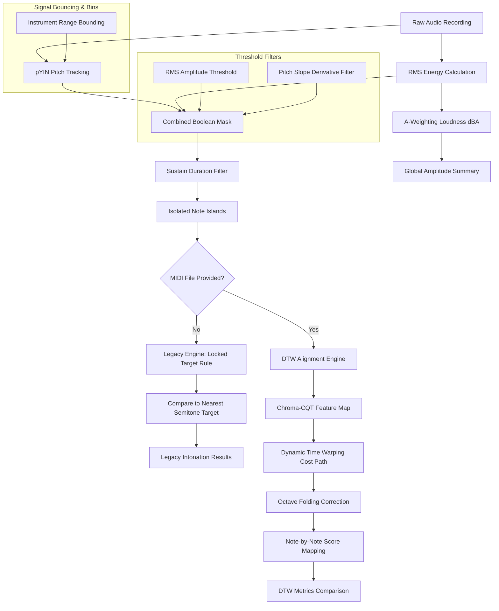

# Hello-Audio: Comparative Intonation and Amplitude Analysis Engine
## Technical Manual & Algorithmic Foundations
*A publication-grade guide to the digital signal processing, alignment, and filtering components of Hello-Audio.*

---

## 1. Executive Summary & System Architecture

The **Hello-Audio** application is a comparative analysis engine designed to evaluate the physical execution of musical performances on string instruments. It evaluates performance across two fundamental dimensions: **amplitude (intensity)** and **intonation (frequency deviation)**. The system is engineered to isolate intentional, steady-state notes while rejecting mechanical noise, transient attacks, bow changes, glissandos, and room reverberation.

The processing flow operates under two modes:
1. **Legacy Analysis Mode**: Compares the performed pitch frame-by-frame to the nearest absolute semitone on the Equal Temperament (12-TET) scale.
2. **DTW Alignment Mode**: Unlocked when a MIDI reference score is provided. It mathematically warps the performance timeline to match the expected notes, enabling precise note-by-note evaluation against the composer's intentions.

### High-Level System Architecture

### Conceptual Overview
> [!TIP]
> Consider Hello-Audio analogous to a strict comparative evaluator:
> 1. The system first applies a bandpass filter restricted to the physical frequency range of the designated instrument (**Frequency Range Bounding**).
> 2. It rejects transient acoustic events, ambient noise (**RMS Thresholding**), anomalous frequency slides (**Pitch Slope Filter**), and momentary tracking artifacts (**Sustain Duration Filter**).
> 3. In the absence of a reference score, the system assumes the performer's intended pitch is the nearest standard semitone, maintaining this target irrespective of minor performance drift (**Locked Target Rule**).
> 4. When a reference score is provided, the system dynamically aligns the temporal execution of the performance to the score (**Dynamic Time Warping**), while mathematically resolving harmonic tracking artifacts that occur in adjacent registers (**Octave Folding**).

---

## 2. Input Bounding & Frequency Limits

### Mathematical Formulation
To prevent the pitch tracking algorithm from wandering into spectral regions containing only background hum or mechanical clicks, a bandpass search boundary is established. In digital pitch tracking, restricting the search range for the fundamental frequency ($f_0$) is mathematically equivalent to limiting the search space of the pitch lag parameter $\tau$ (measured in samples) during autocorrelation:

$$\tau_{\min} = \frac{f_s}{f_{\max}} \quad \text{and} \quad \tau_{\max} = \frac{f_s}{f_{\min}}$$

where $f_s$ is the sampling rate of the audio file in Hz, $f_{\min}$ is the lower bound, and $f_{\max}$ is the upper bound.

In `pitch_engine.py`, the limits are bound to the physical registers of string instruments:
* **Violin**: $f_{\min} = \text{G3} \approx 196.00\text{ Hz}$, $f_{\max} = \text{C7} \approx 2093.00\text{ Hz}$
* **Viola**: $f_{\min} = \text{C3} \approx 130.81\text{ Hz}$, $f_{\max} = \text{A6} \approx 1760.00\text{ Hz}$
* **Cello**: $f_{\min} = \text{C2} \approx 65.41\text{ Hz}$, $f_{\max} = \text{E6} \approx 1318.51\text{ Hz}$

### Conceptual Overview
Limiting the search space focuses the algorithm exclusively on the physical capabilities of the instrument. Without this boundary, the probability of selecting anomalous subharmonic or high-frequency data increases significantly.

### Parameter Considerations
* **Select Instrument**: This setting locks the frequency boundaries to the physical capabilities of the selected instrument. 
* **Demonstration Toggle (`Enable Instrument Freq Limits`)**:
  * **When Enabled**: High-frequency acoustic artifacts, ambient low-frequency noise, and subharmonic anomalies are rejected.
  * **When Disabled (Failure Mode)**: The tracker searches the entire spectrum (from $16\text{ Hz}$ to $25,000\text{ Hz}$). Low-frequency ambient noise registers as a false $f_0$ track, and high-frequency string friction registers as anomalous pitch data. The resulting plot exhibits significant noise in the unvoiced frames.

---

## 3. Pitch Tracking via pYIN

### Mathematical Formulation
The Probabilistic YIN (pYIN) algorithm is an extension of the classic YIN pitch estimator. YIN is based on the **Difference Function** $d_t(\tau)$, which computes the squared difference between an audio window and its shifted counterpart at lag $\tau$:

$$d_t(\tau) = \sum_{j=t}^{t+W-1} (x_j - x_{j+\tau})^2$$

To prevent the algorithm from choosing subharmonics (which have a low difference value but are twice the true period), YIN computes the **Cumulative Mean Normalized Difference Function** $d'_t(\tau)$:

$$d'_t(\tau) = \begin{cases} 
1 & \text{if } \tau = 0 \\ 
\frac{d_t(\tau)}{\frac{1}{\tau} \sum_{j=1}^{\tau} d_t(j)} & \text{otherwise} 
\end{cases}$$

pYIN models the selection of the lag $\tau$ probabilistically rather than using a hard threshold. It treats the pitch trajectory as a sequence of hidden states in a Hidden Markov Model (HMM). The states correspond to:
1. **Unvoiced** (noise or silence).
2. **Voiced** with a specific fundamental frequency $f_0$.

The transition between states is governed by a transition matrix parameterized by the **Switch Probability** ($\beta$):

$$P(S_t = \text{Voiced} \mid S_{t-1} = \text{Unvoiced}) = \beta$$
$$P(S_t = \text{Unvoiced} \mid S_{t-1} = \text{Voiced}) = \beta$$

### Conceptual Overview
This probabilistic model provides algorithmic inertia. It assumes continuity in the pitch state; if the signal was evaluated as voiced in the preceding frame, a low switch probability demands significant statistical evidence to transition to an unvoiced state in the subsequent frame, thereby preventing discontinuous jumps.

### Parameter Considerations
* **Switch Probability ($\beta$)**:
  * **Low $\beta$ (e.g., $0.005$)**: Penalizes rapid toggling between voiced/unvoiced states. This stabilizes note blocks, preventing brief tracking dropouts from splitting a single long note.
  * **High $\beta$ (e.g., $0.050$)**: Allows rapid switching. This is useful for fast, detached notes (staccato) but introduces tracking jitter in sustained notes.

---

## 4. Signal Filtering & Note Isolation

Once the raw pitch ($f_0$) and amplitude (RMS) are extracted, they are processed through three filters to isolate intentional, stable notes.

### A. RMS Amplitude Threshold
#### Mathematical Formulation
The Root Mean Square (RMS) energy represents the average signal power over a frame of $N$ samples:

$$x_{rms} = \sqrt{\frac{1}{N} \sum_{n=1}^{N} x[n]^2}$$

A frame is classified as active only if:

$$x_{rms} > \theta_{rms}$$

where $\theta_{rms}$ is the user-determined RMS Amplitude Threshold.

#### Failure Mode (Bypass Toggle)
* **When Disabled**: Ambient noise, string friction, and instrument resonance decay are evaluated as valid pitches. The data output will exhibit extraneous pitch data trailing the intended note terminations.

---

### B. Pitch Slope Derivative Filter
#### Mathematical Formulation
To isolate the stable, flat center of a note, the system calculates the absolute first derivative of the pitch sequence in the log-frequency (MIDI) domain:

$$p_{midi}[n] = 12 \log_2\left(\frac{f_0[n]}{440}\right) + 69$$
$$s[n] = |p_{midi}[n] - p_{midi}[n-1]|$$

A frame at index $n$ is kept only if the slope $s[n]$ satisfies:

$$s[n] \le \theta_{slope} \quad \text{or} \quad \text{is\_nan}(s[n])$$

where $\theta_{slope}$ is the Maximum Pitch Slope. The condition $\text{is\_nan}(s[n])$ ensures that the very first frame of a newly struck note is kept (since the transition from silence involves a NaN and would otherwise be discarded).

#### Conceptual Overview
This filter functions as a discontinuity sensor: if the trajectory of the frequency changes at a physically improbable rate, it marks that specific transition as invalid, discarding the anomalous frames.

#### Failure Mode (Bypass Toggle)
* **When Disabled**: The pitch track retains transient frequency slides during note transitions, extreme vibrato excursions, and glissandi. The results contain anomalous data points at note boundaries, artificially elevating the calculated standard deviation.

---

### C. Sustain Duration Filter
#### Mathematical Formulation
This filter parses the boolean mask of active frames into contiguous islands of `True` values. Let an island be defined by start frame $n_{start}$ and end frame $n_{end}$. The duration of the island in frames is $L = n_{end} - n_{start}$. The island is preserved only if:

$$L \ge \theta_{sustain}$$

where $\theta_{sustain}$ is the Minimum Sustain Duration. If $L < \theta_{sustain}$, the mask for the entire range $[n_{start}, n_{end}]$ is flipped to `False`.

#### Conceptual Overview
This filter operates as a temporal smoothing mechanism. Acoustic events that are too brief to constitute intentional notes (e.g., incidental percussive impacts) are systematically discarded.

#### Failure Mode (Bypass Toggle)
* **When Disabled**: Brief, spurious acoustic transients and tracking artifacts are registered as independent notes. The results table will display an inflated count of short notes, skewing the overall temporal average.

---

## 5. Intonation Scoring & The Locked Target Rule (Legacy)

### Mathematical Formulation
In Legacy Mode (without a MIDI score), the system must determine what note the performer intended to play. For each isolated note island, the algorithm converts the pitch track to MIDI values, extracts the median value, and rounds it to the nearest integer to define the **Locked Target Note** ($T$):

$$T = \text{round}\left( \text{median}\left( p_{midi}[n] \right) \right) \quad \text{for } n \in [n_{start}, n_{end}]$$

The frequency deviation (in cents) for each frame in the island is calculated relative to this static target $T$:

$$\text{dev}[n] = (p_{midi}[n] - T) \times 100 \quad \text{cents}$$

#### Conceptual Overview
The Locked Target Rule establishes a static center for deviation analysis over the duration of a sustained note. This isolates the performer's intonation drift relative to their initial intended target, rather than dynamically moving the target to accommodate their errors.

### Failure Mode (Bypass Toggle: `Enable Locked Target Rule`)
* **When Enabled**: The target note $T$ is a static integer for the entire note island. Intonation deviation accurately reflects the performer's drift from that designated semitone.
* **When Disabled**: The target note is calculated iteratively frame-by-frame: $T[n] = \text{round}(p_{midi}[n])$. If a performer plays a note significantly flat (e.g., drifting from C4 towards B3), the target note shifts mid-note. The calculated deviation exhibits a severe discontinuity in the analysis. Consequently, the average deviation calculation is artificially minimized because the target continually shifts to track the player's errors.

---

## 6. Time Alignment via Dynamic Time Warping (DTW)

When a MIDI reference is uploaded, Hello-Audio swaps the legacy nearest-semitone assumption for a strict, score-bound evaluation using a **Two-Phase Architecture**:

### Phase 1: Temporal Alignment (Finding the Map)
**Goal:** Align the rhythm and speed of the human performance to the MIDI score, regardless of what octave the human played in.

#### A. Chroma CQT Feature Mapping
#### Mathematical Formulation
To align a real instrument recording with a synthesized MIDI track, the audio waveforms must be converted into a representation that is robust to differences in timbre (e.g. comparing a warm, vibrating cello to a dry, computerized sine wave). The system extracts a 12-bin **Chroma Constant-Q Transform (CQT)**. 

The CQT projects the spectral energy onto a logarithmic frequency scale where the bins are spaced according to the Western musical scale:

$$X_{cqt}[k] = \sum_{n} x[n] \cdot g_k[n] \cdot e^{-j 2\pi f_k n}$$

where $f_k = f_0 \cdot 2^{k/12}$ represents the center frequency of the $k$-th bin, and $g_k[n]$ is a window function whose length is inversely proportional to $f_k$. 

The 12 Chroma bins are calculated by wrapping all octaves into a single octave:

$$C[b] = \sum_{octave} X_{cqt}[b + 12 \cdot octave] \quad \text{for } b \in \{0, 1, \dots, 11\}$$

This yields a 12-dimensional vector at each frame representing the intensity of the 12 semitones (C, C#, D, etc.) regardless of which octave they were played in.

**Figure 1**

*Chroma CQT Spectral Transformation*

*Note.* The transformation of a linear frequency spectrogram (left) into a 12-bin octave-agnostic Chroma CQT matrix (right), demonstrating how distinct notes C3 and C4 map to the corresponding pitch class bin.

---

#### B. DTW Cost Matrix & Warping Path
#### Mathematical Formulation
Let the synthesized MIDI Chroma sequence be $X = (\mathbf{x}_1, \mathbf{x}_2, \dots, \mathbf{x}_N)$ and the performed audio Chroma sequence be $Y = (\mathbf{y}_1, \mathbf{y}_2, \dots, \mathbf{y}_M)$. 
The system computes an $N \times M$ local cost matrix using the cosine distance between the Chroma vectors:

$$d(i, j) = 1 - \frac{\mathbf{x}_i \cdot \mathbf{y}_j}{\|\mathbf{x}_i\| \|\mathbf{y}_j\|}$$

By using Chroma CQT instead of Absolute Frequency (STFT), the algorithm mathematically erases octave mismatches that would otherwise cause alignment failures:

**Figure 2**

*Cost Matrix Comparison: Absolute Frequency vs. Chroma CQT*

*Note.* A comparison of Dynamic Time Warping (DTW) cost matrices when a human performance contains an octave error. The absolute frequency (STFT) matrix (left) produces a high-cost mismatch, whereas the Chroma CQT matrix (right) aligns the melodic sequence by omitting the register differential.

The cumulative cost matrix $D(i, j)$ is computed recursively using dynamic programming:

$$D(i, j) = d(i, j) + \min \begin{cases} 
D(i-1, j) & \text{(Insertion)} \\ 
D(i, j-1) & \text{(Deletion)} \\ 
D(i-1, j-1) & \text{(Match)} 
\end{cases}$$

The optimal warping path $Wp = (w_1, w_2, \dots, w_K)$ is found by backtracking from $D(N, M)$ to $D(1, 1)$, selecting the path that minimizes the total accumulated alignment cost. This path maps each frame of the performance to the expected note index and pitch from the MIDI file.

#### Conceptual Overview
DTW functions comparably to a dynamic temporal mapping function that accommodates local deviations. It allows the algorithm to hold one timeline constant while advancing the other, ensuring corresponding acoustic events align despite rhythmic discrepancies.

#### Step-by-Step Pathfinding Example
To understand how DTW finds this path, imagine a simplified scenario where the MIDI plays a three-note melody **[C, D, E]**, but the human performer accidentally holds the first note for twice as long: **[C, C, D, E]**.

The DTW algorithm constructs a grid (the **Local Cost Matrix**). At every intersection, it calculates a Cost: `0` if the notes match, and `100` if they clash.

| Human Performance (Y-axis) | C (MIDI) | D (MIDI) | E (MIDI) |
| :--- | :---: | :---: | :---: |
| **E (Human)** | 100 | 100 | **0** (End) |
| **D (Human)** | 100 | **0** | 100 |
| **C (Human, Sec 2)** | **0** | 100 | 100 |
| **C (Human, Sec 1)** | **0** (Start)| 100 | 100 |

The algorithm must walk from the Bottom-Left (Start) to the Top-Right (End). It can only move **Up** (pausing the MIDI), **Right** (pausing the Human), or **Diagonal** (moving both timelines forward). It seeks the path with the lowest accumulated cost.

1. It starts at (Human C vs MIDI C). Cost = 0.
2. It looks ahead and sees moving Diagonal (Human C vs MIDI D) costs 100. Moving Right costs 100. But moving **Up** (Human C Sec 2 vs MIDI C) costs 0. It chooses to move Up, effectively "stretching" the MIDI C to match the human's held note.
3. From there, it moves **Diagonal** to (Human D vs MIDI D) for a cost of 0.
4. It moves **Diagonal** again to (Human E vs MIDI E) for a cost of 0, successfully reaching the end.

By determining the continuous path of minimal cost, the algorithm generates the Warping Path that synchronizes the two asymmetrical timelines.

---

### Phase 2: Pitch Analysis (Fixing the Intonation)
**Goal:** Extract the raw physical frequencies, align them to the new timeline, and correct any algorithmic octave errors.
1. The **pYIN Algorithm** runs on the raw acoustic audio to extract the exact physical frequencies (in Hz). Unlike Chroma, this data *does* contain exact octave information!
2. The engine utilizes the "Warping Path" generated in Phase 1 to align the pYIN frequency trace to the MIDI timeline.

**Figure 3**

*Temporal Alignment of Raw pYIN Pitch Trace*

*Note.* The application of the Chroma-derived DTW warping path to correct temporal skew. The raw human pYIN frequency trace (left, red) is temporally misaligned with the target MIDI grid (green), but is mathematically mapped into rhythmic alignment (right, blue) utilizing the optimal warping path.

3. The **DTW Masking Logic** ensures that only valid, matched notes are retained, discarding silence and noise:

**Figure 4**

*Unvoiced Frame Masking using DTW Confidence*

*Note.* The isolation of intentional musical notes. The raw pYIN trace (left) contains tracking noise during periods of rest. The DTW boolean masking logic (right) preserves only the frames that successfully match the MIDI score, discarding acoustic noise.

4. Finally, the **Octave Folding Logic** (detailed in Section 7) corrects any harmonic tracking artifacts.

## 7. Octave Folding Logic

### Mathematical Formulation
pYIN can suffer from "octave tracking errors." This occurs when the algorithm tracks a strong harmonic overtone (e.g. the 2nd harmonic at $2f_0$, which is 12 semitones higher) or a subharmonic (e.g. $f_0/2$, which is 12 semitones lower) instead of the fundamental frequency. 

Let the raw tracked pitch in MIDI units be $p_{midi}[n]$ and the expected MIDI pitch from the DTW-aligned score be $p_{expected}[n]$. The octave offset is calculated as:

$$\Delta_{octave}[n] = \text{round}\left( \frac{p_{midi}[n] - p_{expected}[n]}{12} \right)$$

The mathematically folded pitch $p_{folded}[n]$ is computed by subtracting this octave offset:

$$p_{folded}[n] = p_{midi}[n] - 12 \times \Delta_{octave}[n]$$

Finally, the folded pitch is converted back to Hz:

$$f_{folded}[n] = 440 \cdot 2^{\frac{p_{folded}[n] - 69}{12}}$$

**Figure 5**

*Octave Folding Correction of Harmonic Artifacts*

*Note.* The algorithmic correction of a pitch tracking error. A C4 note incorrectly tracked as C5 due to dominant acoustic harmonic overtones (left, red) is mathematically transposed into the correct target register (right, blue), restoring accurate intonation analysis.

#### Conceptual Overview
Octave folding operates similarly to modulo arithmetic, isolating the pitch class from its octave register. This ensures intonation is evaluated strictly on semitone accuracy irrespective of harmonic transposition errors.

### Failure Mode (Bypass Toggle: `Enable Octave Folding`)
* **When Enabled**: Overtone tracking errors are folded back to the correct octave. The intonation deviation calculation accurately measures tuning precision.
* **When Disabled**: If a performer plays a note (e.g., A4 = $440\text{ Hz}$) but pYIN tracks its octave harmonic ($880\text{ Hz}$), the system calculates the deviation relative to the target. Without folding, the deviation will be calculated as $+1200$ cents. This creates significant discontinuities in the pitch plot, thereby skewing the average deviation.

---

## 8. Loudness & Perceptual Weighting

### Mathematical Formulation
To analyze performance intensity, Hello-Audio measures the Root Mean Square (RMS) energy. However, the human ear does not perceive all frequencies as equally loud. To match human perception, the system calculates both physical and perceptual intensity:

1. **dBFS (Decibels relative to Full Scale)**:
   This measures the physical voltage/power of the digital signal relative to the maximum possible digital clipping point ($1.0$):
   
   $$\text{dBFS} = 20 \log_{10}(x_{rms})$$

2. **dBA (A-weighted Decibels)**:
   This applies a frequency-domain filter to mimic the human ear's sensitivity, which is less sensitive to low and high frequency extremes. 
   
   The transfer function of the A-weighting filter in the frequency domain is defined as:
   
   $$R_A(f) = \frac{12194^2 \cdot f^4}{(f^2 + 20.6^2) \sqrt{(f^2 + 107.7^2)(f^2 + 737.9^2)} (f^2 + 12194^2)}$$
   $$A(f) = 20 \log_{10}(R_A(f)) + 2.00 \quad \text{dB}$$
   
   In `amplitude_analysis.py`, the Short-Time Fourier Transform (STFT) magnitude spectrum $S(f, t)$ is multiplied by the A-weighting curve before calculating the RMS energy. This weights the frequency components according to their perceptual loudness.

**Figure 6**

*Perceptual A-Weighting of Broadband Audio*

*Note.* The effect of the A-weighting perceptual filter on a flat broadband noise signal. The raw signal (left) contains equal energy across all frequencies, while the filtered signal (right) attenuates low and high frequencies to mimic human hearing sensitivity.

### Conceptual Overview
The A-weighting filter functions as a frequency-dependent transformation, attenuating spectral extremes to reflect the non-linear sensitivity characteristics of the human auditory system.

---

## 9. Summary of User-Controlled Parameters

| Parameter | Recommended Value | Physical Meaning | Algorithmic Role |
| :--- | :--- | :--- | :--- |
| **Analysis Profile** | Preset / Custom | Experimental standard | Selects presets (`Rapid` vs `Slow`) to guarantee trial consistency. |
| **Select Instrument** | Match played | Bounding filter | Adjusts the $f_{\min}$ and $f_{\max}$ search limits in pYIN. |
| **Switch Probability** | $0.005$ | HMM stability | Penalizes rapid toggling between voiced/unvoiced states in the HMM. |
| **RMS Threshold** | $0.01 - 0.02$ | Noise Gate | Sets the minimum signal energy required to classify a frame as active. |
| **Sustain Duration** | $10\text{ frames} \approx 116\text{ ms}$ | Note length | Discards any isolated active blocks shorter than this threshold. |
| **Max Pitch Slope** | $0.10\text{ semitones}$ | Derivative threshold | Discards frames where the frame-to-frame pitch jump exceeds this limit. |

---

## 10. References & Bibliography

For further reading on the mathematical principles and signal processing algorithms implemented in this engine, refer to the foundational literature below:

1. **pYIN Pitch Tracking (Probabilistic YIN):**
   * Mauch, M., & Dixon, S. (2014). *pYIN: A Fundamental Frequency Estimator Using Probabilistic Threshold Distributions*. Proceedings of the IEEE International Conference on Acoustics, Speech and Signal Processing (ICASSP).
   * De Cheveigné, A., & Kawahara, H. (2002). *YIN, a fundamental frequency estimator for speech and music*. The Journal of the Acoustical Society of America, 111(4), 1917-1930.

2. **Dynamic Time Warping (DTW) & Chroma Features:**
   * Müller, M. (2015). *Fundamentals of Music Processing: Audio, Analysis, Algorithms, Applications*. Springer. (Specifically Chapter 3 on Music Synchronization and Chapter 4 on DTW).
   * Ellis, D. P. W., & Poliner, G. E. (2007). *Identifying 'cover songs' with chroma features and dynamic programming beat tracking*. Proceedings of the IEEE International Conference on Acoustics, Speech and Signal Processing (ICASSP).

3. **A-Weighting & Acoustic Loudness Standards:**
   * International Electrotechnical Commission (IEC). (2003). *IEC 61672-1: Electroacoustics - Sound level meters - Part 1: Specifications*. (Defines the standard A-weighting filter curve $R_A(f)$).
   * Fletcher, H., & Munson, W. A. (1933). *Loudness, its definition, measurement and calculation*. The Journal of the Acoustical Society of America. (Foundational research on equal-loudness contours).

4. **Digital Signal Processing & Python Ecosystem:**
   * McFee, B., Raffel, C., Liang, D., Ellis, D. P. W., McVicar, M., Battenberg, E., & Nieto, O. (2015). *librosa: Audio and Music Signal Analysis in Python*. Proceedings of the 14th Python in Science Conference.
