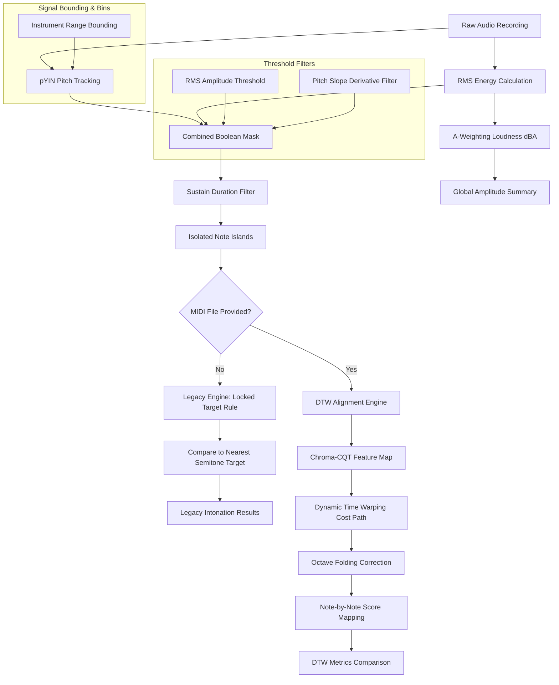

# Hello-Audio: Comparative Intonation and Amplitude Analysis Engine
## Technical Manual & Algorithmic Foundations
*A publication-grade guide to the digital signal processing, alignment, and filtering components of Hello-Audio.*

---

## 1. Executive Summary & System Architecture

The **Hello-Audio** application is a comparative analysis engine designed to evaluate the physical execution of musical performances on string instruments. It evaluates performance across two fundamental dimensions: **amplitude (intensity)** and **intonation (frequency deviation)**. The system is engineered to isolate intentional, steady-state notes while rejecting mechanical noise, transient attacks, bow changes, glissandos, and room reverberation.

The processing flow operates under two modes:
1. **Legacy Analysis Mode**: Compares the performed pitch frame-by-frame to the nearest absolute semitone on the Equal Temperament (12-TET) scale.
2. **DTW Alignment Mode**: Unlocked when a MIDI reference score is provided. It mathematically warps the performance timeline to match the expected notes, enabling precise note-by-note evaluation against the composer's intentions.

### High-Level System Architecture

### High-Level Analogy
> [!TIP]
> Think of Hello-Audio as a strict choir director holding a stopwatch and a sheet music score. 
> 1. First, the director puts on sound-isolating headphones that only let through frequencies in the human vocal range (**Frequency Range Bounding**).
> 2. The director ignores quick throat-clearings and breaths (**RMS Thresholding**), sliding between notes (**Pitch Slope Filter**), and accidental slips that last less than a fraction of a second (**Sustain Duration Filter**).
> 3. If the director does not have sheet music, they assume the singer is trying to hit whatever standard note they are closest to, holding the target still even if the voice wobbles slightly (**Locked Target Rule**).
> 4. If the director *does* have sheet music, they stretch or compress time to align the singer's syllables with the score (**Dynamic Time Warping**), and ignore octave mistakes where the singer sings the correct note but in a register that is too high or too low (**Octave Folding**).

---

## 2. Input Bounding & Frequency Limits

### Mathematical Formulation
To prevent the pitch tracking algorithm from wandering into spectral regions containing only background hum or mechanical clicks, a bandpass search boundary is established. In digital pitch tracking, restricting the search range for the fundamental frequency ($f_0$) is mathematically equivalent to limiting the search space of the pitch lag parameter $\tau$ (measured in samples) during autocorrelation:

$$\tau_{\min} = \frac{f_s}{f_{\max}} \quad \text{and} \quad \tau_{\max} = \frac{f_s}{f_{\min}}$$

where $f_s$ is the sampling rate of the audio file in Hz, $f_{\min}$ is the lower bound, and $f_{\max}$ is the upper bound.

In `pitch_engine.py`, the limits are bound to the physical registers of string instruments:
* **Violin**: $f_{\min} = \text{G3} \approx 196.00\text{ Hz}$, $f_{\max} = \text{C7} \approx 2093.00\text{ Hz}$
* **Viola**: $f_{\min} = \text{C3} \approx 130.81\text{ Hz}$, $f_{\max} = \text{A6} \approx 1760.00\text{ Hz}$
* **Cello**: $f_{\min} = \text{C2} \approx 65.41\text{ Hz}$, $f_{\max} = \text{E6} \approx 1318.51\text{ Hz}$

### Intuitive Analogy
Imagine searching a dictionary for a word starting with 'G'. Bounding the search means you open the dictionary directly to the 'G' section and ignore pages 'A' through 'F' and 'H' through 'Z'. Without this boundary, you might accidentally select a word in the 'S' section just because it looks slightly similar.

### Parameter Considerations
* **Select Instrument**: This setting locks the frequency boundaries to the physical capabilities of the instrument. 
* **Demonstration Toggle (`Enable Instrument Freq Limits`)**:
  * **When Enabled**: High-frequency squeaks, room air conditioning rumble, and subharmonic thuds are ignored.
  * **When Disabled (Failure Mode)**: The tracker searches the entire spectrum (from $16\text{ Hz}$ to $25,000\text{ Hz}$). Low-frequency floor rumble registers as a false $f_0$ track, and high-frequency bow-hair friction registers as whistle registers. The resulting plot will show spikes and noise in the unvoiced frames.

---

## 3. Pitch Tracking via pYIN

### Mathematical Formulation
The Probabilistic YIN (pYIN) algorithm is an extension of the classic YIN pitch estimator. YIN is based on the **Difference Function** $d_t(\tau)$, which computes the squared difference between an audio window and its shifted counterpart at lag $\tau$:

$$d_t(\tau) = \sum_{j=t}^{t+W-1} (x_j - x_{j+\tau})^2$$

To prevent the algorithm from choosing subharmonics (which have a low difference value but are twice the true period), YIN computes the **Cumulative Mean Normalized Difference Function** $d'_t(\tau)$:

$$d'_t(\tau) = \begin{cases} 
1 & \text{if } \tau = 0 \\ 
\frac{d_t(\tau)}{\frac{1}{\tau} \sum_{j=1}^{\tau} d_t(j)} & \text{otherwise} 
\end{cases}$$

pYIN models the selection of the lag $\tau$ probabilistically rather than using a hard threshold. It treats the pitch trajectory as a sequence of hidden states in a Hidden Markov Model (HMM). The states correspond to:
1. **Unvoiced** (noise or silence).
2. **Voiced** with a specific fundamental frequency $f_0$.

The transition between states is governed by a transition matrix parameterized by the **Switch Probability** ($\beta$):

$$P(S_t = \text{Voiced} \mid S_{t-1} = \text{Unvoiced}) = \beta$$
$$P(S_t = \text{Unvoiced} \mid S_{t-1} = \text{Voiced}) = \beta$$

### Intuitive Analogy
Imagine walking on a slippery path. If you take steps without thinking about where your last step was, you might slide sideways instantly. A low switch probability acts like "inertia" or "gravity"—it expects that if you were walking forward in a straight line at the last frame, you are highly likely to keep walking forward at the next frame, rather than suddenly flying off to the side.

### Parameter Considerations
* **Switch Probability ($\beta$)**:
  * **Low $\beta$ (e.g., $0.005$)**: Penalizes rapid toggling between voiced/unvoiced states. This stabilizes note blocks, preventing brief tracking dropouts from splitting a single long note.
  * **High $\beta$ (e.g., $0.050$)**: Allows rapid switching. This is useful for fast, detached notes (staccato) but introduces tracking jitter in sustained notes.

---

## 4. Signal Filtering & Note Isolation

Once the raw pitch ($f_0$) and amplitude (RMS) are extracted, they are processed through three filters to isolate intentional, stable notes.

### A. RMS Amplitude Threshold
#### Mathematical Formulation
The Root Mean Square (RMS) energy represents the average signal power over a frame of $N$ samples:

$$x_{rms} = \sqrt{\frac{1}{N} \sum_{n=1}^{N} x[n]^2}$$

A frame is classified as active only if:

$$x_{rms} > \theta_{rms}$$

where $\theta_{rms}$ is the user-determined RMS Amplitude Threshold.

#### Failure Mode (Bypass Toggle)
* **When Disabled**: Quiet room noise, bow scrapes on the string, and instrument resonant decay (after the note has ended) are evaluated as valid pitches. The pitch plots will show long tails of garbage pitches at the end of notes.

---

### B. Pitch Slope Derivative Filter
#### Mathematical Formulation
To isolate the stable, flat center of a note, the system calculates the absolute first derivative of the pitch sequence in the log-frequency (MIDI) domain:

$$p_{midi}[n] = 12 \log_2\left(\frac{f_0[n]}{440}\right) + 69$$
$$s[n] = |p_{midi}[n] - p_{midi}[n-1]|$$

A frame at index $n$ is kept only if the slope $s[n]$ satisfies:

$$s[n] \le \theta_{slope} \quad \text{or} \quad \text{is\_nan}(s[n])$$

where $\theta_{slope}$ is the Maximum Pitch Slope. The condition $\text{is\_nan}(s[n])$ ensures that the very first frame of a newly struck note is kept (since the transition from silence involves a NaN and would otherwise be discarded).

#### Intuitive Analogy
Imagine driving a car down a road that suddenly hits a brick wall and teleports 5 miles to the left. The derivative filter acts as a safety sensor: if the trajectory of the vehicle changes at an impossible rate, it marks that moment as an invalid transition, discarding the teleportation frames.

#### Failure Mode (Bypass Toggle)
* **When Disabled**: The pitch track includes the violent frequency slides during note changes (transients), wide vibrato swings, and glissandos. The results will contain noisy data points at the edges of notes, raising the calculated standard deviation.

---

### C. Sustain Duration Filter
#### Mathematical Formulation
This filter parses the boolean mask of active frames into contiguous islands of `True` values. Let an island be defined by start frame $n_{start}$ and end frame $n_{end}$. The duration of the island in frames is $L = n_{end} - n_{start}$. The island is preserved only if:

$$L \ge \theta_{sustain}$$

where $\theta_{sustain}$ is the Minimum Sustain Duration. If $L < \theta_{sustain}$, the mask for the entire range $[n_{start}, n_{end}]$ is flipped to `False`.

#### Intuitive Analogy
Think of this as a spelling checker that ignores single-letter typos. If a sound is too brief to be an intentional note (like a quick fingernail click against the wood of the cello), it is erased.

#### Failure Mode (Bypass Toggle)
* **When Disabled**: Tiny, spurious audio spikes and transient tracking artifacts appear as short notes. The results table will show a large count of short notes, skewing the overall average.

---

## 5. Intonation Scoring & The Locked Target Rule (Legacy)

### Mathematical Formulation
In Legacy Mode (without a MIDI score), the system must determine what note the performer intended to play. For each isolated note island, the algorithm converts the pitch track to MIDI values, extracts the median value, and rounds it to the nearest integer to define the **Locked Target Note** ($T$):

$$T = \text{round}\left( \text{median}\left( p_{midi}[n] \right) \right) \quad \text{for } n \in [n_{start}, n_{end}]$$

The frequency deviation (in cents) for each frame in the island is calculated relative to this static target $T$:

$$\text{dev}[n] = (p_{midi}[n] - T) \times 100 \quad \text{cents}$$

#### Intuitive Analogy
Imagine throwing darts at a board. The **Locked Target Rule** is like drawing the target rings around the center of where your darts actually landed. Even if your hand wobbles, the center of the target stays in one place while we measure how far each dart landed from it. 

### Failure Mode (Bypass Toggle: `Enable Locked Target Rule`)
* **When Enabled**: The target note $T$ is a single locked integer for the whole note island. Intonation deviation reflects how much the performer drifted from that note.
* **When Disabled**: The target note is calculated frame-by-frame: $T[n] = \text{round}(p_{midi}[n])$. If a performer plays a note flat by more than 50 cents (e.g., drifting from C4 down towards B3), the target note shifts *mid-note*. The calculated deviation suddenly jumps from $-50$ cents to $+50$ cents, showing a discontinuous cliff in the graph. Paradoxically, the average deviation will look much lower because the target keeps moving to track the player's errors.

---

## 6. Time Alignment via Dynamic Time Warping (DTW)

When a MIDI reference is uploaded, Hello-Audio swaps the legacy nearest-semitone assumption for a strict, score-bound evaluation using **Dynamic Time Warping (DTW)**.

### A. Chroma CQT Feature Mapping
#### Mathematical Formulation
To align a real instrument recording with a synthesized MIDI track, the audio waveforms must be converted into a representation that is robust to differences in timbre (e.g. comparing a warm, vibrating cello to a dry, computerized sine wave). The system extracts a 12-bin **Chroma Constant-Q Transform (CQT)**. 

The CQT projects the spectral energy onto a logarithmic frequency scale where the bins are spaced according to the Western musical scale:

$$X_{cqt}[k] = \sum_{n} x[n] \cdot g_k[n] \cdot e^{-j 2\pi f_k n}$$

where $f_k = f_0 \cdot 2^{k/12}$ represents the center frequency of the $k$-th bin, and $g_k[n]$ is a window function whose length is inversely proportional to $f_k$. 

The 12 Chroma bins are calculated by wrapping all octaves into a single octave:

$$C[b] = \sum_{octave} X_{cqt}[b + 12 \cdot octave] \quad \text{for } b \in \{0, 1, \dots, 11\}$$

This yields a 12-dimensional vector at each frame representing the intensity of the 12 semitones (C, C#, D, etc.) regardless of which octave they were played in.

---

### B. DTW Cost Matrix & Warping Path
#### Mathematical Formulation
Let the synthesized MIDI Chroma sequence be $X = (\mathbf{x}_1, \mathbf{x}_2, \dots, \mathbf{x}_N)$ and the performed audio Chroma sequence be $Y = (\mathbf{y}_1, \mathbf{y}_2, \dots, \mathbf{y}_M)$. 
The system computes an $N \times M$ local cost matrix using the cosine distance between the Chroma vectors:

$$d(i, j) = 1 - \frac{\mathbf{x}_i \cdot \mathbf{y}_j}{\|\mathbf{x}_i\| \|\mathbf{y}_j\|}$$

The cumulative cost matrix $D(i, j)$ is computed recursively using dynamic programming:

$$D(i, j) = d(i, j) + \min \begin{cases} 
D(i-1, j) & \text{(Insertion)} \\ 
D(i, j-1) & \text{(Deletion)} \\ 
D(i-1, j-1) & \text{(Match)} 
\end{cases}$$

The optimal warping path $Wp = (w_1, w_2, \dots, w_K)$ is found by backtracking from $D(N, M)$ to $D(1, 1)$, selecting the path that minimizes the total accumulated alignment cost. This path maps each frame of the performance to the expected note index and pitch from the MIDI file.

#### Intuitive Analogy
Imagine aligning a zipper with missing or misaligned teeth. If you zip it straight up, it jams. DTW acts like a flexible zipper slider that can pause on one side or stretch the other side to ensure that every tooth on the left meshes with its correct partner on the right, even if the timing is slightly off.

---

## 7. Octave Folding Logic

### Mathematical Formulation
pYIN can suffer from "octave tracking errors." This occurs when the algorithm tracks a strong harmonic overtone (e.g. the 2nd harmonic at $2f_0$, which is 12 semitones higher) or a subharmonic (e.g. $f_0/2$, which is 12 semitones lower) instead of the fundamental frequency. 

Let the raw tracked pitch in MIDI units be $p_{midi}[n]$ and the expected MIDI pitch from the DTW-aligned score be $p_{expected}[n]$. The octave offset is calculated as:

$$\Delta_{octave}[n] = \text{round}\left( \frac{p_{midi}[n] - p_{expected}[n]}{12} \right)$$

The mathematically folded pitch $p_{folded}[n]$ is computed by subtracting this octave offset:

$$p_{folded}[n] = p_{midi}[n] - 12 \times \Delta_{octave}[n]$$

Finally, the folded pitch is converted back to Hz:

$$f_{folded}[n] = 440 \cdot 2^{\frac{p_{folded}[n] - 69}{12}}$$

#### Intuitive Analogy
Imagine a clock face. If an appointment is scheduled for 2:00 PM, but you write down 2:00 AM, you are off by 12 hours (an octave error). **Octave Folding** is like looking at a 12-hour clock: it ignores the "AM/PM" offset and focuses entirely on the position of the hands, ensuring your timing accuracy is evaluated relative to 2:00, regardless of the day or night cycle.

### Failure Mode (Bypass Toggle: `Enable Octave Folding`)
* **When Enabled**: Overtone tracking errors are folded back to the correct octave. The intonation deviation calculation measures the true tuning accuracy.
* **When Disabled**: If a performer plays a note (e.g., A4 = $440\text{ Hz}$) but pYIN tracks its octave harmonic ($880\text{ Hz}$), the system calculates the deviation relative to the target. Without folding, the deviation will be calculated as $+1200$ cents. This creates massive jumps in the pitch plot and skews the average deviation.

---

## 8. Loudness & Perceptual Weighting

### Mathematical Formulation
To analyze performance intensity, Hello-Audio measures the Root Mean Square (RMS) energy. However, the human ear does not perceive all frequencies as equally loud. To match human perception, the system calculates both physical and perceptual intensity:

1. **dBFS (Decibels relative to Full Scale)**:
   This measures the physical voltage/power of the digital signal relative to the maximum possible digital clipping point ($1.0$):
   
   $$\text{dBFS} = 20 \log_{10}(x_{rms})$$

2. **dBA (A-weighted Decibels)**:
   This applies a frequency-domain filter to mimic the human ear's sensitivity, which is less sensitive to very low and very high frequencies. 
   
   The transfer function of the A-weighting filter in the frequency domain is defined as:
   
   $$R_A(f) = \frac{12194^2 \cdot f^4}{(f^2 + 20.6^2) \sqrt{(f^2 + 107.7^2)(f^2 + 737.9^2)} (f^2 + 12194^2)}$$
   $$A(f) = 20 \log_{10}(R_A(f)) + 2.00 \quad \text{dB}$$
   
   In `amplitude_analysis.py`, the Short-Time Fourier Transform (STFT) magnitude spectrum $S(f, t)$ is multiplied by the A-weighting curve before calculating the RMS energy. This weights the frequency components according to their perceptual loudness.

### Intuitive Analogy
Imagine looking at a painting through colored glasses. The digital recording sees all colors (frequencies) with equal intensity. The A-weighting filter acts like a pair of glasses that tints the view, dimming colors at the far edges (deep infrared and high ultraviolet) so that you only see what is bright to the human eye.

---

## 9. Summary of User-Controlled Parameters

| Parameter | Recommended Value | Physical Meaning | Algorithmic Role |
| :--- | :--- | :--- | :--- |
| **Analysis Profile** | Preset / Custom | Experimental standard | Selects presets (`Rapid` vs `Slow`) to guarantee trial consistency. |
| **Select Instrument** | Match played | Bounding filter | Adjusts the $f_{\min}$ and $f_{\max}$ search limits in pYIN. |
| **Switch Probability** | $0.005$ | HMM stability | Penalizes rapid toggling between voiced/unvoiced states in the HMM. |
| **RMS Threshold** | $0.01 - 0.02$ | Noise Gate | Sets the minimum signal energy required to classify a frame as active. |
| **Sustain Duration** | $10\text{ frames} \approx 116\text{ ms}$ | Note length | Discards any isolated active blocks shorter than this threshold. |
| **Max Pitch Slope** | $0.10\text{ semitones}$ | Derivative threshold | Discards frames where the frame-to-frame pitch jump exceeds this limit. |
